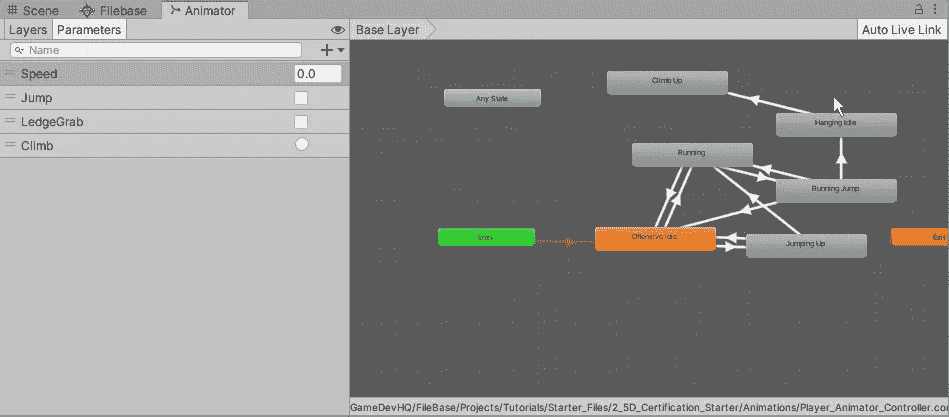
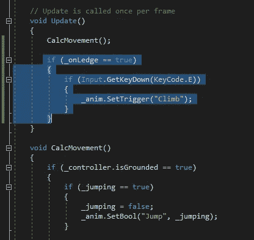
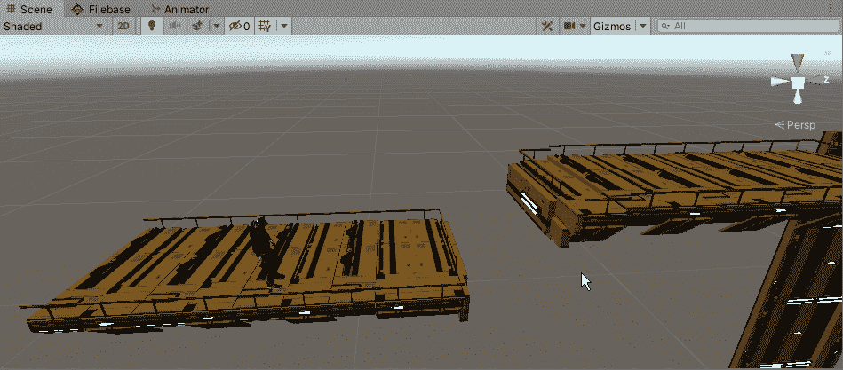
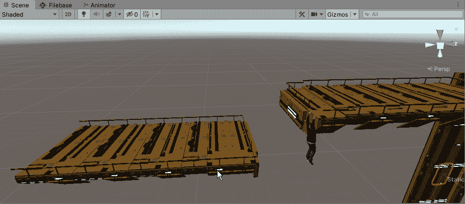
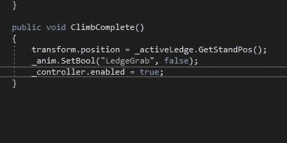
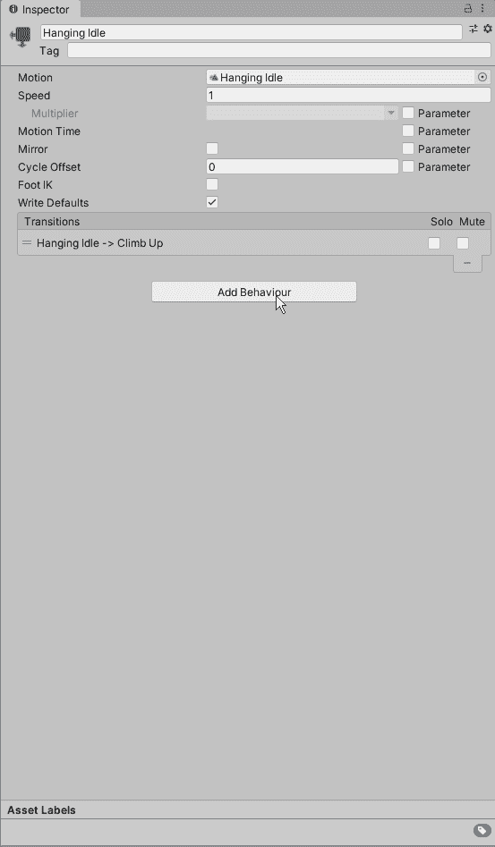
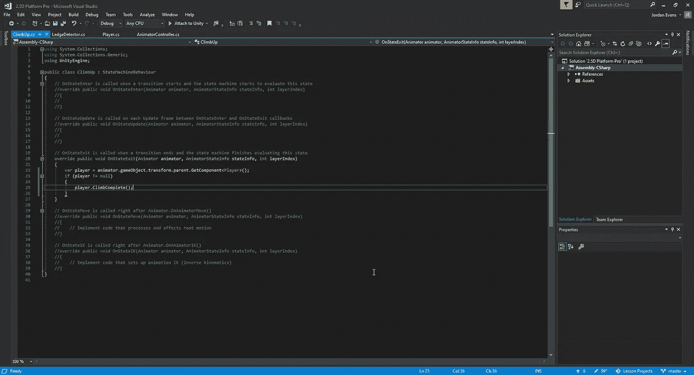
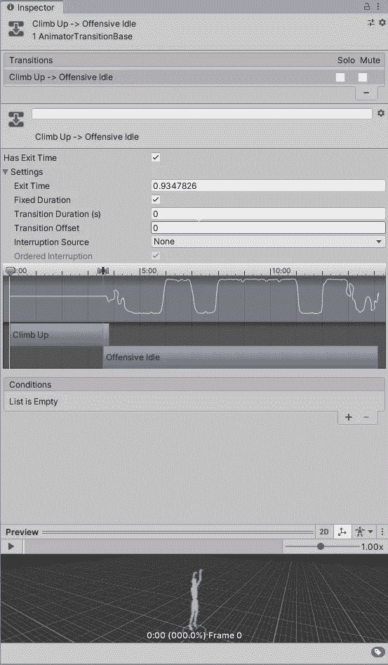
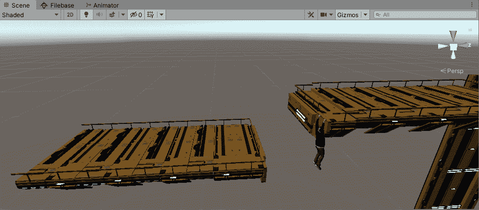

# 在 Unity 中处理动画事件

> 原文：<https://medium.com/nerd-for-tech/working-with-animation-events-in-unity-d9ce4a404380?source=collection_archive---------7----------------------->

现在我们已经有了一个抓岩架，让我们开始制作动画来爬上我们的岩架，并在到达顶部时保持在那个位置。首先，我们将找到一个新的动画，并将其与 animator 网格一起添加到我们的资产中。我们现在将它附加到挂起的空闲动画上，这样我们可以确保它正常工作:

从这里开始，我们将需要在我们的播放器中创建代码，使我们能够按下一个键来启用我们的壁架攀爬，但是因为我们已经在连接到壁架时关闭了控制器，所以我们需要确保将它添加到我们已经做出的控制器运动声明之后:

从这里，我们可以通过快速播放来查看它在我们场景中的样子:

现在，如果我们想让它在动画结束时切换到空闲状态，我们会遇到一个小问题:

发生这种情况的原因是，当我们把玩家的位置设置到终点时，玩家已经附着到壁架上了。由于动画没有覆盖当前玩家的位置，我们现在需要在代码中创建一个方法，使我们能够在结束攀爬动画时将角色移动到新的位置。要做到这一点，我们首先需要弄清楚我们的玩家将要站立的大致位置，以使它成为我们希望玩家在完成攀爬动画后捕捉到的位置。一旦我们分配了它并放置了坐标，我们必须在我们的壁架探测器脚本中创建一个函数，我们可以调用它来将我们的玩家放置在那个位置:

在我们的玩家脚本中，我们想要创建一个新的方法，让玩家的位置变成我们之前确定的位置，同时关闭我们的 ledgegrab bool 并重新激活我们的玩家控制器，这样我们就可以继续玩游戏。从这里，我们将想要创建一个新的脚本，但这一次将是我们的动画，所以这将是一个有点不同的方法:

这样做的目的是为我们的动画创建一个行为脚本，为我们提供可供选择的选项，我们可以选择我们认为最适合我们所处情况的选项:

在这种情况下，我们需要 OnStateExit 条件，我们将调用 player 对象来调用新创建的方法。这将在我们的攀爬动画结束后播放。现在所有这些都完成了，让我们看看它是否有效:

它几乎完美地工作，除了动画结束时出现的小故障。这是因为我们对过渡设置了过渡持续时间，这是我们不希望的:

一旦我们把这个拿掉，我们就可以看到我们最终的结果了:

我们已经做到了，我们已经设法在我们的游戏中创建了一个向上爬的动画，允许我们快速移动到新的位置，并启用游戏中的所有内容，这样我们就可以继续玩下去。