# 使用动画状态| Unity

> 原文：<https://medium.com/nerd-for-tech/working-with-animation-states-unity-ed82814c3fcd?source=collection_archive---------0----------------------->

## 统一指南

## 关于如何在 Unity 中使用动画状态的快速指南

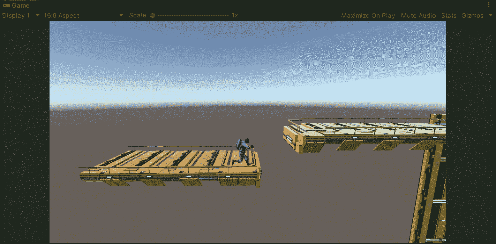

**目标**:执行一个动画后，使用动画状态来处理玩家的位置。

在上一篇文章中，我介绍了[如何用 Unity](https://fas444.medium.com/creating-a-ledge-grab-mechanic-unity-ec78c0c8fa40) 为我们的玩家创建一个抓岩架的机制。现在，是时候处理动画状态了，以便在我们的平台游戏中动画结束后处理玩家的位置。

# 当前动画状态

如果你没有看过我的上几篇帖子，我建议你去看看，以防你不知道如何用 Unity 添加新的动画:

 [## 创建壁架抓取机制| Unity

### 关于如何在 Unity 中创建壁架抓取机制的快速指南

fas444.medium.com](https://fas444.medium.com/creating-a-ledge-grab-mechanic-unity-ec78c0c8fa40)  [## 动画播放器| Unity

### 关于如何在 Unity 中制作 3D 播放器动画的快速指南

medium.com](/nerd-for-tech/animating-player-unity-5e04ba44fb19) 

在这些帖子中，我们为玩家实现了下一个动画状态:

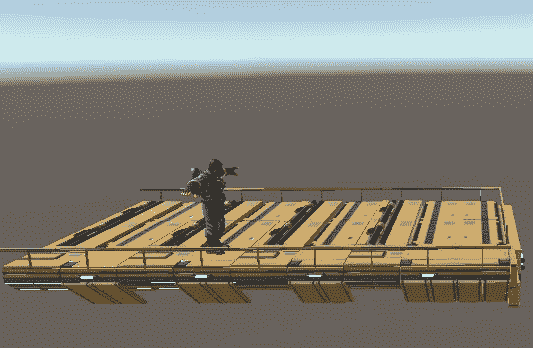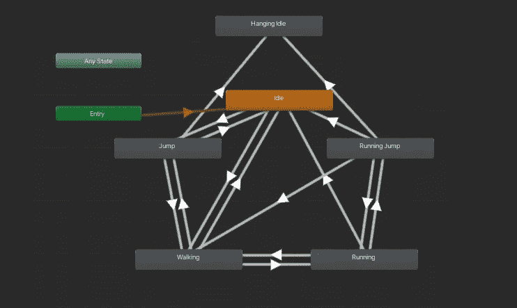

# 新动画

因此，为了跟进上一篇文章(其中我们实现了一个抓取壁架的动画)，让我们实现一个新的动画来显示我们的玩家爬上壁架:

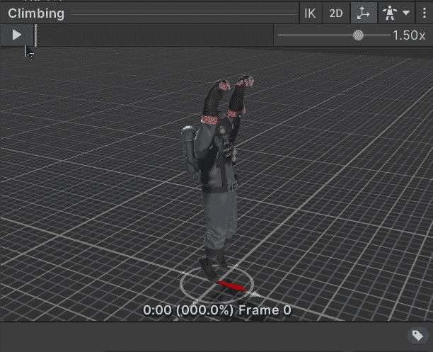

这部动画是从 [Mixamo](https://www.mixamo.com/) 免费获得的。

然后，为了在新状态下添加和处理动画，让我们:

*   将文件拖到 Animator 窗口中。
*   从壁架抓取动画创建新的过渡。
*   创建一个 Trigger 类型的新参数来触发动画。
*   选择来自壁架抓取动画的新过渡。
*   禁用 ***具有退出时间*** 属性，以避免在执行攀爬动画之前等待最后一个动画结束。
*   添加新的触发参数作为转换到爬升状态的条件。

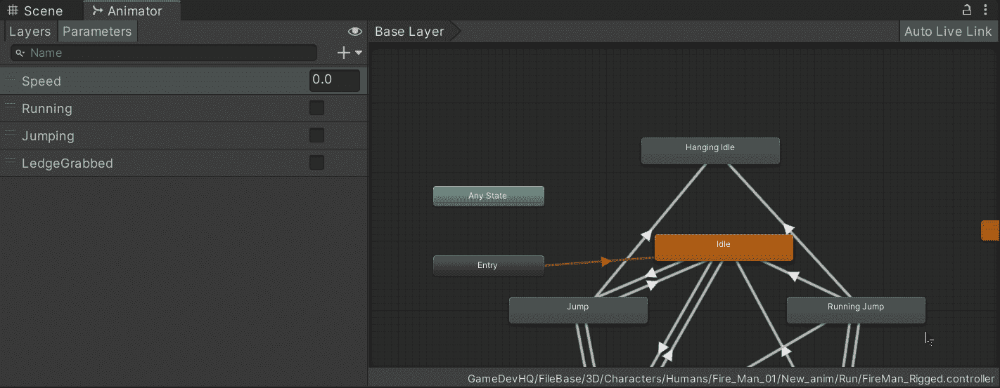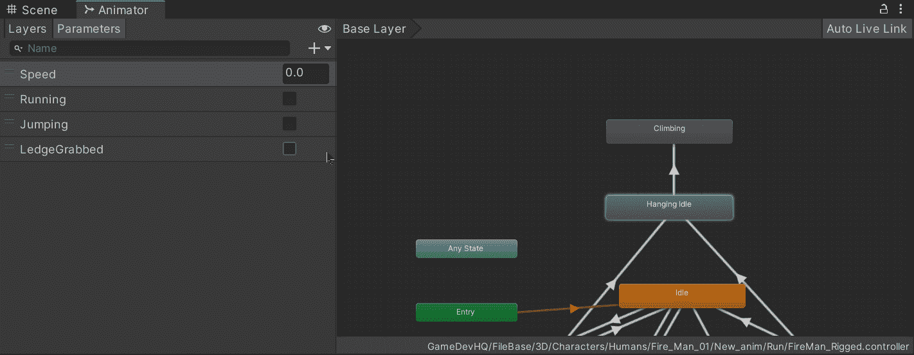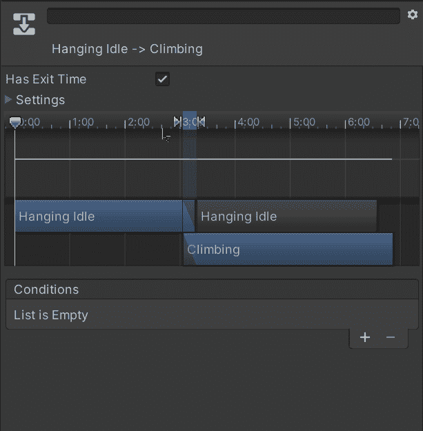

## 触发动画

现在，为了表明玩家当前正在抓取一个壁架(来自上一篇文章)，让我们打开玩家脚本并使用一个新的 bool:

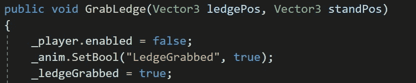

然后，为了在玩家向前移动时触发动画，让我们执行**更新**方法中的下一步:

*   检查玩家是否正在抓一个壁架。
*   检查玩家是否试图向前移动。
*   使用 animator 组件中的 **SetTrigger** 方法触发动画。

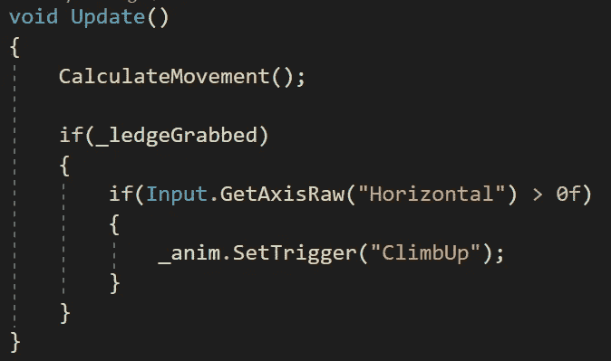

如果我们在 Unity 中运行游戏，我们会看到动画按预期执行，但是，在动画结束后还有一个细节。我们可以注意到玩家游戏对象(碰撞器)静止在壁架上，这是因为我们的动画被烘焙到该位置，因此它们不会影响根变换:

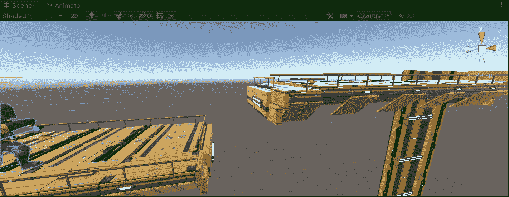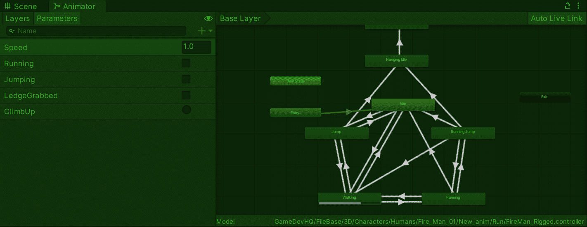

# 使用动画状态

那么，我们能做些什么来改变这种情况呢？……我们可以用动画状态来处理它！

首先，让我们创建一个从攀爬状态到空闲状态的新过渡，以便玩家在攀爬壁架后执行空闲动画。不要忘记将 ***已经退出*** 属性启用，因为动画需要在进入空闲状态之前完成:

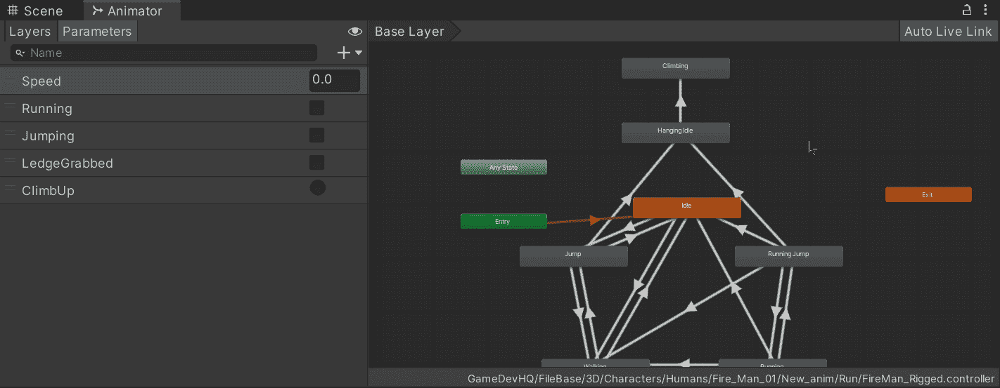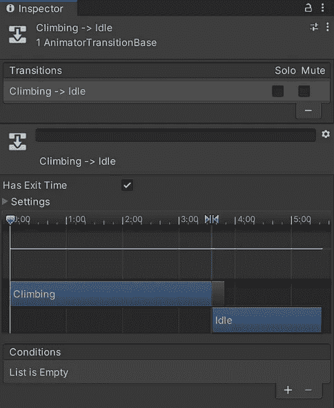

然后，为了在动画结束时改变玩家的位置，我们给攀爬状态添加一个**statemachinehaviation**script**组件:**

**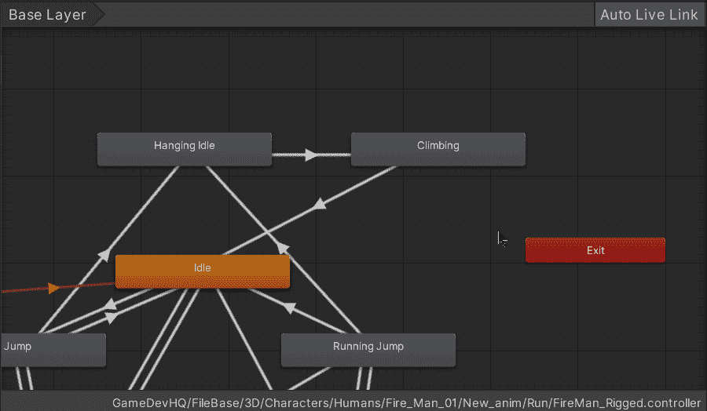****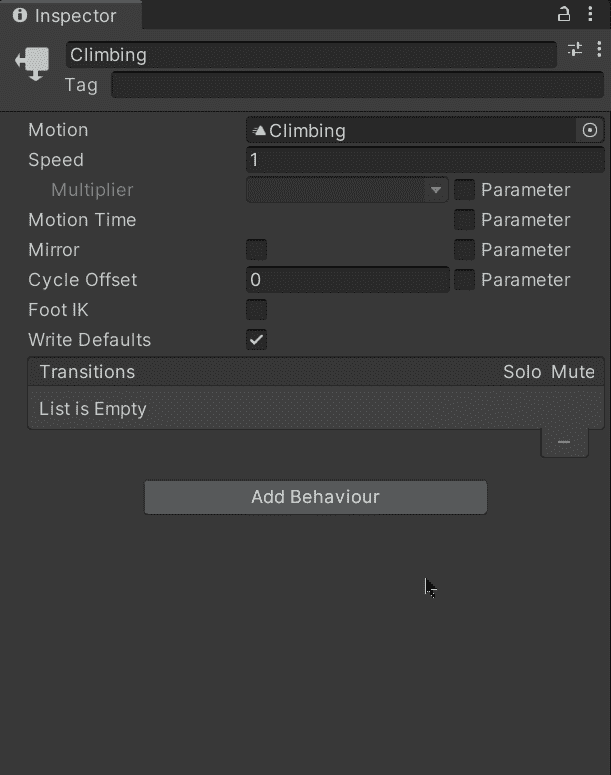**

**接下来，让我们创建一个新的空游戏对象来指示攀爬动画结束时玩家模型的确切位置:**

**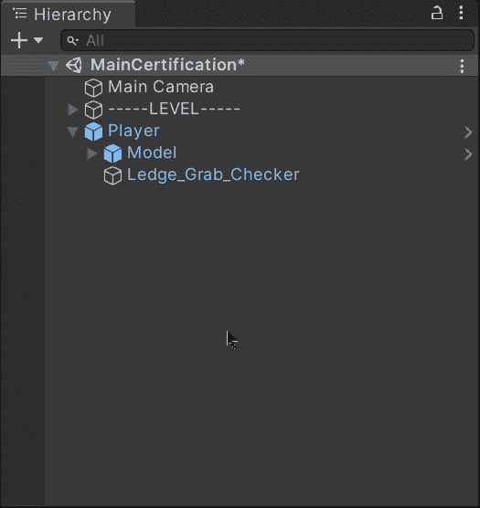****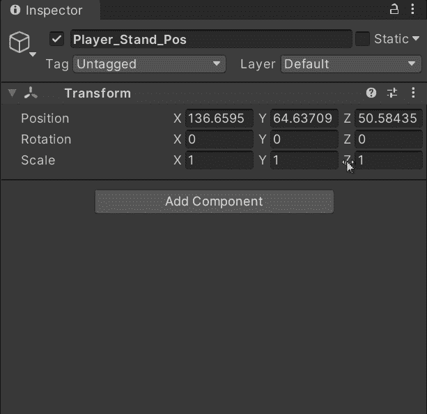****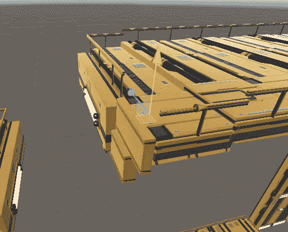**

**现在，让我们打开玩家脚本并创建一个新变量(除了新的 bool)来保存我们刚刚创建的 gameobject 的 **Vector3** 位置:**

**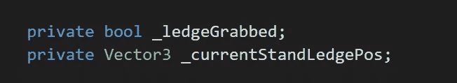**

**当我们执行每次玩家抓住壁架时被调用的公共函数时，我们将设置各自的位置:**

**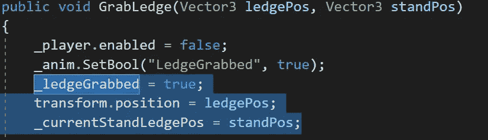**

**现在，让我们创建一个新的公共函数，它将在玩家爬上当前壁架时改变玩家的位置，并重新启用角色控制器组件以保持在平台上移动:**

**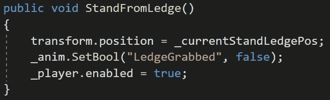**

**然后，让我们打开为攀爬动画状态创建的**statemachinehaviation**脚本:**

**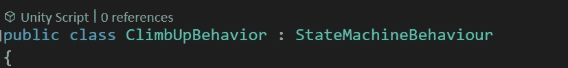**

**在这里，我们可以利用**onsteexit**方法在玩家退出攀爬状态时执行代码:**

**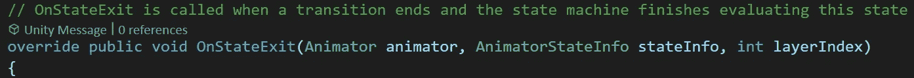**

**最后，由于我们可以访问我们的播放器的 animator 组件(从参数中)，我们可以从其父级(播放器)获取**播放器**脚本引用，并调用相应的公共函数来更改播放器的位置:**

**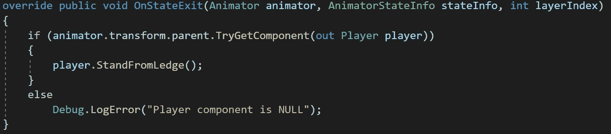**

**如果您想了解更多关于**状态机器行为**组件的信息，您可以访问 Unity 文档:**

** [## 状态机行为

### unity engine/Inherits from:ScriptableObject/建议更改感谢您帮助我们提高质量…

docs.unity3d.com](https://docs.unity3d.com/ScriptReference/StateMachineBehaviour.html) 

现在，如果我们在 Unity 中运行游戏，我们会看到在爬上壁架后动画状态按预期工作:

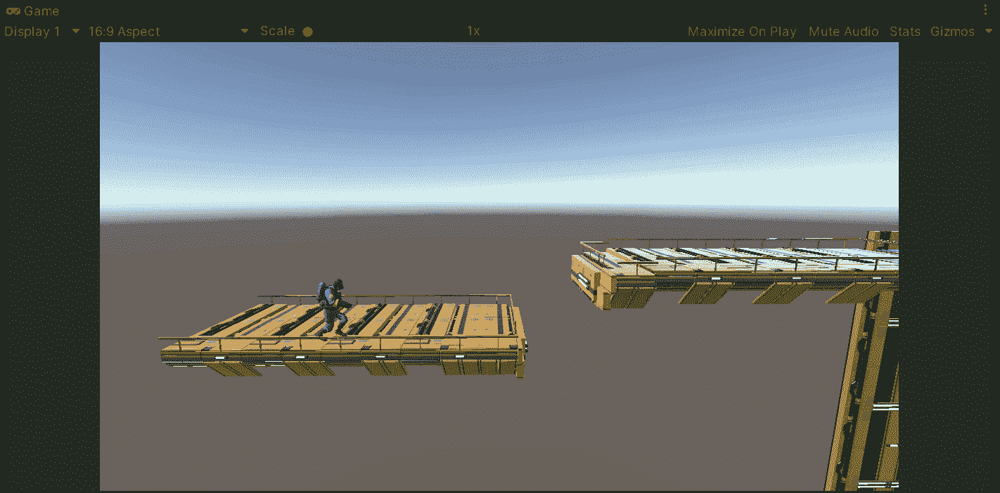

就是这样，我们用动画状态来统一处理玩家的位置！:d .我会在下一篇文章中看到你，在那里我将展示 Unity 平台游戏的新内容。** 

> ***如果你想了解我更多，欢迎登陆*[***LinkedIn***](https://www.linkedin.com/in/fas444/)**或访问我的* [***网站***](http://fernandoalcasan.com/) *:D****