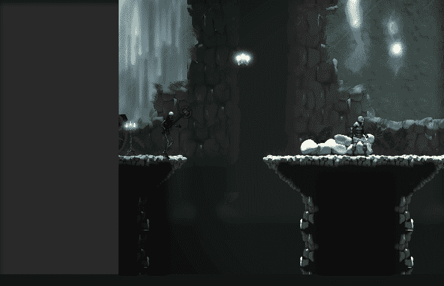
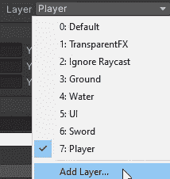
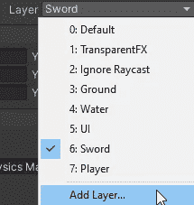
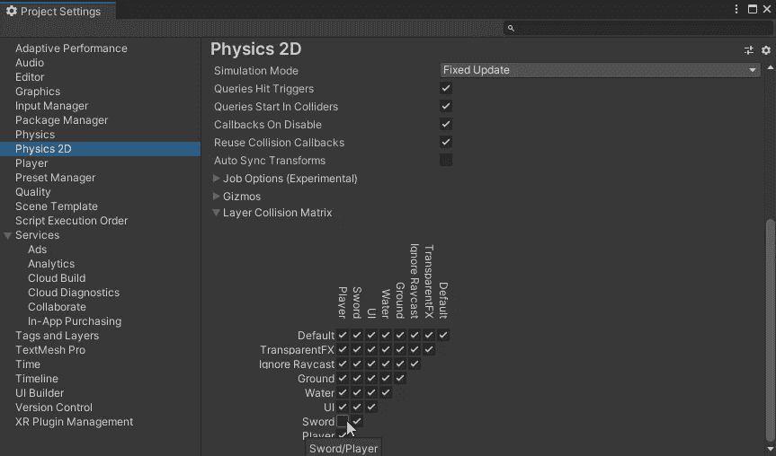
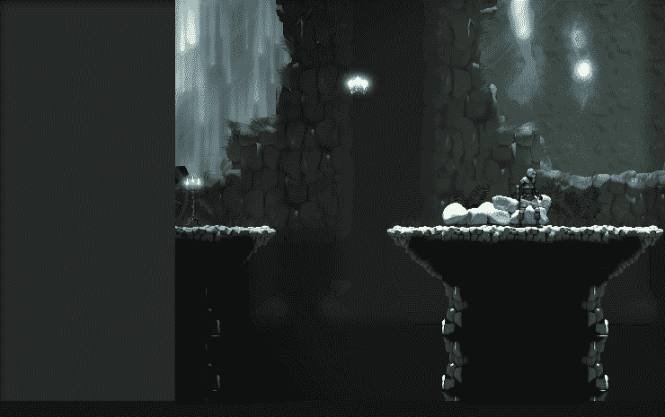

# 在 Unity 中使用碰撞层

> 原文：<https://medium.com/nerd-for-tech/working-with-collision-layers-in-unity-30390b8aff25?source=collection_archive---------17----------------------->

当我在构建我的 hitbox 和添加功能时，我发现当使用 **OnTriggerEnter2D** 时，当你挥剑时玩家碰撞器被击中。这不是你想要的，因为它会在玩家每次挥剑时伤害他们。

为了防止这种情况发生，我们将允许剑碰撞器在 Unity 中使用图层系统来忽略玩家碰撞器。开始创建一个名为 player 的新层。然后你将把玩家放在这一层。

现在创建一个剑层，把剑放在这个层上。

进入**编辑= >项目设置= >物理 2D** ，取消选择**层碰撞矩阵**中玩家和剑层相交的盒子。

这将允许剑碰撞器忽略玩家碰撞器，他们不会互动。

