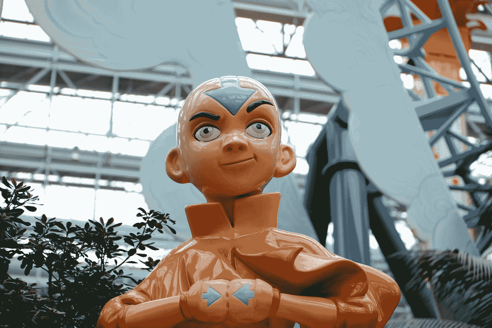

# 使用很酷的卡通头像

> 原文：<https://medium.com/nerd-for-tech/working-with-cool-cartoon-avatars-227470c938b9?source=collection_archive---------6----------------------->

我发现了一个很酷的卡通人物图书馆

帕曼南德·贾格南丹在 [Unsplash](https://unsplash.com?utm_source=medium&utm_medium=referral) 上的照片

## 在后台

今天的故事将会很短而且内容丰富。像往常一样，我们总是从引擎盖下的概念开始我们的故事。这里我们定义了我们是如何产生写这个故事的想法的。

我们正在为我们的[平台](http://ihatereading.in)上的开发者开发一个个人资料页面。我们想展示的不是用户图像，而是…