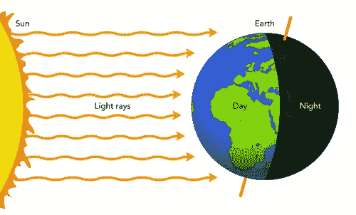
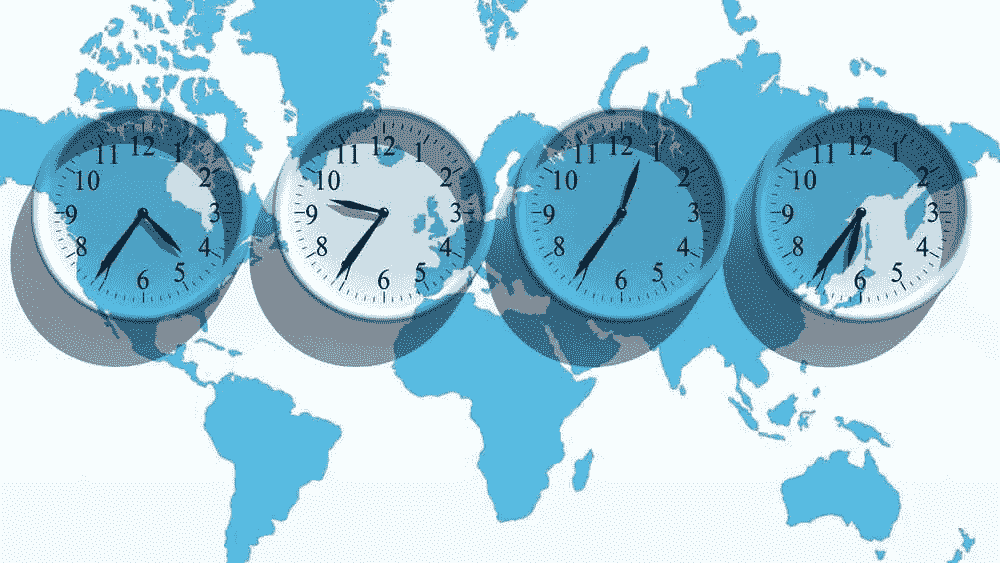
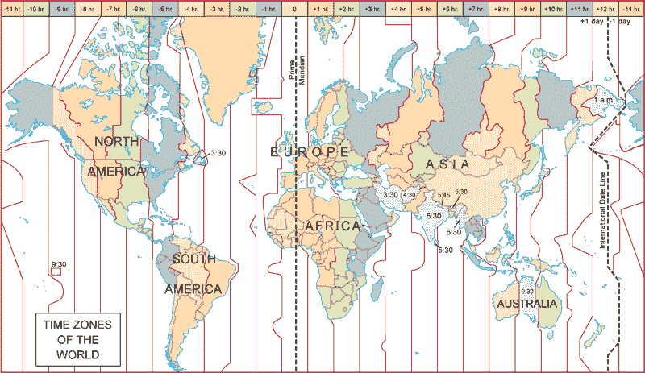
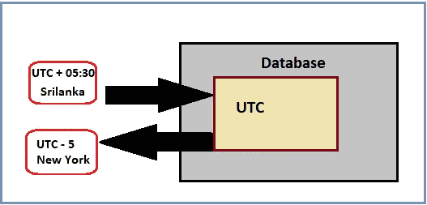

# 对软件工程师来说，处理日期和时间是非常重要的！为什么？😱

> 原文：<https://medium.com/nerd-for-tech/working-with-dates-and-time-are-so-much-important-to-software-engineers-why-2e4d7ef23a9?source=collection_archive---------11----------------------->

# 什么是“时区”👀

当太阳在世界上的一个国家升起时，对另一个国家来说就是日落。这是因为地球是一个球体。

图片说明:阳光照射地球的方式(参考:(“太阳能和地球的季节”|太阳与地球的关系| Siyavula)

为了使世界上每个人的时间都与太阳一致，引入了 ***时区*** 。根据时区，每一个**都会得到一个*偏移量。***

这个偏移量可以是正数，也可以是负数。

时区代表一个时区偏移量，它还计算出夏令时。

# ***UTC —通用协调时间***

这是英国的时区，被认为是世界标准时间。这个 UTC 不是一个时区，而是一个用来表示时区的标准。GMT(格林威治标准时间)没有 UTC 的偏移值。

*示例:斯里兰卡的时间可以通过在 UTC (UTC+ 05:30)上加 5 小时 30 分钟得到*

图片说明:带偏移数字的世界地图[Ref: V. profile，“时区”，*Scienceworldbang.blogspot.com*。【在线】。可用:[https://science world bang . blogspot . com/2021/01/time-zones . html](https://scienceworldbang.blogspot.com/2021/01/time-zones.html)

> 要记住的事情…🔊🔊

✦ *在两个不同的时区可以有相同的 UTC 时差。*

✦:同一个时区在两个不同的国家会有不同的表现。

✦:在同一个国家，不同的时区会有不同的表现。

# 世界上两种不同类型的时间

## ☀️Daylight 节约时间(DST)

这是一种在夏季将标准时间向前调一小时，然后在另一个月再调回来一小时的方式。(这是为了充分利用自然日光)

## ☀️ **标准时间**

这里，我们不使用 DST，而是用它来定义时区。

# 时区怎么处理？

我们通过下面的例子来了解一下 java 是如何处理时区差异问题的。

***举例:***

*假设我的服务器在斯里兰卡，访问应用程序的用户来自澳大利亚。所以当用户使用该应用程序时，他希望根据他的时区来查看时间。但是对于客户端和服务器位于同一时区的站点来说，这可能不是问题。当应用程序根据位于澳大利亚的客户端的斯里兰卡时间来表示服务器时间时，会出现此问题。那么* ***如何解决这类问题呢？***

*解决方案:*

***对于客户端:我们可以使用 javascript 库中的 date 类。在那里，您可以找到 getTimezoneOffset()方法。该方法将给出客户端的偏移值。例如，对于一个在斯里兰卡的客户，它将给出+5:30。然后，我们必须获取客户端的时区，并将其存储在 cookie 中，然后发送到服务器。***

***用于服务器端:从客户端获取数据(UTC 格式)后，将其改回用户的时区。***

> 重要提示…🔊🔊

🖌🖌我们可以使用 ***java。util。Timezone*** 类来解决这些类型的“时区”问题。 ***java。util。Timezone"*** 类可以表示时区偏移量，也可以发现夏令时。*(要获得关于时区类的更多信息，请参考以下 URL:*[【https://www.javatpoint.com/java-util-timezone】T21](https://www.javatpoint.com/java-util-timezone)*)*

🖌🖌还有，在 ***Java 8*** 中有改进的新库可以解决这类“时区”问题。(更多信息，*参考本网址:*[*https://www . javabrahman . com/Java-8/working-with-time-zones-in-Java-8-zoned datetime-zoneid-tutorial-with-examples/*](https://www.javabrahman.com/java-8/working-with-time-zones-in-java-8-zoneddatetime-zoneid-tutorial-with-examples/)*)*

下面是 java 8 中可用的一些类:

✦ ***偏移日期时间—*** *这将存储带有偏移值的时间和日期字段。*

✦ ***即时—*** *(但此类不包含偏移值)*

✦ ***时区日期***

🖌🖌我们不能用 ***java。util.date*** *包的时区问题，因为它不包含时区。*

> 💭因此，在开发应用程序时，我们应该遵循一些重要的提示💭

🔹始终以 UTC 格式设置服务器中的时区。

🔹以 UTC 格式存储时间和日期。

🔹向用户显示日期和时间时，总是将 UTC 转换为用户的本地时间。

🔹下面是在 Mysql 数据库中存储时区信息的方法。

