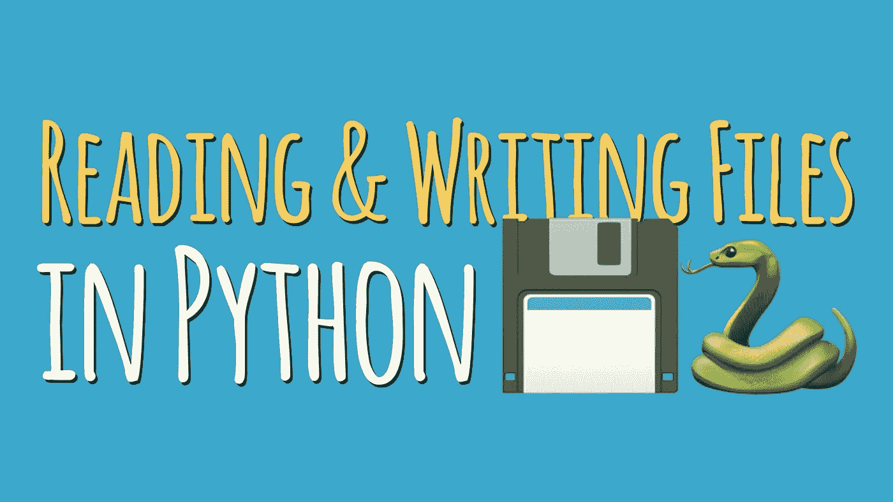

# 在 Python 中使用文件和目录

> 原文：<https://medium.com/nerd-for-tech/working-with-files-and-directories-in-python-2bd33cb993c2?source=collection_archive---------0----------------------->

Python 使得动态处理文件变得非常容易。这里我列出了一些最常用的处理文件的 python 内置模块和函数。



## 读取文件

**方法一:**

```
file = open("my_file.txt")
contents = file.read()
print(contents)
file.close()
```

**方法二:**

```
with open("my_file.txt") as file:
    contents = file.read()
    print(contents)
```

我们使用的第二种方法是 with open(…) as …”模式。在处理非托管资源(如文件流)时，使用“with”关键字。

在方法 1 中，我们在读取文件后显式关闭它。但是，“with”关键字本身负责“exit()”方法。

> 为了节省处理时间，我们用 with。不需要通过给 file.close()来关闭文件。“With”会自动关闭文件

## 写入文件

默认情况下，open 关键字的模式是“只读”。要写入，我们需要使用“写入”模式。

注意:它将删除文件中的旧内容，并用指定的新内容替换它。

```
with open("my_file.txt", mode ="w") as file:
    file.write("New Text.")
```

## 附加到文件

类似地，为了追加到文件中，我们将模式从“w”改为“a”。文件中的旧内容保持不变，而指定的新内容与旧内容一起被追加或添加到文件中。

```
with open("my_file.txt", mode ="a") as file:
    file.write("\nAppended content")
```

## 创建新文件

在处理文件时,“with”关键字是一个多用途关键字。如果文件不存在，它会自动创建一个新文件。

```
with open("code_with_ayush.txt", mode = "w") as file:
    file.write("new text")
```

## 删除文件

要删除文件，我们首先要导入操作系统模块。Python 中的 **OS 模块提供了与操作系统交互的功能。操作系统属于 Python 的标准实用程序模块。**

```
import os

delete_this_file = '<path of the file>'
os.remove(delete_this_file)
```

# 使用目录

## 获取当前路径

```
import os
print(os.getcwd())
```

os.getcwd() →获取当前目录

## 创建一个新目录

```
os.mkdir("new_dir")
```

os.mkdir →创建一个新目录

## 更改目录

```
os.chdir("new_dir")
```

## 在目录中创建一个新文件

```
open('index.html', 'x')
```

“x”类似于“w”。但是对于“x”，**如果文件存在，抛出 filexistserror**。对于“w ”,它将简单地创建一个新文件/截断现有的文件。

## 在路径层次结构中执行一步打包

```
os.chdir("../new_dir")
```

## 列出目录的内容

```
os.listdir("new_dir/website")
```

listdir →方法列出目录中的所有内容

## 检查内容是子目录还是文件

```
for name in os.listdir(dir):
    fullname = os.path.join(dir,name)
    if os.path.isdir(fullname):
        print(f"{fullname} is a directory")
    else:
        print(f"{fullname} is a file")
```

**os** 。**路径**。**智能连接 **Python 中的**()方法连接**一个或多个**路径**组件。

## 获取绝对路径

```
def parent_directory():

  # Create a relative path to the parent
  # of the current working directory
  relative_parent = os.path.join(os.getcwd(), os.pardir)
  # Return the absolute path of the parent directory
  return os.path.abspath(relative_parent)

print(parent_directory())
```

了解更多关于 os.path.join()方法的信息。我推荐这篇文章，我发现它非常有帮助。

## 移动文件和目录

```
>>> import shutil
>>> shutil.move('ayush/', 'code/')
'code'
```

如果`code/`存在，则`shutil.move('ayush/', 'code/')`将`ayush/`移动到`code/`。如果`code/`不存在，`ayush/`将被重命名为`code`

## 重命名文件和目录

```
os.rename('text.html', 'write.html')
```

上面的行将`text.html`重命名为`write.html`。如果目标路径指向一个目录，它将引发一个`OSError`。

你喜欢我的努力吗？如果是的话，请跟我来获取我的最新帖子和更新，或者更好的是，请我喝杯咖啡！☕

[](https://www.buymeacoffee.com/ayushdixit)