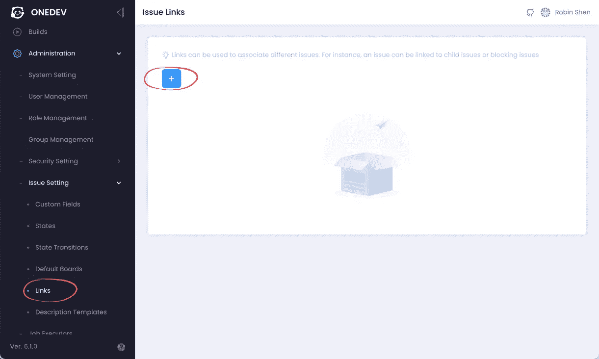
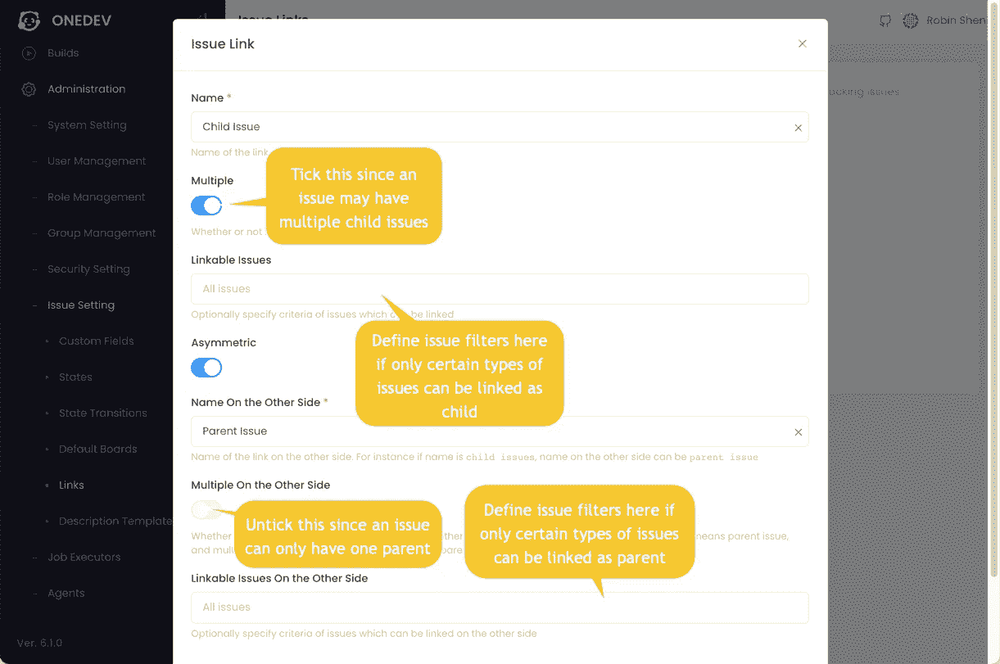
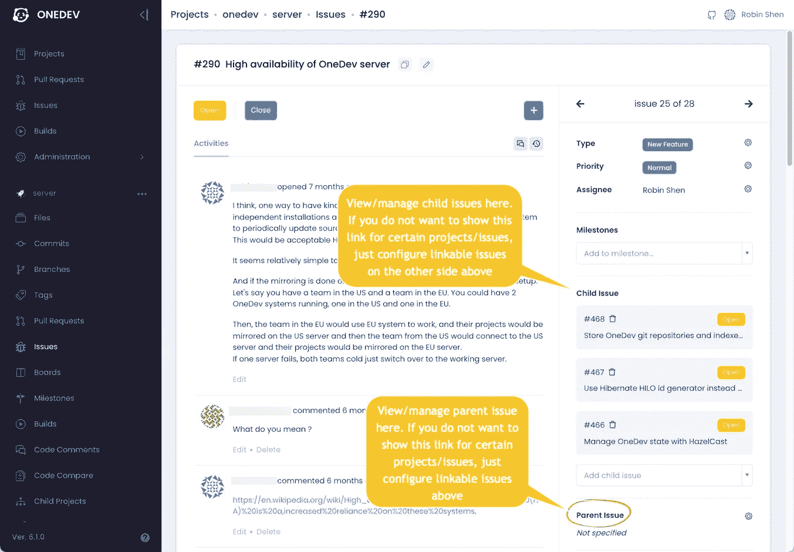
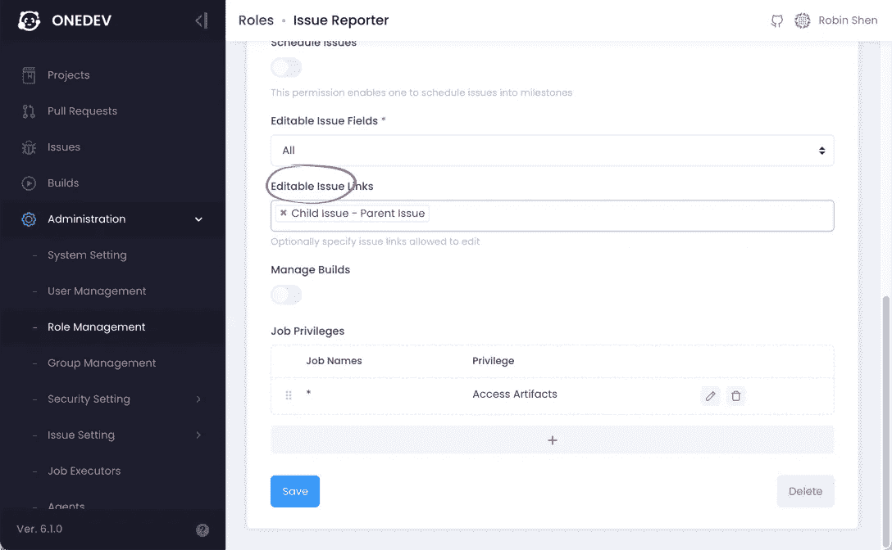
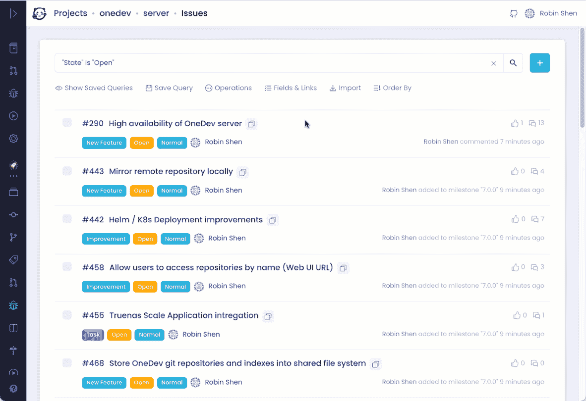
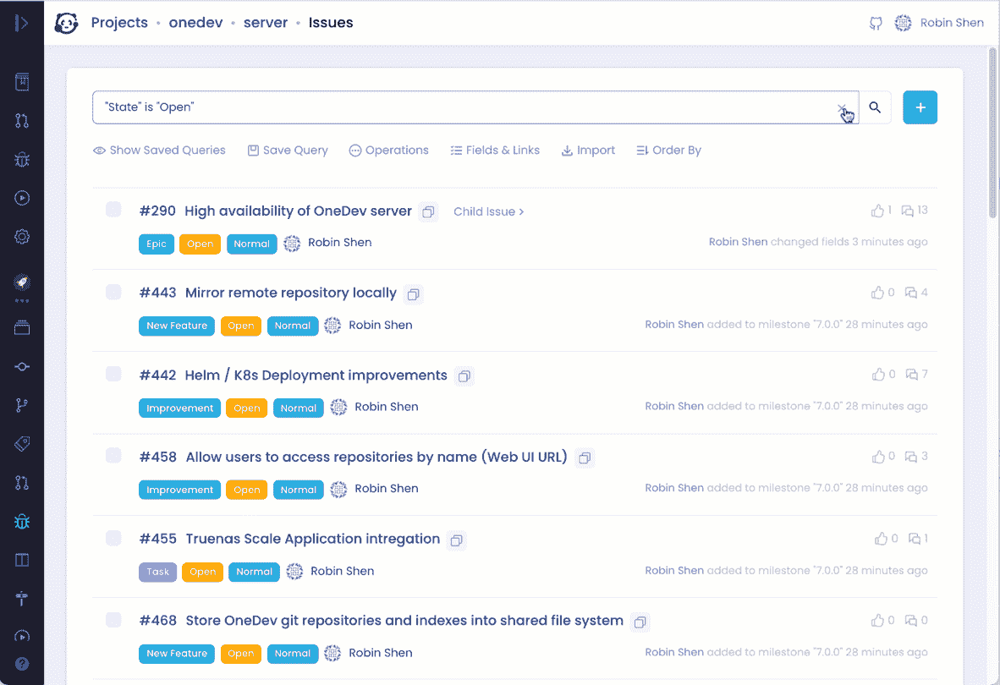
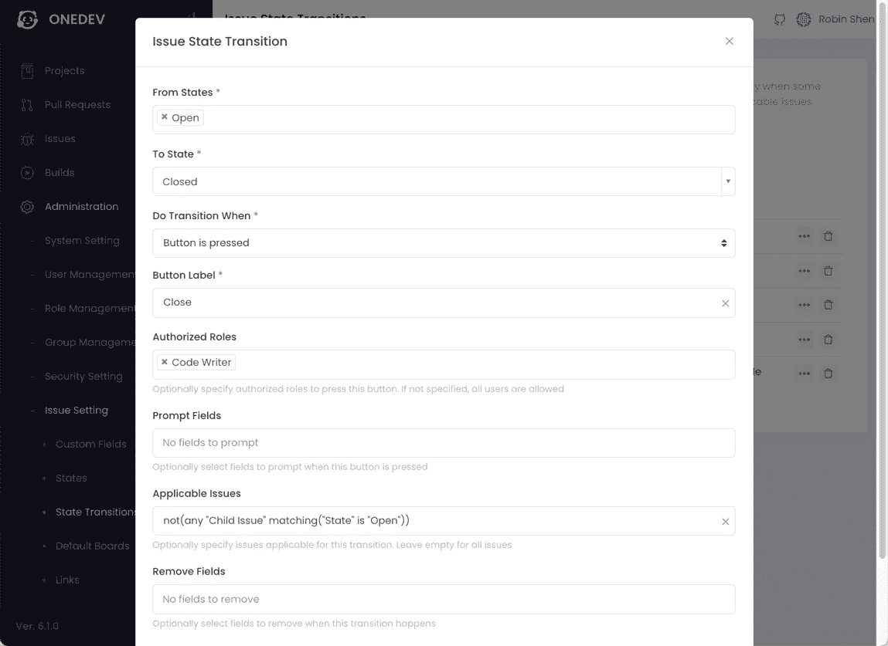
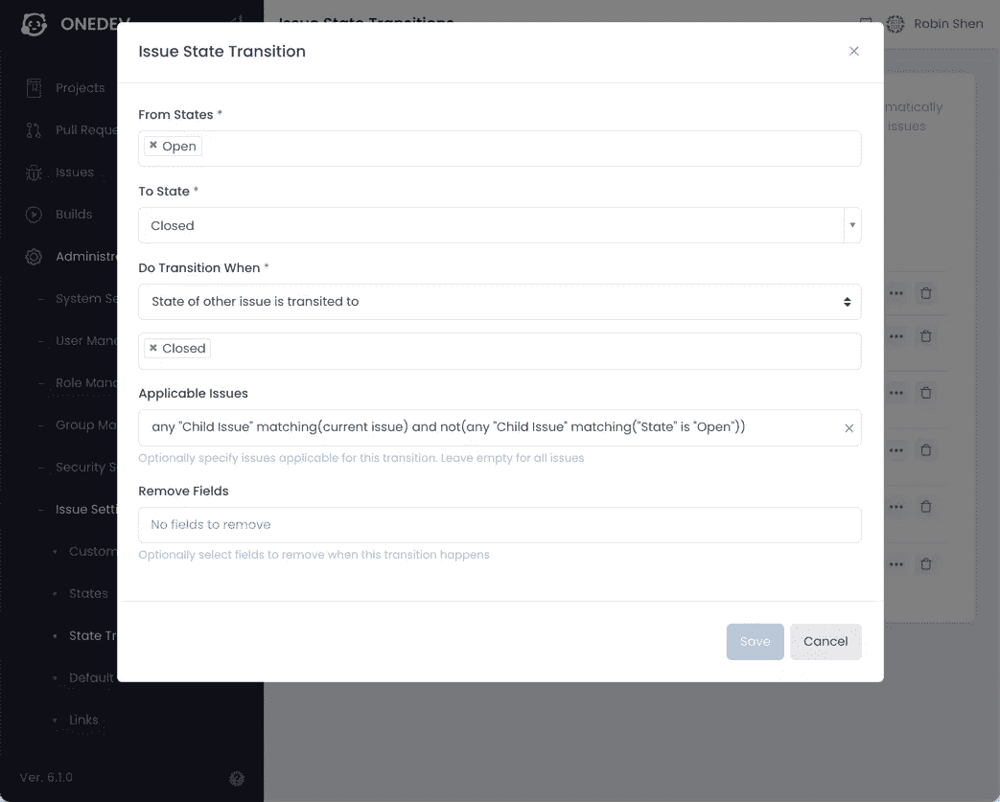
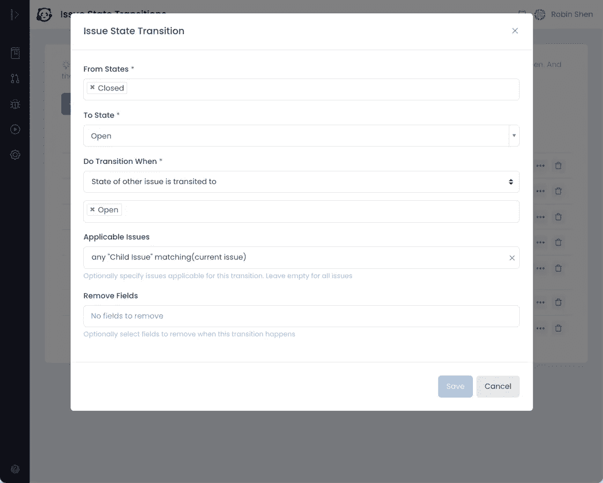

# 在 OneDev 中使用问题链接

> 原文：<https://medium.com/nerd-for-tech/working-with-issue-links-in-onedev-6bbf94ec0547?source=collection_archive---------5----------------------->

# 介绍

one dev 6.0 增加了问题链接的概念，以提供不同问题之间的交叉引用。问题状态转换还可以利用链接信息来使工作流更加顺畅，例如，如果某个问题的所有子任务都已完成，您可能希望自动关闭该问题，或者如果阻止该问题的任何问题仍处于打开状态，您可能希望阻止该问题关闭。

# 定义问题链接

可以从侧菜单*管理/问题设置/链接*中定义问题链接，如下所示:

让我们添加一个链接来模拟问题之间的父子关系:

# 链接问题

定义父/子链接后，您可以从问题详细信息页面管理问题父/子关系:

对于所有链接的问题，当前问题将自动链接到那些名称相反的问题(父->子，子->父)。

请注意，对于链接问题的普通用户，编辑链接的权限需要授予相关角色，如下所示:

只要您告诉 OneDev 显示这些链接，链接的问题也可以显示在问题列表和问题板上:

OneDev 强大而直观的查询语言还支持通过链接查询问题，例如查询所有带有打开子代的问题，或所有父代类型为 *Epic* 的问题等。

# 状态迁移

让我们利用上面定义的父子链接来改进我们的问题工作流程:

1.  如果某个问题的任何子问题仍处于打开状态，则阻止该问题关闭
2.  如果父问题的所有子问题都已关闭，则自动关闭父问题
3.  如果任何子问题被重新打开，则自动重新打开问题

所有这些都可以通过侧菜单*管理/问题设置/状态转换定制问题状态转换规则来完成。*

对于第一个要求，在按下“关闭”按钮时，编辑从*打开*到*关闭*的现有状态转换规则，并指定如下适用问题:

对于第二个要求，添加一个从*打开*到*关闭*的新状态转换规则，如下所示:

对于第三个要求，添加一个从*关闭*到*打开*的新状态转换规则，如下所示:

这就是我们改进的问题工作流程。凭借完全可定制的问题状态、字段、链接和状态转换规则，OneDev 具有足够的灵活性来适应不同的工作流。

感谢阅读！