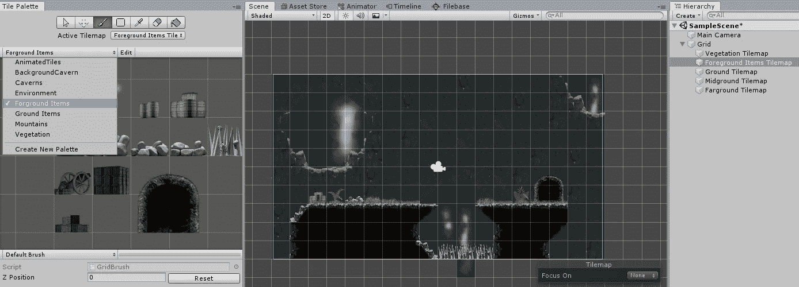
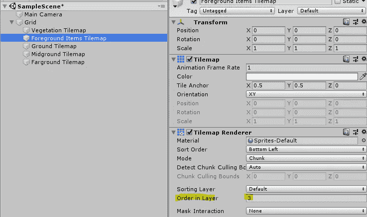
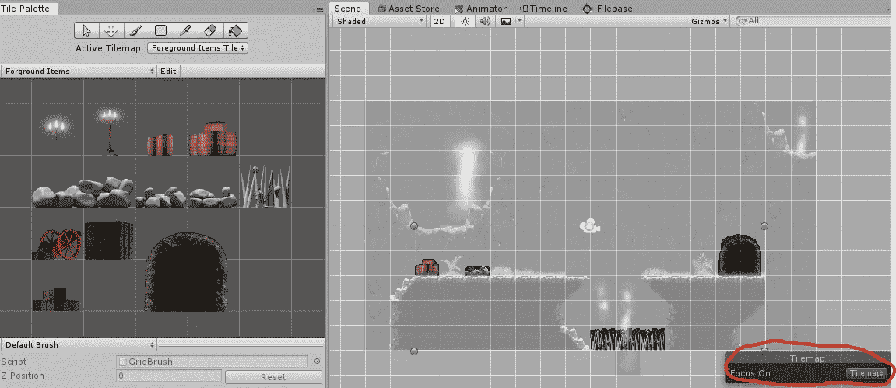

# 在 Unity 中使用多个拼贴调色板

> 原文：<https://medium.com/nerd-for-tech/working-with-multiple-tile-palettes-in-unity-cd536df04fb6?source=collection_archive---------26----------------------->

**目标:**使用多个 tile 调色板创建不同的 tilemap 层。

我们可以继续创建新的调色板和 tilemaps。在图层属性中设置一个 tilemap 的*顺序将使其呈现在其他 tile map 的前面或后面(较大的数字在较小的数字前面)。*

我们可以将上的*焦点设置为 *Tilemap* 来突出显示我们正在处理的当前 Tilemap。*

