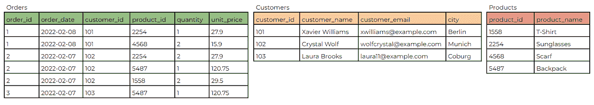
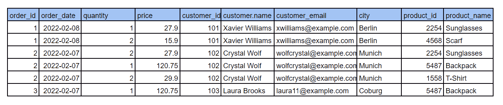
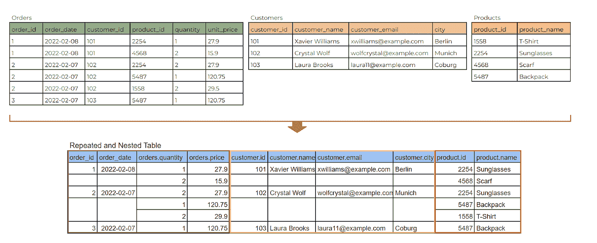
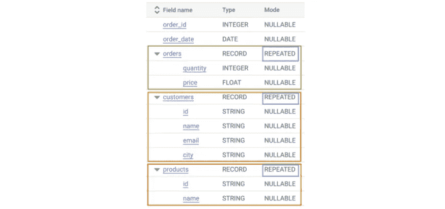
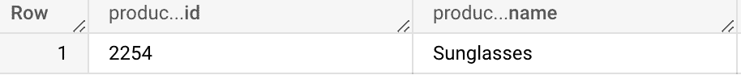
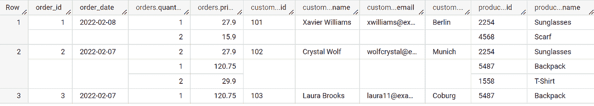
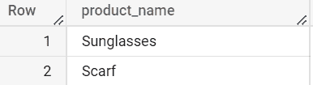
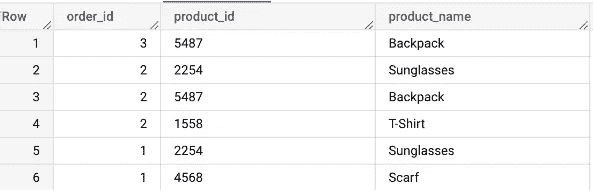
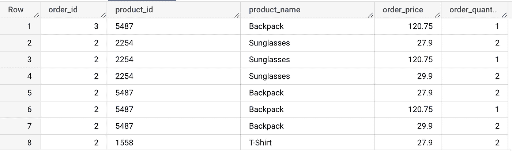
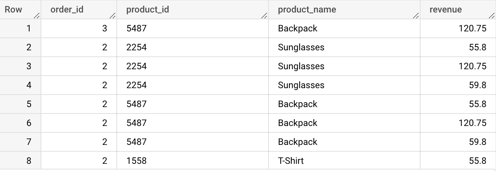

# 在 BigQuery 中使用嵌套和重复字段

> 原文：<https://medium.com/nerd-for-tech/working-with-nested-and-repeated-fields-in-bigquery-2eccc2641ee2?source=collection_archive---------0----------------------->

## BigQuery 嵌套和重复数据的内容、原因和方式。由[法西尔·s·叶瓦拉](https://de.linkedin.com/in/fassil-s-yehuala/)和[桑尤克塔·苏曼](https://de.linkedin.com/in/sanyuktasuman)

照片由[约瑟夫·柯勒](https://unsplash.com/@onetdev)在 [Unsplash](https://unsplash.com?utm_source=medium&utm_medium=referral) 拍摄

如果您曾经使用过嵌套和重复的列，并且发现它们有点困难，那么本文适合您。在这篇博客中，我们解释了 BigQuery 中这类字段的本质。我们将详细讨论为什么它们在数据仓库中是首选的，以及如何创建和查询它们。让我们从定义什么是嵌套和重复字段开始。

# 什么是嵌套数据？

在关系数据库中，数据的组织方式使得关键数据点之间的关系很容易识别。例如，如果我们想分析客户的购买行为，我们可以从包含客户、产品和订单交易信息的三个表中获取信息。“产品”表中的单个产品在“订单”表中可以有多行，这使得很难将数据放在一行中。以最小化数据冗余并增强数据完整性的方式组织关系数据库的过程称为规范化。

对于数据仓库，数据分析师和工程师通常感兴趣的是采用非规范化的方法，将几个独立的表合并成一个没有任何数据冗余的大型报告表。Google 的 BigQuery 提供了一种使用嵌套和重复字段来处理这些过程的方法。

让我们看一个嵌套和重复数据的例子。数据由以下字段组成:

*   身份证明（identification）
*   名字
*   位置
*   位置.城市
*   位置.国家

下面是上面例子中 JSON 数据文件的样子。

{"id":"1 "，"姓名":"泽维尔·威廉姆斯"，"地点":["城市":"柏林"，"国家":"德国"]}

{"id":"1 "，"姓名":"水晶狼"，"地点":["城市":"慕尼黑"，"国家":"德国"]}

基本上，嵌套数据是每个位置内的多个字段，重复数据是多个位置。

# 为什么要嵌套和重复字段？

现在让我们仔细看看 BigQuery 中的嵌套和重复字段，然后看看为什么这是数据分析师和工程师如此流行的设计。我们将通过一个运行在 Google Cloud 上的电子商务示例来说明这一点。该公司将交易订单存储在 BigQuery 的“orders”表中。

*   每个订单都包含关于产品和下订单的客户的信息
*   一个订单可以有一个或多个产品
*   提供下特定订单的客户的详细信息的数据

作为一名数据分析师或工程师，如何在数据仓库中高效地存储这些不同的信息？请注意，该公司需要支持每天请求大量数据的庞大用户群。

如下图 1 所示，一种方法是我们可以将每个事实存储在一个地方，这在关系数据库管理系统中很常见。那么这种方法的缺点是什么呢？当使用通信程序时，我们需要将来自不同位置的数据汇集在一起进行分析。这需要大量的加入。连接，尤其是在非常大的表的情况下，意味着大量的分析工作，因此是昂贵的。这是因为 DBMS 是基于记录的，它们必须完全打开每个记录，并从它所连接的表中提取连接键。

规范化模式

另一种方法是，我们可以走完全非规范化的路线，将所有级别的粒度存储在一个大表中。虽然它加快了数据读取的速度，但是这个选项有几个缺点。在图 2 所示的模式中，重复了每个订单共有的信息。这意味着我们在分析不同粒度级别的数据时必须非常小心。在计算时，我们必须小心不要重复或重复计算。

完全反规范化模式

这就是嵌套和重复数据字段派上用场的地方。我们可以为每个订单设置一行，并在一行中设置重复值以获得更详细的数据。例如，下面重复和嵌套的表格清楚地显示了只有三行用于三个唯一的订单 id。

使用嵌套和重复字段对数据进行反规范化

如果您第一次看到一个嵌套的重复表，如图 3 所示，您可能会对“orders.price”这样的列名感到疑惑，并问自己“这些列名中的句点是干什么的？”在 SQL 中，带点的列称为 STRUCT 或结构化数据类型。我们可以将它们视为表中的预连接表。我们可以将产品、订单和客户放在一个大表上，而不是用一个单独的表。

BigQuery 架构中的结构

通过使用 STRUCT，我们简化了查询，因为数据在概念上是预先连接的。BigQuery 基于列的特性使得拥有一个包含重复和嵌套字段的大表成为最有效和最划算的选择。例如，如果我们想知道订购的总数量，BigQuery 通过访问“order.quantity”列返回所需的结果，而不必查看其他列。对于分析师来说，在一个地方拥有大量数据并能够轻松地分析数据而不受多粒度问题的阻碍是一个非常理想的特性。

结构是可以嵌套多个字段和数据类型的容器。数组可以是结构中的一种字段类型。请注意行之间的空白区域，这是因为有些列的粒度更深，这意味着这些列有多个重复值。数组是处理重复值并将数据存储在一行中的理想数据类型。在架构中，通过观察数组数据类型在表架构中的模式，可以将数组数据类型标识为重复的。

BigQuery 模式中的数组

这里需要注意的一点是，SQL 中的 STRUCT 和 ARRAY 数据类型是相互独立的。一个表可能有一个与任何结构都没有关系的数组列。此外，也可以是没有数组字段的结构。我们想同时使用它们，因为我们想利用它们的独特功能。虽然数组允许我们深入不同的粒度级别，但 STRUCT 通过将相关字段预先连接在一起，帮助我们走得更远。

# 何时使用嵌套和重复字段？

当我们的表小于 10 千兆字节时，传统的关系数据库系统是有优势的。因此，最好保持表格的规范化。大小越小，连接对性能的影响就越小。但是，随着数据的增长，连接对性能的影响也会增加。在这种情况下，对我们的数据进行反规范化将是理想的选择。根据经验，10gb 是一个阈值。

# 如何创建嵌套重复字段？

让我们试试 STRUCT 语法并创建一个表。

> 挑选
> 
> 结构(' 2254 '作为 id，
> 
> “太阳镜”作为产品

因为“id”和“name”是产品的子集，所以我们有一个点符号。

运行下面的查询将创建如图 3 所示的重复嵌套表。

> 创建或替换表格
> 
> database.table 作为(
> 
> 选择 1 作为订单标识，
> 
> 日期(' 2022–02–08 ')作为订单日期，
> 
> [STRUCT(1 作为数量，27.90 作为价格)，
> 
> STRUCT(2 作为数量，15.90 作为价格)]作为订单，
> 
> [STRUCT('101 '作为 id，' Xavier Williams '作为名称，' xwilliams@example.com '作为电子邮件，' Berlin '作为城市)]作为客户，
> 
> [结构(' 2254 '作为 id，'太阳镜'作为名称)，
> 
> 结构(“4568”作为标识，“围巾”作为名称)]作为产品
> 
> 联合所有
> 
> 选择 2 作为订单标识，
> 
> 日期(' 2022–02–07 ')作为订单日期，
> 
> [STRUCT(2 作为数量，27.9 作为价格)，
> 
> STRUCT(1 表示数量，120.75 表示价格)，
> 
> STRUCT(2 作为数量，29.90 作为价格)]作为订单，
> 
> [STRUCT('102 '为 id，' Crystal Wolf '为名称，' wolfcrystal@example.com '为电子邮件，' Munich '为城市)]作为客户，
> 
> [结构(' 2254 '作为 id，'太阳镜'作为名称)，
> 
> 结构(id 为“5487”，名称为“Backpack”)，
> 
> 结构(id 为' 1558 '，名称为' T-Shirt)]
> 
> 联合所有
> 
> 选择 3 作为订单标识，
> 
> 日期(' 2022–02–07 ')作为订单日期，
> 
> [结构(数量为 1，价格为 120.75)
> 
> ]作为命令，
> 
> [STRUCT('103 '作为 id，' Laura Brooks '作为姓名，' laura11@example.com '作为电子邮件，' Coburg '作为城市)
> 
> ]作为客户，
> 
> [结构(' 5487 '作为 id，' Backpack '作为名称)]

# 如何查询嵌套重复的字段？

查询嵌套和重复的字段有点棘手。让我们尝试查询一个 ID 为 101 的客户购买的产品的名称。

> 挑选
> 
> products.name 作为产品名称
> 
> 来自“数据.表格”
> 
> 其中 customers.id = "101 "

上述查询将引发以下错误:

*“无法访问具有类型数组<结构< id 字符串、名称字符串、电子邮件字符串、… > > at [4:17]”的值的字段 id。*

由于重复的字段(数组)存储在一行中，我们需要首先将它们分成行，这样我们就可以正常地查询它们。为了从 BigQuery 的重复字段中提取信息，我们必须使用一种更奇特的模式。这通常使用 UNNEST 函数来完成，该函数将表中的值数组转换为行。这个 unnest 函数有助于扁平化数据，使得访问嵌套数据更加容易。

现在，让我们尝试使用 UNNEST 来解决前面的错误。

> 挑选
> 
> p.name 作为产品名称
> 
> 从“数据表”作为 t1，
> 
> UNNEST(t1.products)作为 p，
> 
> UNNEST(t1.customers)作为 c
> 
> 其中 c.id = "101 "

让我们看更多的例子。以下查询将从嵌套和重复的数据中提取 product_id 和 product_name。

> 挑选
> 
> 订单 id，
> 
> p.id 作为产品标识，
> 
> p.name 作为产品名称
> 
> 从“数据表”t1，
> 
> UNNEST(t1.products)作为 p

同样，让我们从订单字段中提取出**订单价格**和**订单数量**

> 挑选
> 
> 订单 id，
> 
> p.id 作为产品标识，
> 
> p.name 作为产品名称，
> 
> o.price，
> 
> o .数量
> 
> 从“数据表”t1，
> 
> UNNEST(t1.products)作为 p，
> 
> 取消嵌套(t1.orders)作为 o

> 用 t1 作为(
> 
> 挑选
> 
> 订单 id，
> 
> p.id 作为产品标识，
> 
> p.name 作为产品名称，
> 
> o.price AS order_price，
> 
> o .订单数量 _ 数量
> 
> 从“数据表”t1，
> 
> UNNEST (t1.products)作为 p，
> 
> 取消嵌套(t1.orders)作为 o
> 
> )
> 
> 挑选
> 
> t1。订单 id，
> 
> t1。产品标识，
> 
> t1 .产品名称，
> 
> t1 .订单价格*t1 .订单数量作为收入
> 
> 从 t1 开始

既然您已经熟悉了嵌套数据和 unnest 函数。让我们从数据库中计算出卖出的最多的产品

> 用 t1 作为(
> 
> 挑选
> 
> 订单 id，
> 
> 将数量计数为已订购数量，
> 
> SUM((o.price)*(o.quantity))作为总收入
> 
> 从“数据表”t1，
> 
> 取消订单作为订单
> 
> 按 1 分组
> 
> 由 DESC 订购
> 
> )
> 
> 挑选
> 
> t1 .订单 id，
> 
> t1。订购数量，
> 
> t1 .总收入
> 
> 从 t1 开始

就是这样！现在轮到你使用你所学的知识来查询复杂的数据了。

这里有几个开源数据供您在 BigQuery 中实践。

*   [谷歌商品商店数据](https://www.kaggle.com/code/alexisbcook/nested-and-repeated-data/data)
*   [Dogecoin 交易数据](https://cloud.google.com/blog/topics/public-datasets/bitcoin-in-bigquery-blockchain-analytics-on-public-data)

# 结论

本文向您介绍了 BigQuery 嵌套字段&重复字段所需的步骤。此外，您了解了什么以及如何创建和查询 BigQuery 嵌套和重复字段。

随着您的数据仓库 Google BigQuery 的上线和运行，您将需要从多个平台提取数据来执行您的分析。然而，整合和分析来自各种数据源的数据可能具有挑战性，这就是 datadice 的用武之地。

访问我们的网站，了解更多关于 [datadice](https://www.datadice.io/) 及其数据服务的信息。

# 本月即将发布的 datadice 博客文章

*   [谷歌数据分析的最新更新(2022 年 10 月)](/geekculture/latest-updates-on-google-data-analytics-october-2022-54b82047112a?source=your_stories_page-------------------------------------)
*   [以正确的方式处理谷歌分析 4 (GA4)数据中的会话和约定](/nerd-for-tech/handle-sessions-and-engagements-in-the-google-analytics-4-ga4-data-in-a-correct-way-d55cc988efee?source=your_stories_page-------------------------------------)

# 更多链接

查看我们的 [LinkedIn](https://www.linkedin.com/company/datadice) 账户，深入了解我们的日常工作生活，并获得关于 BigQuery、Data Studio 和营销分析的重要更新。

我们也从我们自己的 YouTube 频道开始。我们讨论了重要的 DWH、BigQuery、Data Studio 和许多其他主题。点击查看频道[。](https://www.youtube.com/channel/UCpyCm0Pb2fqu5XnaiflrWDg)

如果你想了解更多关于如何使用 Google Data Studio 并结合 BigQuery 更上一层楼，请查看我们的 Udemy 课程[这里](https://www.udemy.com/course/bigquery-data-studio-grundlagen/)。

如果您正在寻求帮助，以建立一个现代化的、经济高效的数据仓库或分析仪表板，请发送电子邮件至 hello@datadice.io，我们将安排一次通话。

*最初发布于*[*https://www . data dice . io*](https://www.datadice.io/nested-and-repeated-fields-in-bigquery)*。*