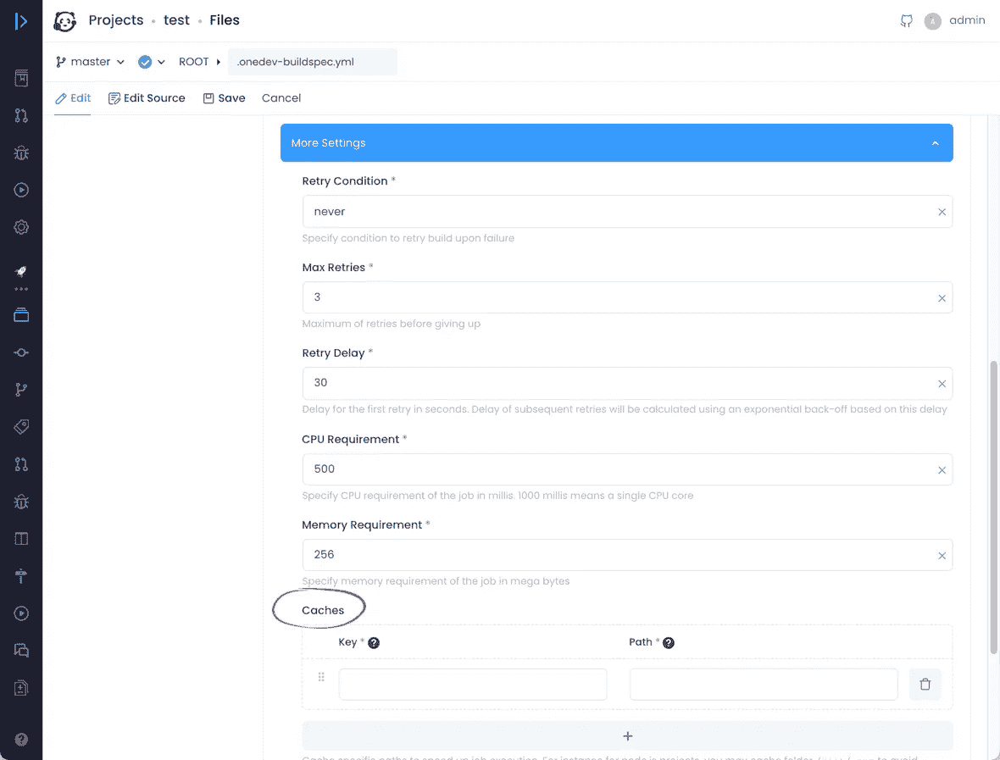
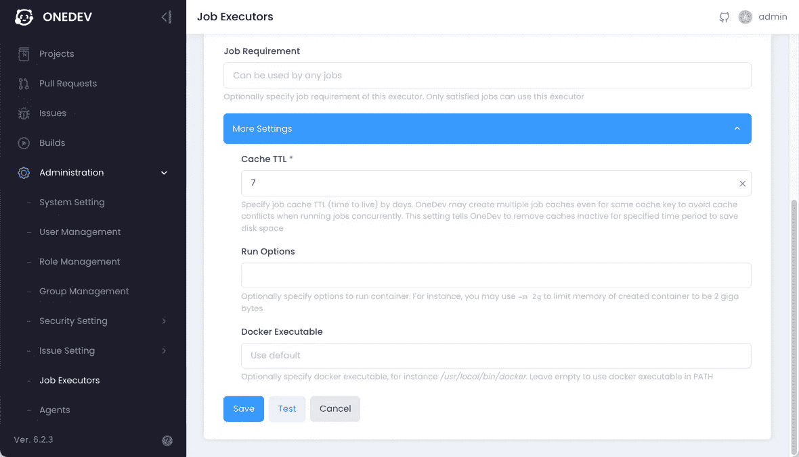
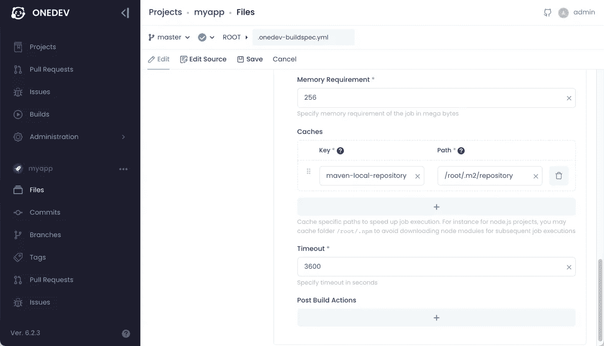
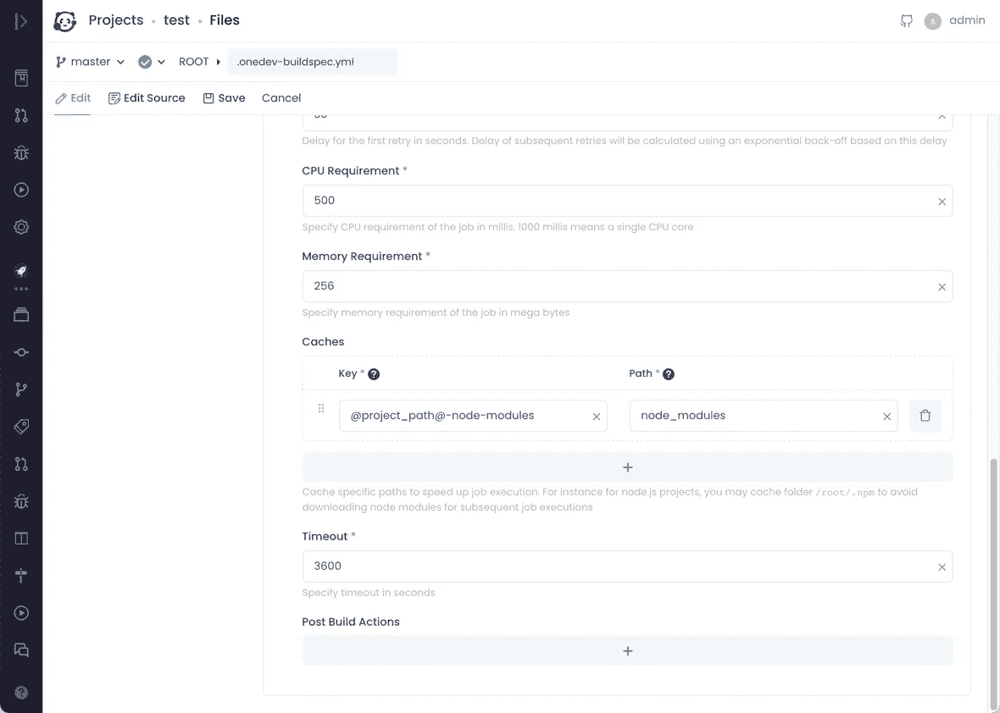

# 使用 OneDev 缓存

> 原文：<https://medium.com/nerd-for-tech/working-with-onedev-cache-5d84cefc9a3?source=collection_archive---------2----------------------->

在容器中运行的 CI/CD 作业总是从干净的环境开始，并且可能会很慢，因为它不能重用在作业的上一次运行中下载/生成的文件。为了解决这个问题，OneDev 提供了缓存指定容器目录的能力，使它们能够在不同的作业运行中存活。

# 定义作业缓存

可以在作业的*更多设置*中定义缓存，如下图:

这里缓存键标识一个缓存。具有相同键的缓存可以跨不同的项目或作业重用，即使路径不同，而具有不同键的缓存即使路径相同也不会被重用。

# 它是如何工作的

缓存位于运行作业的节点的本地。如果一个作业在节点 1 上运行以填充缓存，如果后续运行发生在节点 2 上，它将不会受益于该缓存，除非节点 2 上的缓存也被填充。在幕后，OneDev 分配一个由缓存键标识的主机目录，并将其作为缓存路径挂载到容器中，这样在作业容器被销毁后，它就不会被销毁。

此外，如果有多个作业在同一节点上并发运行，声明相同的缓存键，OneDev 将在该键下分配多个主机目录，以确保单个缓存目录在同一时间仅由单个作业使用，从而避免争用情况。由于这会消耗大量磁盘空间，作业执行器中定义的缓存 TTL 会告诉 OneDev 何时清理未使用的缓存目录:

默认情况下，OneDev 会自动发现作业执行器，默认缓存 TTL 是一周。创建适当的作业执行器，并在必要时覆盖缓存 TTL。

# 示例设置

让我们在本节中检查一些示例设置。

1.缓存 Java 项目的 maven 本地存储库

一个典型的 Java maven 项目可能会下载很多依赖项，这可能会花费很多时间。缓存保存下载依赖项的 maven 本地存储库至关重要。在容器中运行时，maven 本地存储库通常放在 */root/.m2/repository* 中，因此我们可以添加一个缓存条目，如下所示:

所有 Maven 项目的缓存键应该是相同的，因为我们希望尽可能多地重用缓存

2.缓存 JavaScript 项目的 npm 包

一个典型的 JavaScript 项目也会下载许多 npm 包，通常保存在项目根目录下的目录 *node_modules* 中。我们可以缓存这个目录来加速 *npm 安装*，如下所示:

在这个例子中，我们将项目路径嵌入到缓存键中，使它只能在同一个项目中重用。这是因为不同的项目可能有非常不同的依赖关系。虽然 *npm 安装*将重新同步已挂载的 *node_modules* 以确保它们与当前的 *package-lock.json* 一致，但是如果缓存先前被不同的项目使用，缓存中的太多文件可能需要更改，这可能会使 *npm 安装*运行缓慢。

请注意，如果作业在 Kubernetes 集群中运行，缓存 *node_modules* 将导致构建失败，因为相对路径缓存是通过符号链接设置的，许多 npm 包对此处理得不好。在这种情况下，建议缓存 */root/。取而代之的是 npm* ，缓存键不应该包含项目路径，因为全局 npm 缓存是以累积的方式工作的。