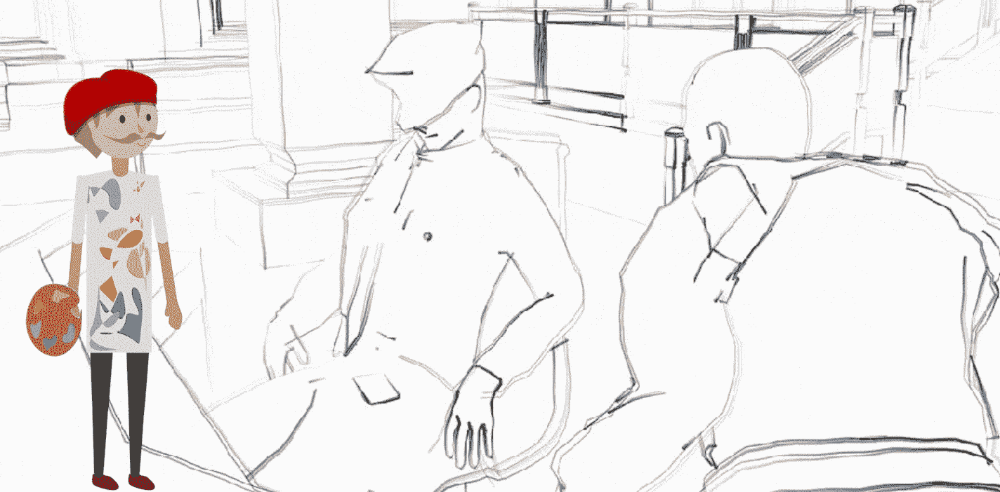
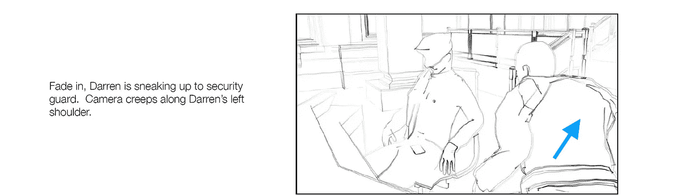
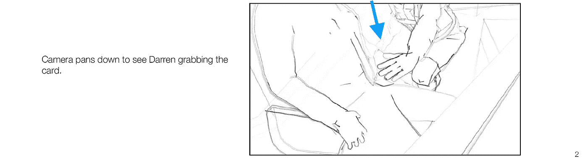
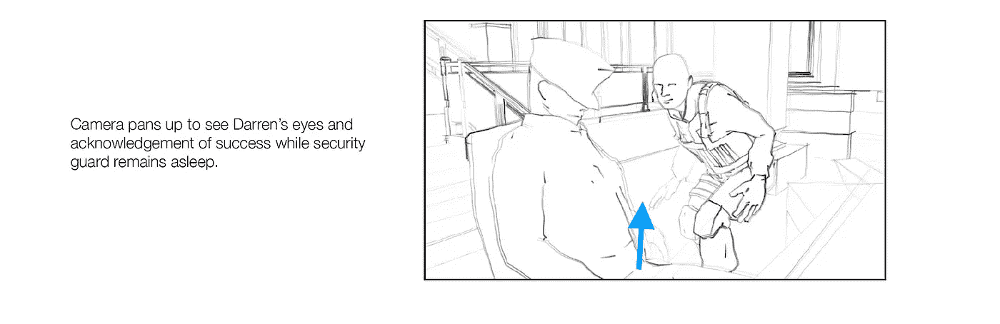

# 使用 previs 元素和 Unity

> 原文：<https://medium.com/nerd-for-tech/working-with-previs-elements-unity-89aa8103007c?source=collection_archive---------18----------------------->

## 一致

## 关于使用 previs 元素和 Unity 的快速回顾

**目标**:回顾使用 previs 元素在 Unity 中制作过场动画的重要性。

在上一篇文章中，我提到了[反射探头和屏幕空间反射的区别](/nerd-for-tech/reflection-probes-vs-screen-space-reflections-unity-218e4c923b75)。现在，是时候检查使用 previs 元素在 Unity 中构建过场动画的重要性了。

# 新项目

在过去的几天里，我和 Unity 一起开始了一个新的 3D 项目。在这个项目中，我将使用一些概念，如 Cinemachine，previs 元素，动画，时间轴，过场动画，光线投射等。

首先，您可以检查我将使用的资产(这些资产在 Unity 资产商店中是免费的):

 [## 伟大的羊毛|教程| Unity 资产商店

### 使用 GameDevJon，Inc .的大羊毛提升您的下一个项目。在…上找到这个&更多教程和模板

assetstore.unity.com](https://assetstore.unity.com/packages/templates/tutorials/the-great-fleece-110186) 

> 特别感谢[乔纳森·温伯格](https://medium.com/u/90a954a86fba?source=post_page-----89aa8103007c--------------------------------)和[艾尔·赫克](https://medium.com/u/f6abfbedfe07?source=post_page-----89aa8103007c--------------------------------)提供的资产:)

这个项目的目标之一是在游戏的某些时刻显示过场动画。为此，我们提供了一些 previs 元素，它们将定义组成过场动画的方式。

游戏行业经常使用 Previs 元素来预先可视化过场动画的动态效果。作为一名游戏程序员，我应该使用 previs 元素和动画模型作为参考来部署所需的最终产品。

让我们来看看为其中一个过场动画提供的 previs 元素:

# Previs 元素

在这个过场动画中，我们有一个打扮成忍者的秃头男子，他会从睡在桌子前的警卫那里偷一张安全卡。让我们来看看过场动画的第一个元素:

我们可以用前一个元素分解下一个特征:

*   过场动画开始时应该淡入。
*   小偷的名字叫达伦。
*   摄像机应该沿着达伦的左肩移动。

正如你所看到的，使用 previs 元素可以让我们给过场动画赋予形状。因此，Previs 元素是过场动画的原型。

现在，让我们看看下一个 previs 元素:

有了这个，我们需要下一个特性:

*   当达伦抓住卡片时，摄像机应该向下移动。
*   卡片会从守卫的臀部消失。

然后，我们有了这个过场动画的最后一个预览元素:

有了最后一个元素，我们就有了下一个特性:

*   摄像机应该向上移动，指向达伦的眼睛。
*   过场动画结束。

因此，使用 previs 元素的重要性在于，游戏程序员或艺术家可以使用它们作为参考来编写游戏中的过场动画。在接下来的几周里，我将使用几个 previs 元素来构建一个像上一个一样的过场动画:

而就是这样，这就是在 Unity 中构建过场动画之前使用 previs 元素的重要性！:d .我会在下一篇文章中看到你，在那里我将展示如何用 Unity 和 [Cinemachine](https://unity.com/es/unity/features/editor/art-and-design/cinemachine) 构建一个过场动画。

> *如果你想了解我更多，欢迎登陆*[***LinkedIn***](https://www.linkedin.com/in/fas444/)**或访问我的* [***网站***](http://fernandoalcasan.com/) *:D**