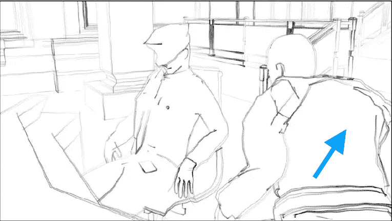
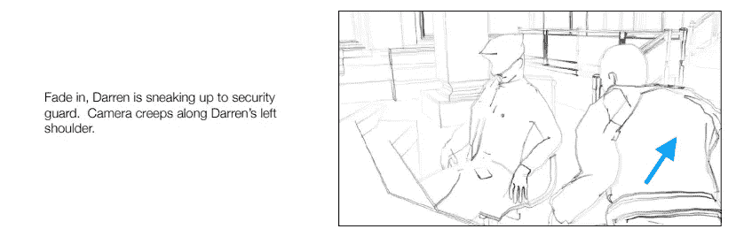
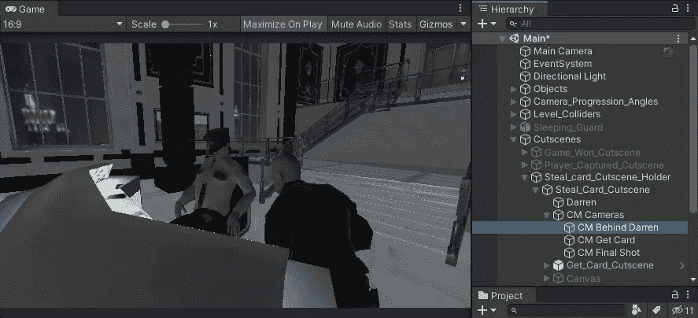
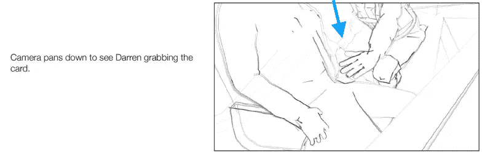
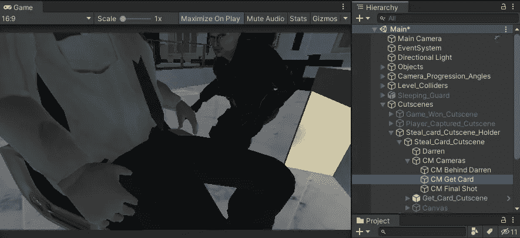
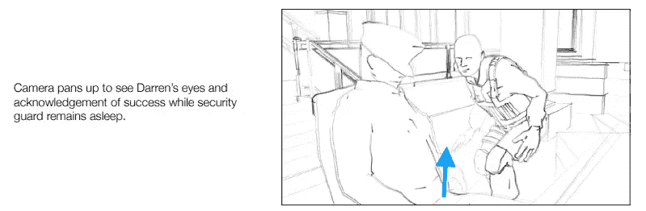
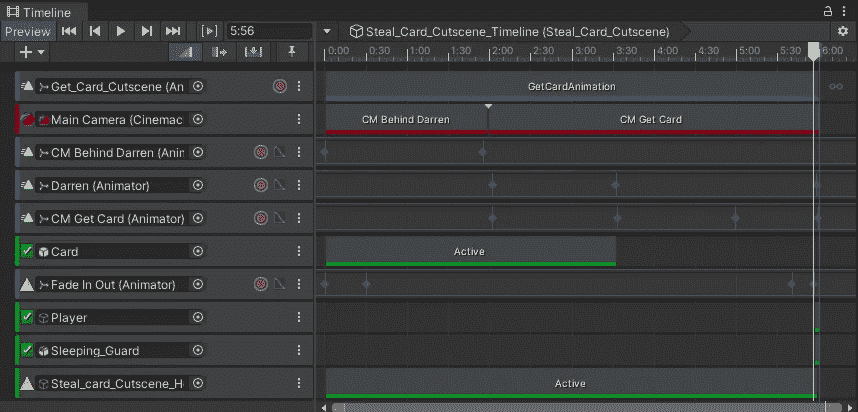
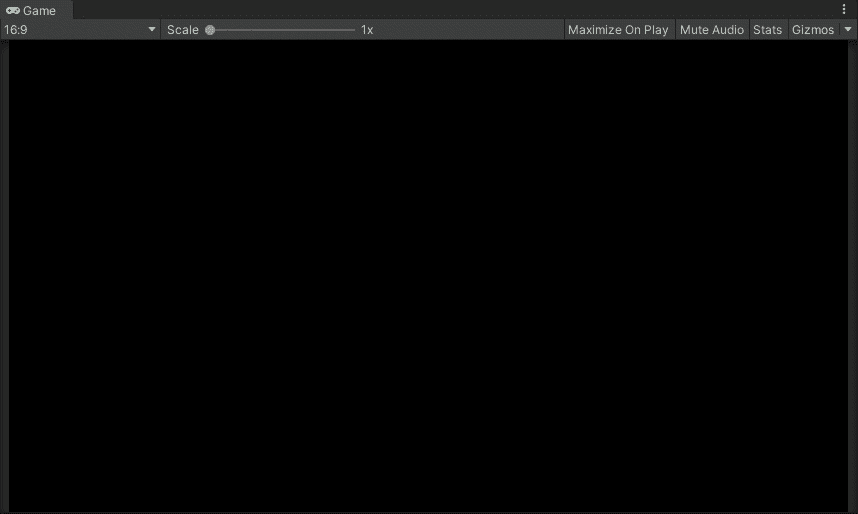

# 使用预先可视化元素

> 原文：<https://medium.com/nerd-for-tech/working-with-previsualization-elements-974884e6edbe?source=collection_archive---------21----------------------->

秘密游戏和电影摄影

根据维基百科的定义，**预视觉化**是在电影拍摄前对电影中复杂场景的视觉化。

在制作任何游戏场景和过场动画之前，你首先要做一些笔记或者草图，看看它会是什么样子或者它应该是什么样子。

现在，让我们一起使用 previs 元素创建一个新的过场动画。

这是第一张草图，我们将参考它来创建我们的场景。因此，将你的预置/游戏对象与场景对齐，然后创建一个电影摄影机。

要设置 cinemachine 摄像机的位置，您可以移动到您想要的摄像机位置，只需使用快捷键**Ctrl+Shift+f。**现在对另一个笔记也这样做。

这是最终的预览，让我们开始用电影机器制作这个场景的动画。

用所有必要的轨迹填充场景。在这里，首先是动画轨道包含已经动画预置显示玩家偷卡。然后有一个 cinemachine 轨道，带有两个 cinemachine 摄像机。还有两个 cinemachine 摄像机，动画显示向导演笔记显示的方向移动。

有一个激活轨道设置游戏对象在其轨道间隔期间激活。你可以添加这个来设置你的卡为活动的，直到玩家偷到它。您还可以添加睡眠守卫和玩家作为激活轨迹，以在场景中将其设置为非活动状态，并在最后一帧将其设置为活动状态，以在场景完成后将其设置为活动状态。

还有一个使用 UI 中的图像的淡入/淡出动画，它是通过操纵图像颜色的 alpha 值来淡入和淡出的动画。

这就是结果。