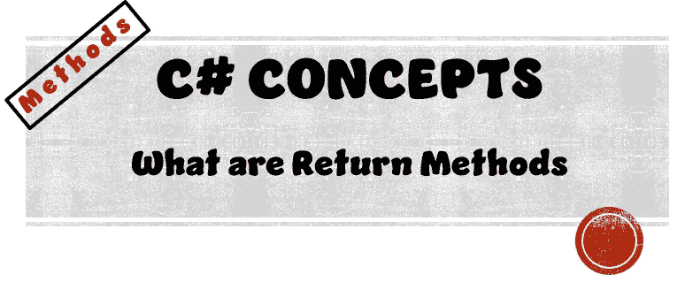
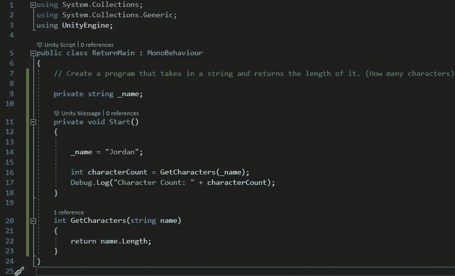

# 使用返回方法

> 原文：<https://medium.com/nerd-for-tech/working-with-return-methods-1c00fe99b25?source=collection_archive---------1----------------------->

## C#概念|方法

> 创建一个简单的程序，接受一个字符串并返回它的长度。



到目前为止，在我们的文章系列中，我们只谈到了 void 方法。void 方法不返回任何内容。相反，它所做的只是运行所需的代码。

另一方面，返回方法可以运行所需的代码，但最终将返回一个可以存储在变量中的值。

# 设置场景

因此，对于这个程序，我们在场景中不需要任何游戏对象。我们所需要的是一个简单的脚本附加到我们的主摄像头。

# 主脚本



以上是我们的目标程序的脚本。在我们测试这个程序之前，让我们弄清楚这个脚本在做什么。

## 字符串变量

```
private string _name;
```

我们创建一个名为 *_name 的私有字符串变量。*

## 返回方法

```
int GetCharacters(string name)
{ 
  return name.Length;
}
```

我们将跳过 start 方法，因为为了构建一个结构，我们需要理解蓝图。

让我们一字不差地描述一下这种方法是怎么回事。

*   **int —** 方法运行后返回一个整数值
*   **GetCharacters —** 方法名
*   **(字符串名称)—** 设置方法将接受的参数

当使用返回方法时，还必须包含关键字 *return* 来告诉该方法何时返回以及返回什么。

在我们的方法中，在第 22 行，我们告诉我们的方法返回该方法在名为 name 的字符串的长度。

## 开始方法

```
private void Start()
  {
      _name = "Jordan";

      int characterCount = GetCharacters(_name);
      Debug.Log("Character Count: " + characterCount);
  }
```

这个简单程序的所有魔力都发生在我们的 start 方法中。让我们一行一行地解码我们的代码，看看发生了什么…

**第 14 行**

```
_name = "Jordan";
```

实例化我们的字符串变量，让我们的 _name 变量保存值“Jordan”

**第 16 行**

```
int characterCount = GetCharacters(_name);
```

在这一行简单的代码中，实际上发生了 3 件事…

1.  创建一个名为 ***字符数*** 的整数变量
2.  实例化我们的 *characterCount* 变量，并让它保存我们的 *GetCharacters* 方法返回的整数值。
3.  调用我们的 *GetCharacters* 方法，并将我们的字符串变量 *_name* 传递给它。

**第 17 行**

```
Debug.Log("Character count: " + characterCount);
```

这一行只是运行一个日志，声明我们的字符数是我们的返回方法给出的值，该值存储在我们的变量 *characterCount* 中。

# 试验


运行我们的程序后，我们得到一个日志注释，说明我们的字符数是 6。哪个“乔丹”有 6 个字符？