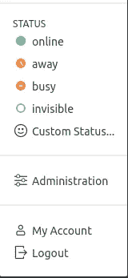
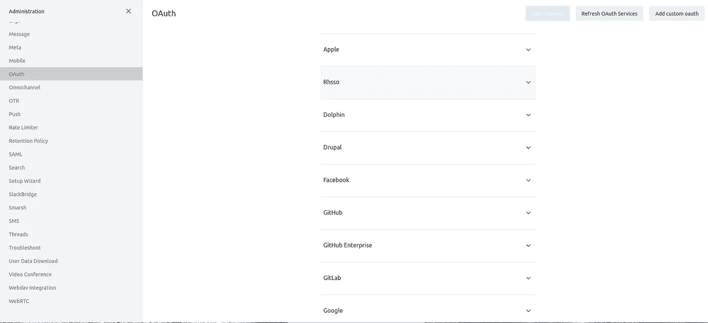
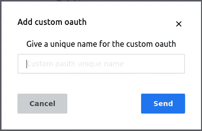
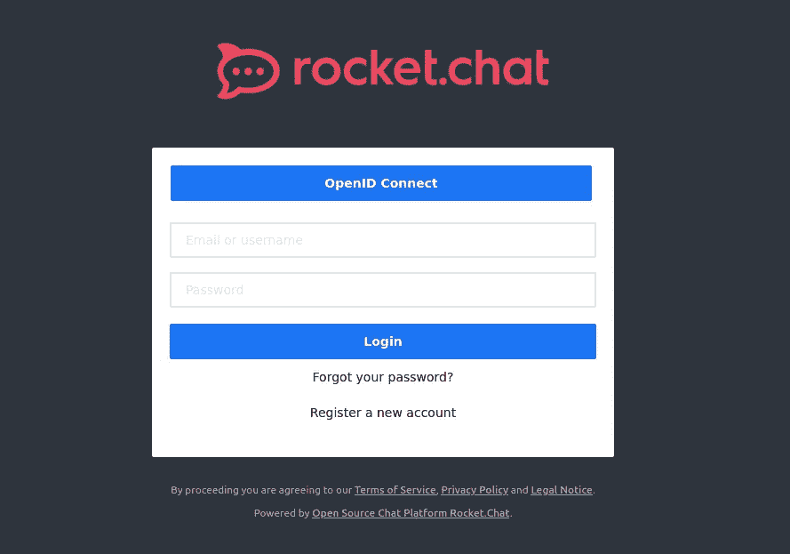

# 使用 Rocket Chat 和 OpenID Connect (RH-SSO)

> 原文：<https://medium.com/nerd-for-tech/working-with-rocket-chat-and-openid-connect-rh-sso-7c420a2ece3?source=collection_archive---------7----------------------->

# 为什么是火箭聊天？

嗯……有很多原因。我已经在离线环境中工作了很长时间，我还没有发现像 Rocket Chat 这样好的社区/社区交流的网络应用程序。在 Rocket Chat 中，我可以为每个群组创建一个频道，并授予任何我想授予的权限(作为管理员)。
更重要的是，我注意到组织内部的沟通更好了，不同团队之间的中间沟通显著增加了。

# 教程里有什么？

在本教程中，我将介绍如何在我们的 OpenShift 环境中运行 Rocket chat 的小型部署，以及如何将其配置为与我们的组织 OpenID Connect provider(在我们的示例中是 Red Hat SSO)一起工作

# 从哪里开始？

首先，我们将部署一个非常小的 rocket chat 部署(如果您想要企业级部署，这里有一个很棒的教程)然后，我们将 Rocket Chat 连接到 RH SSO。

**注意！本文档已经假设您正在运行 RH SSO(或 Keycloak)应用程序。如果你还没有这样做，你可以关注我关于如何配置 RH SSO (keycloak)应用程序的故事[这里](https://itnext.io/using-httpd-as-a-reverse-proxy-for-openid-connect-authentication-791d7e517608)**

# 部署

和往常一样，让我们首先创建项目:

```
# oc new-project rocketchat
```

## 部署 MongoDB

Rocket Chat 的数据库是用副本集配置的 MongoDB。在我们的例子中，我们将只启动一个 POD，但是我们仍然需要确保它提供一个副本集。为此，我们将使用带 args 选项的 statefulset。

我们的 mongodb 将需要一个持久存储，所以首先我们将为它创建一个 PVC，然后是 POD 本身。

对于持久存储:

```
# cat > mongodb-pvc.yaml << EOF
apiVersion: v1
kind: PersistentVolumeClaim
metadata:
  name: mongodb-pvc
spec:
  accessModes:
    - ReadWriteOnce
  volumeMode: Filesystem
  resources:
    requests:
      storage: 1Gi
EOF
```

并且适用于以下情况:

```
# oc apply -f mongodb-pvc.yaml
```

接下来，我们将创建 statefulset:

```
# cat > mongodb-sfs.yaml << EOF
kind: StatefulSet
apiVersion: apps/v1
metadata:
  name: mongo
  labels:
    k8s-app: mongo
spec:
  serviceName: mongo
  replicas: 1
  selector:
    matchLabels:
      k8s-app: mongo
  template:
    metadata:
      labels:
        k8s-app: mongo
        name: mongo
    spec:
      terminationGracePeriodSeconds: 10
      volumes:
      - name: mongo
        persistentVolumeClaim:
          claimName: mongodb-pvc
      containers:
      - image: registry.example.com/mongo:4.2
        name: mongo
        volumeMounts:
        - mountPath: /data/db
          name: mongo
        ports:
        - name: mongo
          containerPort: 27017
        args:
        - --replSet=rs01
        resources:
          requests:
            cpu: "100m"
            memory: "64Mi"
          limits:
            cpu: "500m"
            memory: "512Mi"
EOF
```

并应用它:

```
# oc apply -f mongodb-sfs.yaml
```

接下来，我们将创建一个小型 cron 作业，它将在出现故障时启动副本集。

```
# cat > mongodb-cronjob.yaml << EOF
apiVersion: batch/v1
kind: Job
metadata:
  name: mongo-0-init
spec:
  backoffLimit: 4
  template:
    spec:
      containers:
      - name: mongo-0-init
        image: mongo:4.2
        command: ["sh", "-c", "sleep 15; mongo mongo-0.mongo/rocketchat --eval \"rs.initiate({_id: 'rs01',members: [ { _id: 0, host: 'mongo-0.mongo:27017' } ]})\""]
      restartPolicy: OnFailure
EOF
```

并应用它:

```
# oc create -f mongodb-cronjob.yaml
```

现在我们想要访问我们的 mongodb，所以让我们继续为它创建一个服务:

```
# cat > mongodb-svc.yaml << EOF
apiVersion: v1
kind: Service
metadata:
  name: mongo
  labels:
    k8s-app: mongo
    name: mongo
spec:
  ports:
  - port: 27017
    targetPort: 27017
  selector:
    k8s-app: mongo
EOF
```

创建完成后，我们就可以进入应用程序部分了:

```
# oc apply -f mongodb-svc.yaml
```

## 火箭聊天部署

Rocket Chat 将数据存储在数据库之外的文件中，因此它需要自己的 PVC:

```
# cat > rocketchat-data-pvc.yaml << EOF
apiVersion: v1
kind: PersistentVolumeClaim
metadata:
  name: rocketchat-data-pvc
spec:
  accessModes:
    - ReadWriteOnce
  volumeMode: Filesystem
  resources:
    requests:
      storage: 1Gi
EOF
```

让我们来应用它:

```
# oc apply -f rocketchat-data-pvc.yaml
```

## 添加自定义 CA 证书

使用 OpenID Connect 取决于通过 TLS 验证过程的应用程序。为了做到这一点，我们需要添加我们的自定义 CA 证书到火箭聊天图像。

要做到这一点，有两种方法:

1.  将 CA 添加到映像中
2.  使用 CA 证书文件创建配置映射。

在我们的例子中，出于几个原因，我们将把 CA 添加到我们的映像中。
感觉我们在一个断开的环境中工作，我们将我们的图像定向到一个内部注册表(在我们的例子中是 registry.example.com ),所以改变图像的摘要几乎没有影响。其次，我认为了解多种方法来实现您想要的是一个好的实践，如果在某些情况下，我们想要创建一个操作符(未来的提示)并使用该操作符部署应用程序，那么我们将无法向它添加配置映射(除非它是操作符的一部分)。
要更新镜像，我们需要做的就是将 CA 证书复制到镜像中，并通过一个环境变量告诉 node.js (Rocket Chat 的中间件)我们添加的证书。

要添加 ca，请创建以下 Dockerfile :
(在我们的示例中，我们的 CA 证书文件被命名为 ca.crt，它与 Dockerfile 文件位于同一目录中。

```
# cat > Dockerfile << EOF
FROM registry.example.com/rocket.chat:latest
MAINTAINER You RockUSER root
RUN mkdir /etc/certs
COPY ca.crt /etc/certs/keycloak.crt
USER rocketchat
EOF
```

我们使用 buildah 来更新图像，然后将它推回我们的注册表。

```
# buildah bud -f Dockerfile -t registry.example.com/rocket.chat
# buildah push registry.example.com/rocket.chat:latest
```

既然映像已经更新，我们需要将“NODE_EXTRA_CA_CERTS”环境变量添加到 rocket chat 部署中，并将 rocket chat 指向 mongodb。

部署文件应该如下所示:

```
# cat > rocketchat-deployment.yaml << EOF
kind: Deployment
apiVersion: apps/v1
metadata:
  name: rocketchat
  labels:
    k8s-app: rocketchat
spec:
  replicas: 1
  selector:
    matchLabels:
      k8s-app: rocketchat
  template:
    metadata:
      labels:
        k8s-app: rocketchat
        name: rocketchat
    spec:
      volumes:
      - name: rocketchat
        persistentVolumeClaim:
          claimName: rocketchat-data-pvc
      containers:
      - image: registry.example.com/rocket.chat:latest
        imagePullPolicy: Always
        name: rocketchat
        env:
        - name: INSTANCE_IP
          valueFrom:
            fieldRef:
              fieldPath: status.podIP
        - name: MONGO_URL
          value: "mongodb://mongo-0.mongo:27017/rocketchat?replicaSet=rs01"
        - name: MONGO_OPLOG_URL
          value: "mongodb://mongo-0.mongo:27017/local?replicaSet=rs01"
        - name: ROOT_URL
          value: "[https://chat.](https://chat.oichman.net)example.com"
        - name: PORT
          value: "3000"
        - name: NODE_EXTRA_CA_CERTS
          value: /etc/certs/keycloak.crt
        volumeMounts:
        - mountPath: /app/uploads
          name: rocketchat
        ports:
        - name: http
          containerPort: 3000
EOF
```

在我的例子中，我将应用程序指向 pod 名称，但是如果我们愿意，我们也可以选择和使用 mongodb 服务。

接下来，我们将为 rocket chat 创建一个服务和入口:

```
# cat > rocketchat-service.yaml << EOF
kind: Service
apiVersion: v1
metadata:
  name: rocketchat
spec:
  selector:
    k8s-app: rocketchat
  ports:
    - protocol: TCP
      port: 3000
      name: http
EOF
```

因为我们想要通过 TLS/SSL 提供服务，所以我们需要创建我们的证书(一个很好的方法可以在这里找到)并创建一个保存证书的秘密。

要创建秘密通道:

```
# oc create secret generic chat-tls \
--from-file=key.pem=`pwd`/chat.key \
--from-file=cert.pem=`pwd`/chat.crt \
-n rocketchat
```

并为入口创建一个文件:

```
# cat > rocketchat-ingress.yaml << EOF
apiVersion: networking.k8s.io/v1beta1
kind: Ingress
metadata:
  name: rocketchat-ingress
spec:
  tls:
    - hosts:
      - chat.example.com
      secretName: chat-tls
  rules:
  - host: "chat.example.com"
    http:
      paths:
      - backend:
          serviceName: rocketchat
          servicePort: 3000
        path: /
EOF
```

现在我们已经完成了部署，我们可以继续进行 OpenID 连接配置了:

去 chat.example.com(去你给火箭聊天入口的 FQDN)。
如果这是您第一次创建新的管理员用户，然后转到管理页面:



然后向下滚动到“oauth”(或者转到:[https://](https://chat.oichman.net/admin/OAuth)`[{rocket_chat_URL}](/nerd-for-tech/{keycloak_ip_address}:{port}/auth)`[/admin/OAuth](https://chat.oichman.net/admin/OAuth):



现在点击“添加自定义 oauth”(在右上角) :



添加一个名称(类似“RH-SSO”)

然后开始填充以下值:

以下配置中提供的 URL 路径也可以通过导航到领域设置并点击`General Tab`中的端点链接来获得。配置以下设置时，用适当的域名替换`realm_name`。Keycloak 提供的默认领域是`master`。

1.  确保您切换到启用栏
2.  网址:`[http://{rh-sso_](/nerd-for-tech/{keycloak_ip_address}:{port}/auth)[URL](/nerd-for-tech/{keycloak_ip_address}:{port}/auth)[:{port}/auth](/nerd-for-tech/{keycloak_ip_address}:{port}/auth)`
3.  令牌路径:`/realms/{realm_name}/protocol/openid-connect/token`
4.  令牌发送方式:标头
5.  身份令牌通过发送:与“令牌通过发送”相同
6.  身份路径`/realms/{realm_name}/protocol/openid-connect/userinfo`
7.  授权路径`/realms/{realm_name}/protocol/openid-connect/auth`
8.  适用范围:`openid`
9.  访问令牌的参数名称:`access_token`
10.  Id:这是火箭的 id。keycloak 中创建的聊天客户端`rocket-chat-client`
11.  Secret:创建火箭时在 credentials 选项卡中提供的密钥。聊天客户端
12.  按钮文本:`Login with Keycloak`
13.  点击“保存更改”

现在注销用户(在“用户”图标上)，现在你会看到“OpenID 连接”链接。



单击它并使用您的组织用户名和密码登录。你将被重定向到火箭聊天。

如果您有任何问题，请随时回复/留下您的评论。
你可以在 linkedin 上找到:[https://www.linkedin.com/in/orenoichman](https://www.linkedin.com/in/orenoichman)或者在 twitter 上找到:[https://twitter.com/ooichman](https://twitter.com/ooichman)

玩得开心！！！