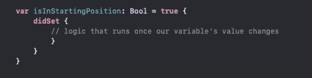
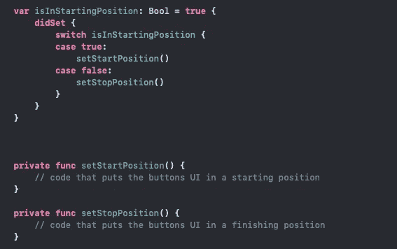
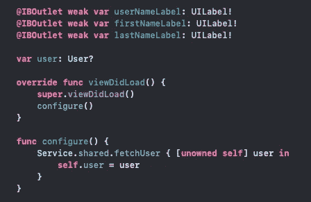
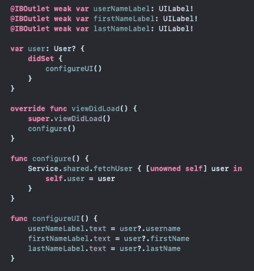

# 在 Swift 中使用 didSet 属性观察器

> 原文：<https://medium.com/nerd-for-tech/working-with-the-didset-property-observer-in-swift-61d36666381e?source=collection_archive---------3----------------------->

照片由[上的](https://unsplash.com/s/photos/coding?utm_source=unsplash&utm_medium=referral&utm_content=creditCopyText)[砌墙](https://unsplash.com/@walling?utm_source=unsplash&utm_medium=referral&utm_content=creditCopyText)拍摄

在应用开发中编写自主高效的代码对于应用的生命周期和用户体验至关重要。应用程序在整个程序流程中监听用户事件和交互。在引擎盖下，iOS 通过使用功能和其他手段，根据多种情况自行促进多种操作。

属性观察器的使用简化了这种有规律的自动化，它根据一个条件监听给定属性的某些事件，以比不包含特定函数更频繁地执行代码块。我们将关注 **didSet 属性观察器**，以便让我们的应用程序更易于管理和流畅。

didSet 属性观察器与一个**计算属性**结合使用，以监听它所赋给的变量何时设置了值。对相关变量的任何更改都会自动调用其 didSet 块。

想象我们正在开发一个有开始和停止按钮来测量时间的应用程序。我们的应用程序要求我们创建一个自定义按钮；同样重要的是，我们的类使用正确的文件访问级别关键字，使得它的方法对于我们应用程序的其他部分是不可访问的。

为了控制按钮的状态，我们将使用带有 didSet 属性观察器的 computed 属性来监听和响应变量的状态，以更新按钮。

默认情况下，我们的按钮将在起始位置，我们的变量将被设置为真。在我们的 didSet 块中，我们将添加一个 switch 语句，它检查我们的变量并根据我们设置的逻辑运行我们的按钮的方法。

每当我们的 isInStartingPosition 变量改变时，我们的 observer 就会被调用，相应的方法也会被调用来改变按钮的状态。这是限制在类之外使用函数的一个很好的方法，它使变量成为根据所建立的逻辑适当调用方法的唯一入口点。

didSet 属性观察器可以简化代码，这些代码是*完成任务所依赖的，比如进行 API 调用或等待调用完成处理程序。*假设在我们的应用程序中，我们正在进行 API 调用，以下载用户数据并显示给我们的用户。一旦我们的数据被下载并填充到我们的数据模型中，我们的用户将被传递到我们的 viewController。

我们的网络层将为我们的 viewController 提供一个用户，以继续我们的应用程序流；虽然这肯定是可行的，但要确定我们的 fetchUser 函数何时完成任务是不可能的。使用 didSet，一旦用户变量有了值，我们就可以自动更新 viewController 的视图。

一旦我们下载的用户数据被成功地传递给我们的变量，didSet 将调用我们的 configureUI 函数来更新我们的视图的状态。值得注意的是，didSet 和其他属性观察器需要一个计算属性来运行它们的代码。didSet 属性观察器使应用程序的流程和逻辑更易于管理，尤其是在等待任务完成时。