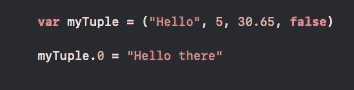
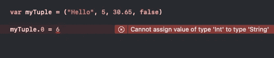
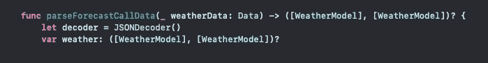
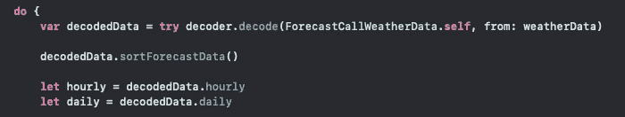
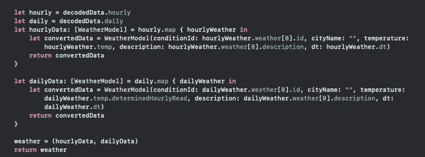

# 在 Swift 中使用元组

> 原文：<https://medium.com/nerd-for-tech/working-with-tuples-in-swift-e04601b4045b?source=collection_archive---------13----------------------->

图片由 [Unsplash](https://unsplash.com/s/photos/coding?utm_source=unsplash&utm_medium=referral&utm_content=creditCopyText) 上的 [Alexandru Acea](https://unsplash.com/@alexacea?utm_source=unsplash&utm_medium=referral&utm_content=creditCopyText) 拍摄

在 Swift 中开发时，每个开发人员都熟悉*命名的类型。*一个命名的类型，当然是在声明的时候就可以命名的类型。这些类型包括结构、类、协议和枚举。Swift 的原生类型，如字符串、整数、数组等。也是命名类型，是隐藏的结构。

除了命名类型，Swift 还有另一种类型，称为*复合类型。*与它的对应物不同，*复合类型*没有名字，包括函数和元组。复合类型可以包含与之关联的任何类型组合，无论它是命名类型、其他复合类型还是任何其他组合。**元组**类型是一组括号，用逗号分隔其元素。

**元组**中的类型可以是*任何类型的组合*，这使得将不同类型的数据打包到集合中以便在代码中使用或传递变得容易。**元组**的索引类似于数组，也从 0 开始。可以使用点符号访问**元组**中的元素。

值得注意的是，一旦一个**元组的**元素被声明，类型安全仍然是强制的，并且*不可能给它的元素重新分配不同的类型。*

这种方便的功能使得对类似数据进行分组以便以后存储或在对象之间传递变得更加容易。假设我们正在开发一个天气应用程序，我们使用的 URL 发送回一大块 JSON，提供每小时和每周的天气预报数据。为了将 JSON 分成我们需要的各个部分，我们将编写的函数将返回一个包含两个天气数据数组的**元组**，一个用于每小时和每周的天气预报。

因为解码 JSON 可能会失败，所以我们用可选的

假设我们的解码器解码正确，由于一些辅助代码，我们的数据将被相应地排序和修整。该函数将按日期对数据进行排序，然后修剪每个集合的前 5 项。(我们的应用程序设计需要 5 小时预报和 5 天预报)

随着我们的数据被正确排序，我们的数据被转换成我们想要使用的模型对象，我们只需要用我们的新集合分配我们的元组。

将我们的**元组**传递给我们的 viewController，我们的数据可以显示给用户。使用这个方法有一个警告:**因为元组的元素没有命名，所以必须知道每个元素在元组中的位置。**在这个例子中，混淆我们的数组并在不正确的空间使用它们会更容易。**元组**使得存储和传递数据变得轻而易举，尤其是当数据是混合类型时。