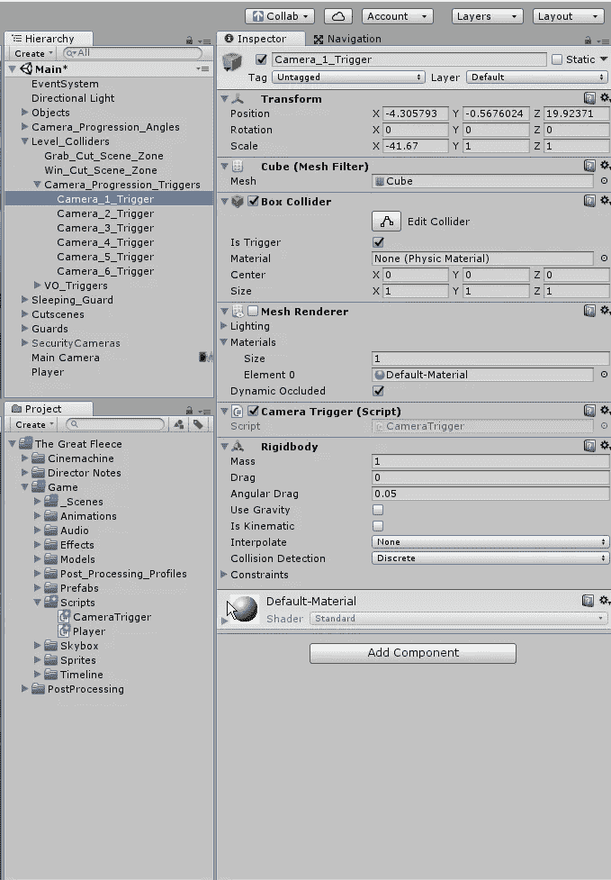
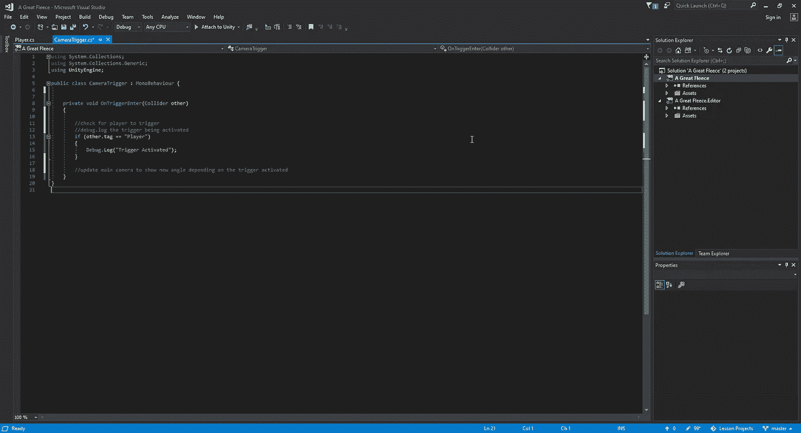
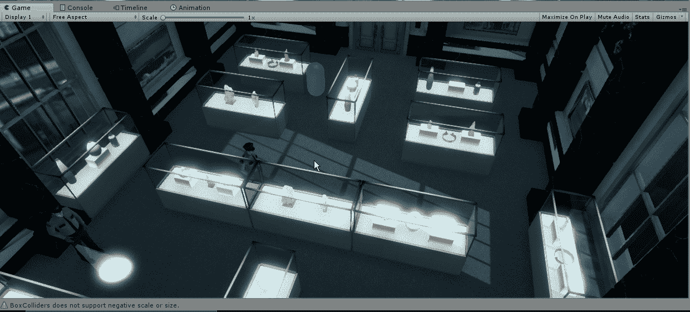
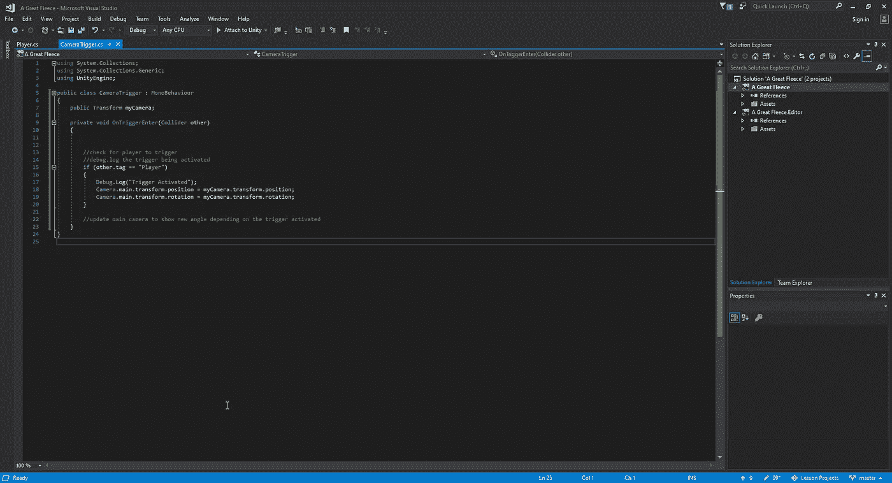
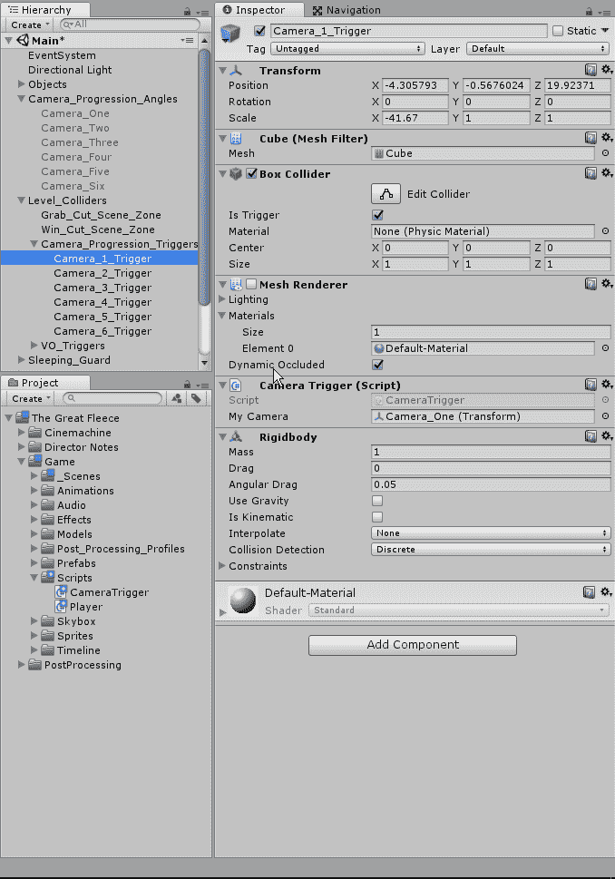
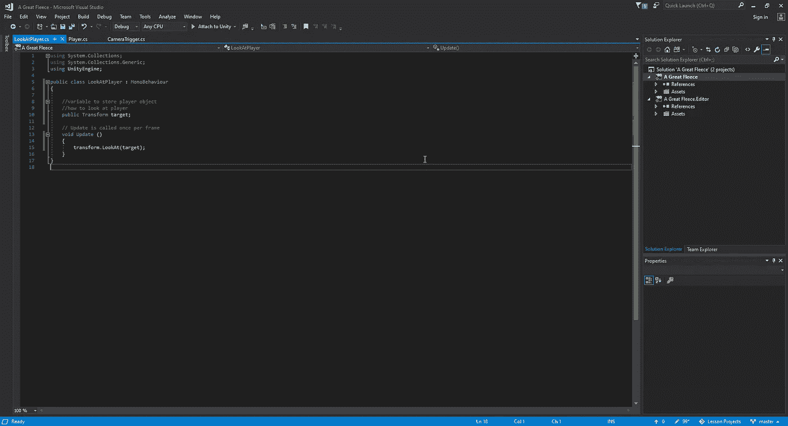
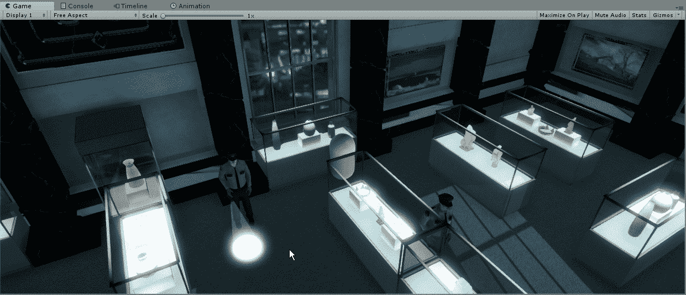

# 使用 Unity 的 Nav Mesh 系统进行摄像机切换

> 原文：<https://medium.com/nerd-for-tech/working-with-unitys-nav-mesh-system-for-camera-switching-3ce25a55c2a1?source=collection_archive---------16----------------------->

现在我们有了一个可以在场景中移动的工作玩家，让我们的游戏视图在我们点击设置好的触发器时打开。为此，我们需要为我们的触发器创建一个新的脚本，并将其附加到每个单独的触发器上。同样，我们将希望确保我们添加了一个刚体，以便可以进行检测:

从这里开始，我们将进入我们的脚本，首先确保我们在播放器和触发器之间有某种检测，以便我们知道它正常工作:

现在我们有了检测功能，我们可以根据被激活的触发器来调整我们的摄像机来改变它的视角。首先，我们需要创建一个模块化系统，以便每个触发器都有我们希望其附带的摄像机角度:

现在我们告诉 Unity 我们希望主摄像机看着我的摄像机，我们需要将一个摄像机角度附加到这个变量上，这样它才能工作:

如果我们现在运行这个，我们将会遇到一个视觉问题，玩家可能会剪掉相机的视点，不允许我们继续，因为我们不能点击某个点来激活下一个触发器，所以要解决这个问题，我们需要创建一个新的脚本并附加到我们的主相机上。这个脚本只有一个目的，它将一直运行。这个目的是简单地观察我们的玩家:

现在我们已经有了一个可以工作的动态相机系统，我们可以开始把我们的玩家从圆柱体变成我们想要的精灵。