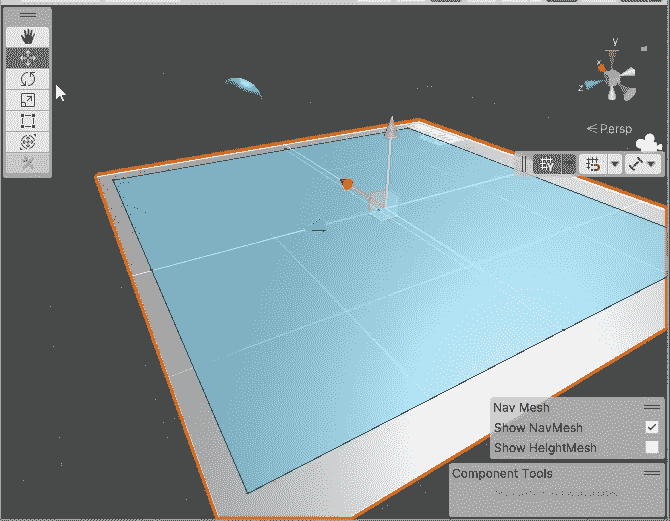

# 使用 Unity 的 NavMesh 系统实现智能人工智能

> 原文：<https://medium.com/nerd-for-tech/working-with-unitys-navmesh-system-for-smart-ai-556584f1229c?source=collection_archive---------12----------------------->

Unity 2021 导航网格和导航网格代理

以前的一篇文章探讨了我们如何在 Unity 2021 中使用 NavMesh 和 NavMesh 代理来处理玩家角色的点击移动。今天我们将更深入地从头开始建立一个 NavMesh 系统，并讨论我们如何将它用于敌方的 AI 系统。