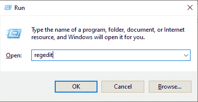
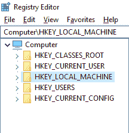
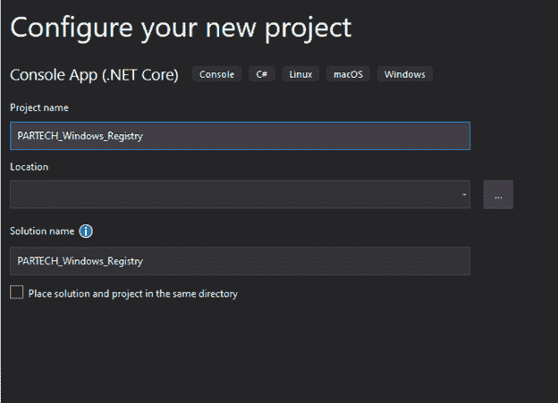
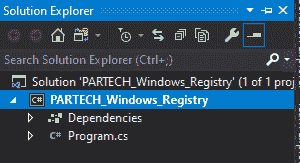
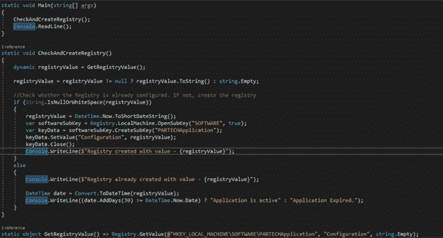
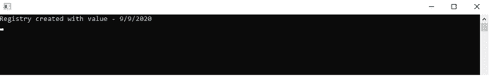
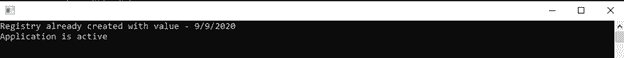

# 使用 C#使用 Windows 注册表

> 原文：<https://medium.com/nerd-for-tech/working-with-windows-registry-using-c-ae0f78e29e37?source=collection_archive---------20----------------------->

我们每个人都会安装一个试用版的软件，如杀毒软件、游戏、授权工具等。在我们生命中的某个时刻。但是在做的时候，你有没有注意到试用期结束后，软件会神奇地停止为你工作。甚至当你再次尝试卸载并安装该软件时，它也会发出同样的过期信息。你一定想知道这怎么可能。这个问题的答案是 Windows 注册表。

安装后，该软件会借助 Windows 注册表在注册表中提供所有必要的信息。出于安全或许可目的等多种原因，该信息随后由软件在运行时使用。在这篇文章中，我们将解释什么是 Windows 注册表以及如何通过程序访问它。

**目录**

1.  **什么是 Windows 注册表？**
2.  如何访问 Windows 注册表？
3.  注册表编辑器中有什么？
4.  如何以编程方式访问 Windows 注册表？
5.  包扎

# 什么是 Windows 注册表？

Windows 注册表是设置的分层数据库。它存储安装在系统上的硬件和软件所使用的信息、设置、选项和其他值。

在 Windows 的最初版本中，对存储程序配置和设置的配置文件有很大的依赖性。但是，在 Windows 注册表中，应用程序的详细信息存储为子项。

# 如何访问 Windows 注册表？

注册表编辑器是一个免费的注册表编辑工具，它与从微软 Windows 95 到最新的 Windows 10 的所有已知 Windows 版本打包在一起。它是一个预加载的工具(无需安装)，可以通过从运行(win+r)窗口执行命令 **regedit** 来访问。

注册表编辑器充当注册表的界面，它是一种用户友好的方式来查看和编辑注册表信息。

# 注册表编辑器中有什么？

注册表编辑器显示 Windows 注册表中存在的所有项和值。

在打开 Windows 注册表编辑器时，它会显示包含所有注册表值的根键。有 5 个常见的根密钥，让我们快速浏览一下-

## HKEY 类根

它也被称为 HKCR，当用户请求查看驱动器的内容或打开某一类型的文件等时，它包含有助于 Windows 的信息。

它包含的信息依次包含文件扩展名相关信息和 OLE(对象链接嵌入)信息。

## HKEY 当前用户

它也被称为 HKCU，是 Windows 注册表的主要部分。它包含特定于当前登录的 Windows 用户的 Windows 和已安装软件的配置信息。

受当前用户控制的设置，如桌面墙纸、环境变量、映射的网络驱动器、显示设置、安装的打印机都存储在此注册表配置单元中。

## HKEY 本地机器

它也被称为 HKLM。它保存软件和 Windows 操作系统的主要配置信息。它还包含有关当前检测到的硬件和设备驱动程序的信息。

从 Windows Vista 到最新版本的 Windows，即 Windows 10，有关计算机启动配置的信息都存储在 HKLM 中。

## HKEY 用户

它也被称为 HKU。它保存所有活动用户的特定于用户的配置信息。这里的活动用户是指当前已经登录的用户，也包括其他已经登录的用户和切换用户。

用户的详细信息存储在 HKEY 用户根目录下每个用户的安全标识符下。用户的注册表项和值存储在相应的安全标识符下。一旦用户第一次登录，映射的网络驱动器、环境变量、安装的打印机等详细信息就存储在该注册表中。

## HKEY 当前配置

它也被称为 HKCC。与其他注册表不同，它不包含任何特定的键和值。相反，它作为一个快捷方式来访问与保存当前用户的硬件配置文件信息相关的键和值。

它充当\ SYSTEM \ Current control set \ Hardware Profiles \ Current \ registry 项的引用。HKCC 的存在是为了方便，它使编辑其他注册表中的详细信息变得更容易。

# 如何使用 C#以编程方式访问 Windows 注册表？

到目前为止，我们已经了解了如何访问 Windows 注册表以及它包含的所有内容。让我们考虑一个场景，我们将运行一个应用程序的试用版本，这意味着几天后该应用程序将到期。

背后的想法是以编程方式为应用程序创建一个注册表，它将保存应用程序的首次使用日期，每当用户使用应用程序时，它将使用注册表值验证应用程序是否已过期。

## 第一步

为了实现这一点，我们将使用。net 框架和 C#作为编程语言。以管理员权限打开 visual studio，因为此解决方案将改变 Windows 注册表中的内容。

## 第二步

创建应用程序后，下一步是打开 program.cs 文件，并编写代码来创建注册表(如果注册表不存在的话)。如果注册表项已经存在，则打印注册表中存在的值。

为此，我们将使用 HKEY_LOCAL_MACHINE Windows 注册表。并且将在 HKLM 下的软件子密钥下工作。在“software”子项下，我们的想法是创建一个子项—“PARTECHApplication ”,它将保存一个子项—“Configuration”及其值。

## 第三步

创建代码后，当我们第一次运行它时，子项将不存在。因此，代码将创建步骤 2 中提到的子项，并将其保存在注册表中。

## 第四步

当相同的代码再次运行时，它将返回文本“Registry always created with value ”,后跟它的值。然后，它将验证添加了 30 天的注册表起息日是否仍然小于当前日期的值。这样，可以通过 C#应用程序来完成试验的验证。

# 包扎

Windows 注册表是软件、硬件和用户的设置、配置的数据库。这是检索应用程序的存储配置的最安全的方式之一，它充当存储和使用应用程序的基本设置和配置的单一位置。所以，现在就开始尝试访问 Windows 注册表吧。

*原载于*[*https://www . partech . nl*](https://www.partech.nl/nl/publicaties/2020/09/working-with-windows-registry)*。*