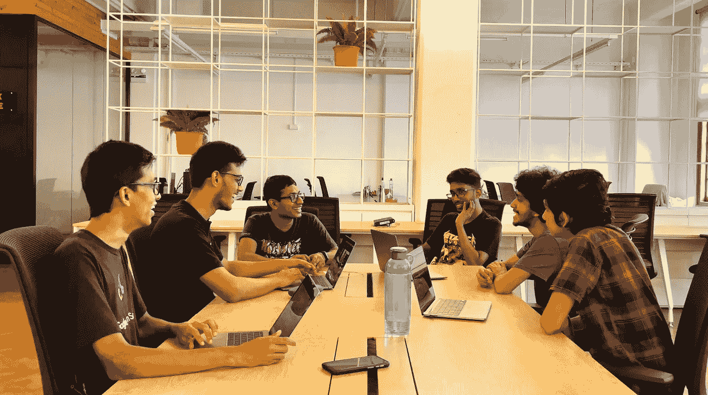
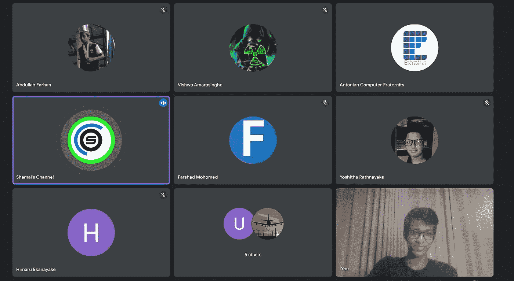
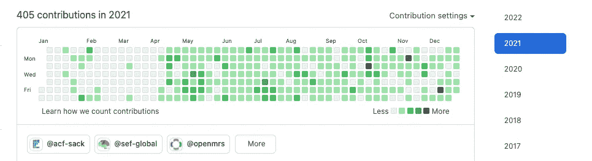
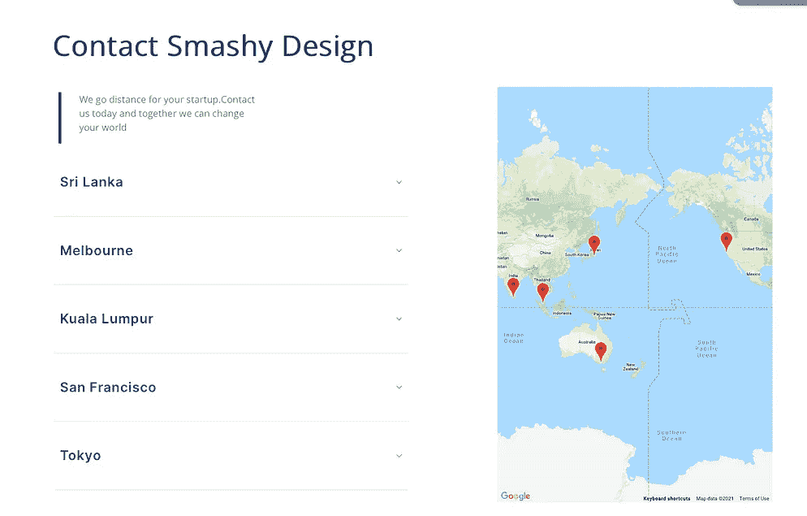
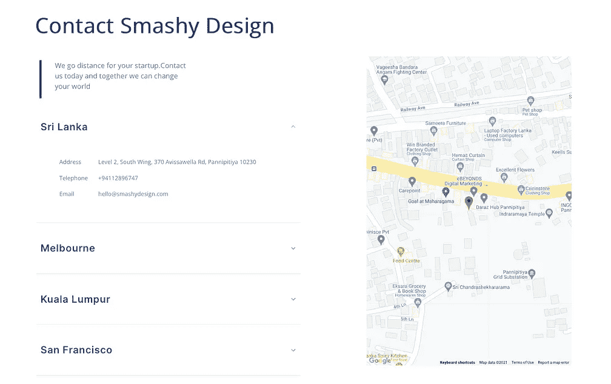
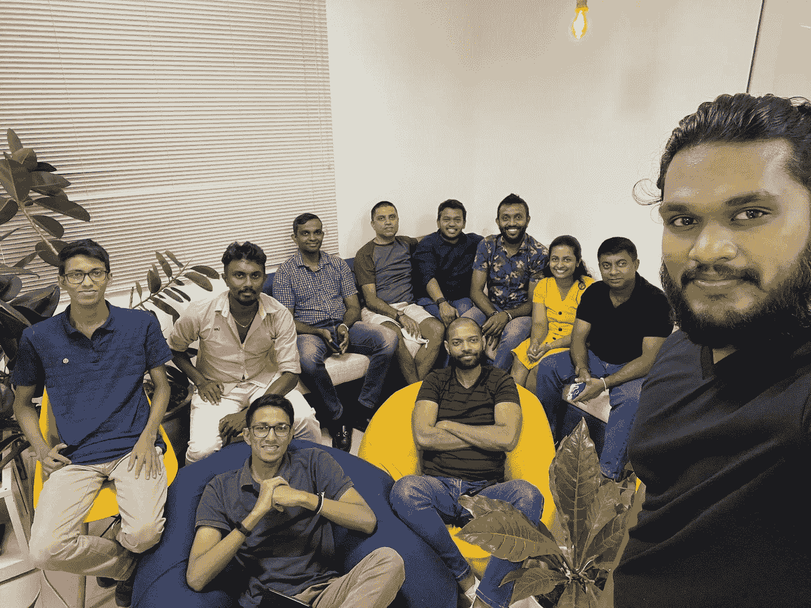

# 为 2021 年做准备

> 原文：<https://medium.com/nerd-for-tech/wrapping-things-up-for-2021-5634a932f199?source=collection_archive---------8----------------------->

2021 年是我职业生涯中最有成效的一年。这一年充满了新的机遇和经历。随着这一年接近尾声，我想用几段话来分享我这一年来的经历。我写这篇文章的灵感来自于阅读 [Anjula Shanaka](https://medium.com/u/beea7c363d03?source=post_page-----5634a932f199--------------------------------) 最新的[博客文章](/nerd-for-tech/what-feels-like-the-end-is-often-the-beginning-14204463d9ea)，一定要关注他并阅读他的文章。

# 对开源社区的贡献

## SEF(可持续教育基金会)

今年，我在 SEF 参与了不同的项目。今年 6 月我开始参与 ScholarX 2021 项目，因此，我被 SEF 的[工程团队](https://sefglobal.org/team.html#:~:text=SEE%20MORE-,Engineering,-Team)选为助理软件工程师。目前，我正在为 ScholarX 2022 项目做贡献。

## 开放式医疗记录系统

OpenMRS 是一个协作性的开源项目，旨在开发软件来支持发展中国家的卫生保健服务。我加入了这个社区，为使用柏树和黄瓜编写 E2e 测试的 [QA 仪表板](https://github.com/openmrs/openmrs-contrib-qaframework)做贡献。我得到了一个加入 OpenMRS 3 的机会。x QA 团队，也出席了今年的 OpenMRS 实现者会议。这是我职业生涯中的一大步。特别感谢 [Jayasanka Weerasinghe](https://medium.com/u/cd6875870f78?source=post_page-----5634a932f199--------------------------------) 对团队中每个人的指导。

2021 年 OpenMRS 实施者会议(OMRS)

该团队正在与 OpenMRS 的产品经理 Grace Potma 和印第安纳大学医学院的助理教授 Jonathan Dick 通话

筹备实施者会议

## 安东尼计算机兄弟会

8 月份，我为安东尼同胞举办了一个为期 6 周的 Javascript 项目。那个项目有许多热情的学生，目前他们中的大多数已经创建了漂亮的网页，并且开始学习不同的技术。

Javascript 教学的最后一课

今年，我设法为开源社区贡献了 400 多篇文章。也是第四次完成 Hacktoberfest。

# 实习

## [简洁的设计](https://smashydesign.com/)

过去几个月，我一直在用 PHP 创建一个 WordPress 插件。这个插件帮助用户在他们的网页上找到他们公司的多个商店/分支机构。也从公司组织的一个项目中获得了深入了解 CSS 的机会。

已开发插件的截图

2021 年末聚会——Smashy 设计

我真的为我今年取得的成绩感到高兴。希望在 2022 年做的更多。

## “明天是一本 365 页的书的第一页。写一个好的。”
――布莱德·派斯里

感谢您的阅读，祝您新年快乐，希望您今年能够实现您的目标...