# 用背页轻松撰写学术论文

> 原文：<https://medium.com/nerd-for-tech/write-academic-papers-easily-with-overleaf-4f54c293796e?source=collection_archive---------8----------------------->


在 MS word 或任何其他文字处理应用程序中，按照标准格式撰写任何学术论文(如研究论文或任何其他文档)并不容易。

提供了一个基于 web 的写作环境，用户可以方便地使用现有的模板或使用自己的模板来创建文档。许多类型的文档都可以轻松创建，如期刊文章、书籍、论文等。

免费吗？是的，可以免费使用。但是有一些限制，从[这里](https://www.overleaf.com/learn/how-to/Is_Overleaf_free_to_use%3F)阅读更多。

背面基于[乳胶](https://www.overleaf.com/learn/latex/Learn_LaTeX_in_30_minutes)。但是用户不需要任何使用 Latex 的经验就可以在 overleaf 平台中创建文档。

参考链接:

*   【https://www.makeuseof.com/tag/what-is-latex-document/ 
*   [https://www.latex-project.org/about/](https://www.latex-project.org/about/)

通过这篇文章，将为你提供一些基础知识和一些有用的链接，开始用背页写学术论文。

在背页有许多可用的文档模板，用户可以使用这些模板来启动您的文档。

[](https://www.overleaf.com/latex/templates) [## 模板-日志、简历、演示文稿、报告等

### 易于使用的在线 LaTeX 编辑器。无需安装，实时协作，版本控制，数百个 LaTeX…

www.overleaf.com](https://www.overleaf.com/latex/templates) 

在背页创建文档需要遵循的步骤。

**步骤 01——在背面注册**

首先，你需要创建一个背页账户。

[](https://www.overleaf.com/) [## 背面，在线 LaTeX 编辑器

### 在我们的模板库中有成千上万的模板，所以它真的很容易开始，无论你是写一个…

www.overleaf.com](https://www.overleaf.com/) 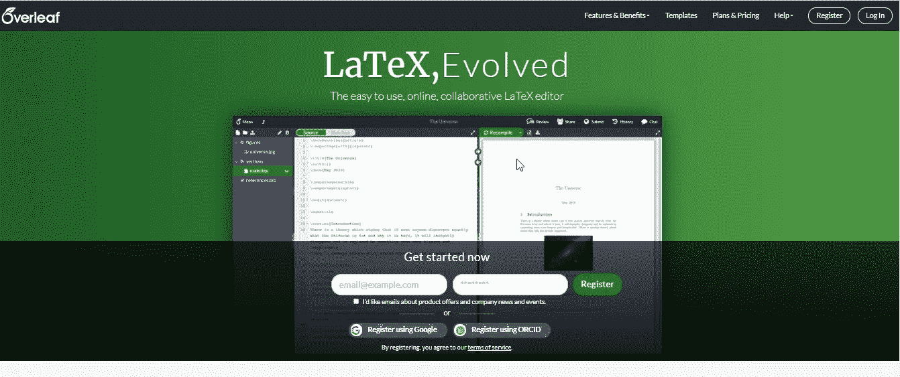

您可以使用用户名和密码或第三方认证方法来创建用户帐户。

创建帐户后，控制面板将如下所示。

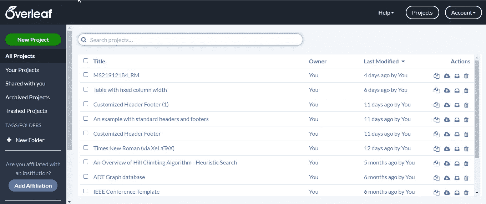

**步骤 02 —创建新项目**

单击“新建项目”按钮，并选择一个您希望开始文档的选项。

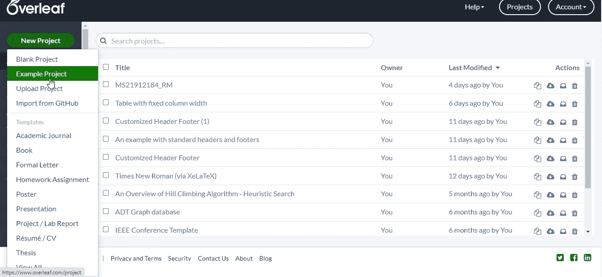

单击黑色项目后，用户将导航到文本编辑器，如下图所示。

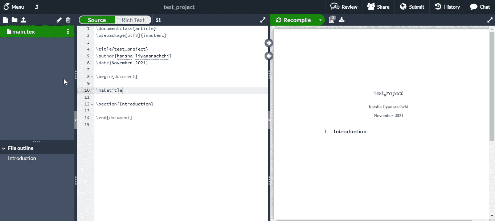

左侧是面板，用户可以在其中组织他们在项目中的文件和文件夹(文件管理器面板)。您不仅可以创建文件夹，还可以在项目空间中上传和组织外部文件。你可以创建单独的文件夹来保存你的图片。

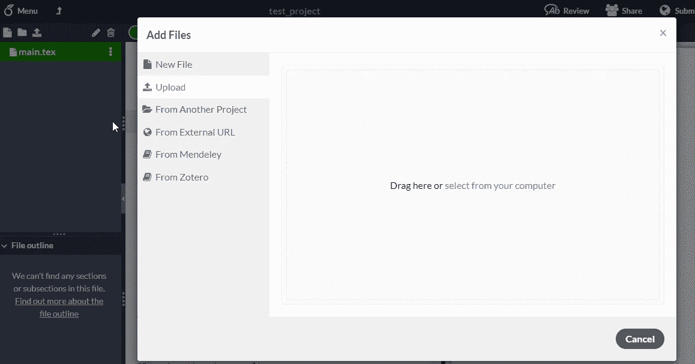

中间部分是用户使用 LaTex 输入内容的地方(带圆圈的区域可以用作编辑区域，以便向文档输入内容)。

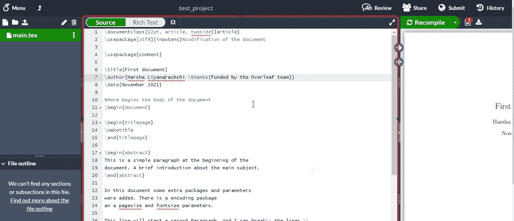

右侧部分是用户能够以 PDF 格式呈现文档输出的区域。

overleadf 中的其他酷功能，用户可以在其他人之间共享它来阅读或使用它。


使用编辑器中存在的面板，用户可以通过单击 submot 按钮从编辑器中轻松提交出版物文档。


单击历史将显示版本控制面板，而聊天按钮将打开聊天窗口，用户可以在其中与其他协作者聊天。

你可以看到另一个很棒的面板，当你点击仪表板上的菜单图标时，有几个选项可供使用。

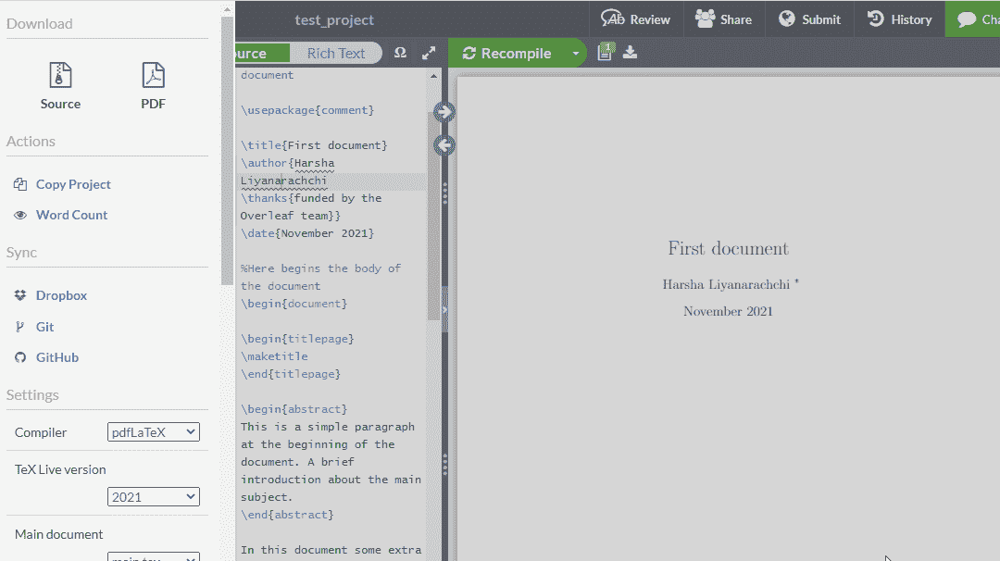

完成文档中的修改后，您可以通过单击重新编译按钮和旁边的下载 PDF 按钮来呈现 PDF 文件，下载 PDF 格式的文档。

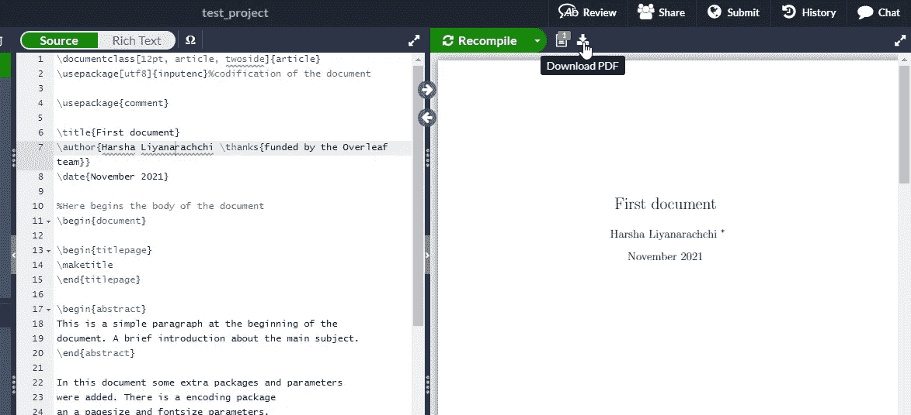

**PS:** 在重新编译和下载按钮之间，您可以找到按钮来查看文件日志和输出，您可以在其中找到任何与您的文档相关的错误或警告消息，并可以使用该功能轻松修复您的文档中的错误。

**步骤 03 —开始编写文档**

用户可以在项目创建时通过选择现有模板来开始文档，或者用户可以使用 latex 根据需要来安排文档。

但是当涉及到学术工作时，用户在安排文档时需要遵循一些标准或结构。当然，你需要包括封面(标题，作者细节等)，引用(参考)，表格和数字。

出于演示目的，我使用了一个现有的示例模板。

文件结构如下图所示。只有一个名为 main.tex 的文件，用户可以在其中包含修改文档的内容。

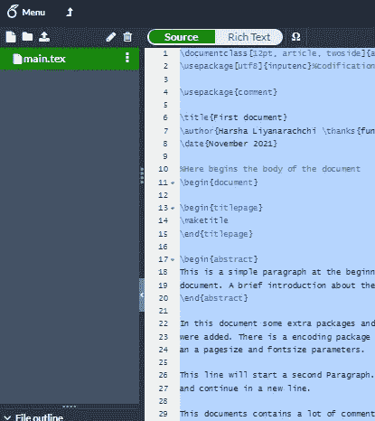

源代码将在下面的代码片段。

上面的源代码可以创建下面的 PDF 文档。

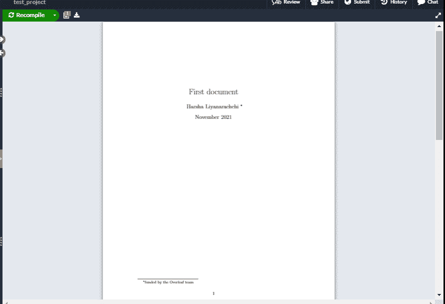

*   \documentclass[12pt，article，twoside]{article} —我们将此文档的常规字体大小设置为 12pt，然后将文档类型设置为 article。
*   \usepackage —用于加载创建文档所需的包。
*   \标题\作者\日期—用于在文档中输入文档标题、作者详细信息和日期的关键字。
*   \节—帮助定义文档中的节。
*   \begin{document} —开始文档正文。
*   \end{document} —文档正文的结尾。
*   \ begin { abstract } & \ end { abstract }—用于在必要时定义文档中的摘要部分。

像 wise 一样，为了在背面的[工作，你需要熟悉很多关键词。](https://www.overleaf.com/learn)

[](https://www.overleaf.com/learn) [## 证明文件

### 欢迎来到背面的知识库。左手边提供了完整的主题列表，但这里有一个…

www.overleaf.com](https://www.overleaf.com/learn) 

如果用户希望**在文档**中包含数字。首先，他们需要将图像上传到项目工作空间。然后你可以调用下面的代码片段。

*   添加[个表格](https://www.overleaf.com/learn/latex/Tables)。(将在下一篇文章中讨论如何在文档中添加带有不同选项的表格)。

**引文/参考文献**

引文是学术文献中最重要的部分，用户可以在其中找到参考资料的详细信息。

在背面，用户可以在 bibtext 文件中单独保存引文，如下图所示。

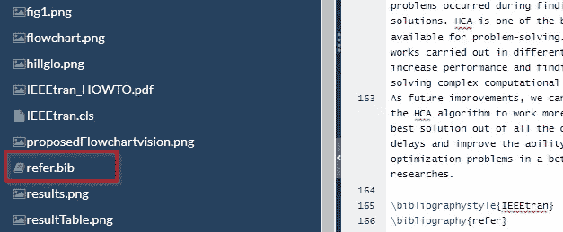

导航到文件管理面板，单击添加新文件并使用创建文件。围兜延伸。在创建的 bib 文件中，您可以包含 bibtex 格式的参考详细信息。

样品 bibtex 看起来像，

```
[@INPROCEEDINGS](http://twitter.com/INPROCEEDINGS){second,  
author={L. {Hernando} and A. {Mendiburu} and J. A. {Lozano}},  booktitle={2018 IEEE Congress on Evolutionary Computation (CEC)},   title={Hill-Climbing Algorithm: Let's Go for a Walk Before Finding the Optimum},   year={2018},  volume={},  number={},  pages={1-7},  doi={10.1109/CEC.2018.8477836}
}
```

你可以在 IEEE Explorer、researchgate 等研究论文发布网站上轻松获得 bibtex 格式的参考资料。

要在您的文档中使用这些 bibtex 格式的参考文献，用户需要使用\cite{citationID}来调用它，您不需要一直记住引用 ID，编辑器会将用户包含的所有引用 id 建议到 bib 文件中。你论文的参考文献列表将根据你的参考文献类型自动生成。

我的大部分学术著作都遵循 IEEE 格式，将向你展示如何在你的文档中设置 IEEE 格式的引用。

\bibliographystyle{IEEEtran} —将有助于确定需要遵循的参考样式，它可以是 IEEE 参考标准或任何其他标准。

\书目{refer} —这将链接。bib 文件。tex 文档，在花括号内，用户需要包含用户创建的 bibTex 文件名，以包含引用 bibTex。根据此示例，refer 是 bib 文件名(refer.bib)。

以下是一些包含符号、数学表达式等的键盘快捷键。

[](https://www.overleaf.com/latex/templates/symbol-table/fhqmttqvrnhk) [## 符号表

### 易于使用的在线 LaTeX 编辑器。无需安装，实时协作，版本控制，数百个 LaTeX…

www.overleaf.com](https://www.overleaf.com/latex/templates/symbol-table/fhqmttqvrnhk) 

这不是结束…

在下一篇文章中，您将学习如何通过 latex 编辑器将表格包含到文档中