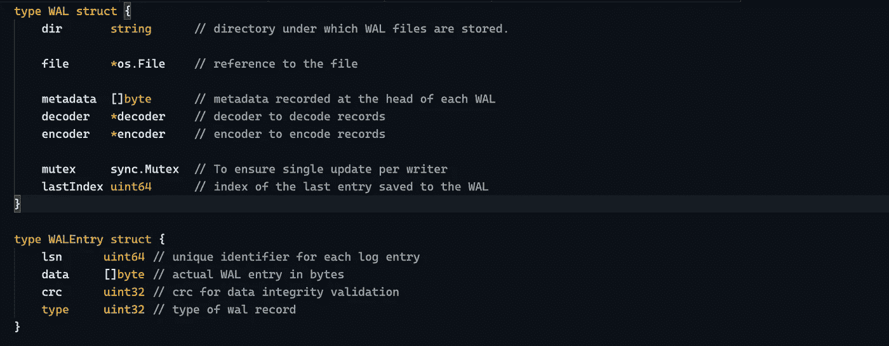

# 预写日志— WAL

> 原文：<https://medium.com/nerd-for-tech/write-ahead-log-wal-c4c3327c6742?source=collection_archive---------2----------------------->

预写日志示例结构

强持久性是默认的，这是我们从所有数据存储中假定的。但是，您是否想知道，即使在服务器崩溃(电源故障/操作系统故障/硬件故障)的情况下，如何在满足所有高性能/高吞吐量要求的情况下实现这种高耐用性。嗯，答案是沃尔。

# WAL —提前写入日志