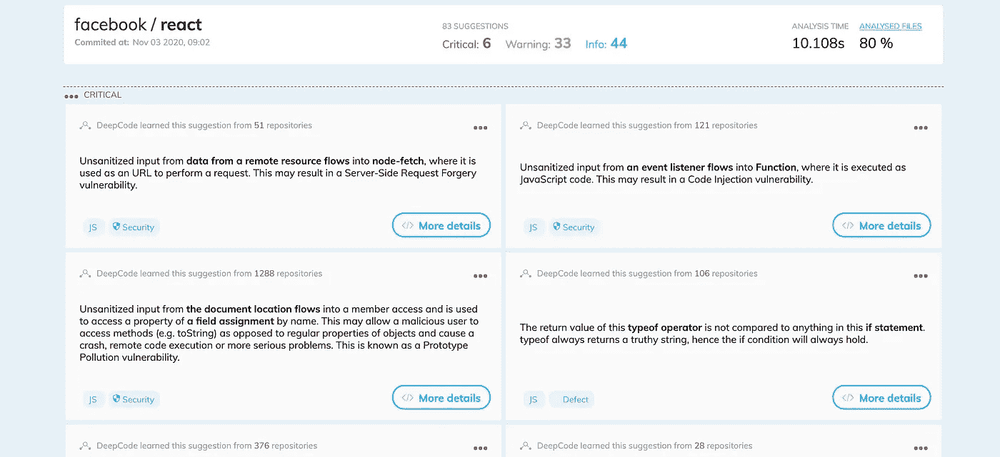
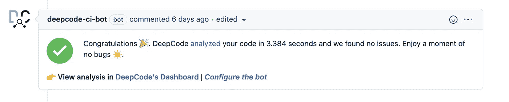

# 用 AI 写出更好的代码

> 原文：<https://medium.com/nerd-for-tech/write-better-code-with-ai-dd688abbdbf1?source=collection_archive---------20----------------------->

在 [Unsplash](https://unsplash.com?utm_source=medium&utm_medium=referral) 上拍摄的 [ThisisEngineering RAEng](https://unsplash.com/@thisisengineering?utm_source=medium&utm_medium=referral)

人工智能是当今最重要的技术。它开启了我们看待数据的新方式。

它可以:

*   对用户的信息进行分类，以检查作者的意图
*   为我们写一篇文章
*   从实体模型创建整个应用程序

**那么，我们为什么不用它们来编写我们自己编写的审查代码呢？**

# Deepcode 满足了这些需求

Deepcode 是“第一个实时语义代码分析——由人工智能驱动”,正如其网站上所说。是由 [Snyk](https://snyk.io/) 创作的。他们负责扫描你的代码寻找漏洞。这也是 Deepcode 在扫描分析代码库方面有很强背景的原因。

[扫描 React 代码库结果](https://www.deepcode.ai/app/gh/facebook/react/6b28eb6175e5251b31507749b79c55c0e389b6ef/_/dashboard)

Deepcode 不仅指出可能导致错误或漏洞的代码，还会提示您如何解决这些问题。这是我们改进代码库的快速有效的方法。

Deepcode 支持 6 种不同的语言:

*   JavaScript/类型脚本
*   Java 语言(一种计算机语言，尤用于创建网站)
*   计算机编程语言
*   C/C++
*   C#
*   服务器端编程语言（Professional Hypertext Preprocessor 的缩写）

这一切都是免费的。

# 使用深度代码

我们可以将 deepcode 与几个 IDE 集成。我们可以对 VS 代码、Sublime Text、IntelliJ 和 Atom 使用扩展。此外，我们可以将 Deepcode 的 bot 集成到我们的存储库中。Bot 留下了关于代码分析和在打开的 pull 请求中发现的错误的评论。

深度代码分析通过

您可以在 [Deepcode integrations](https://www.deepcode.ai/integrations) 页面上找到关于在哪里以及如何使用它的更多信息。

# 用在哪里？

我意识到并不是每个项目都能从使用 Deepcode 中获益。不是在每个项目中，你都可以使用一个工具来扫描你的整个代码库。它非常适合只有一个 dev 的项目。第二双眼睛总是很珍贵。Deepcode 可以代替二次开发者寻找小 bug 和常见错误。

# 摘要

人工智能很神奇。帮助越来越多。Deepcode 非常适合没有很多开发者的副业项目。它可以帮助您确保您的代码不包含常见错误。但不仅限于此，它还可以帮助你在大型项目中补充开发人员的代码审查。自己试试 Deepcode 让我知道你的想法。