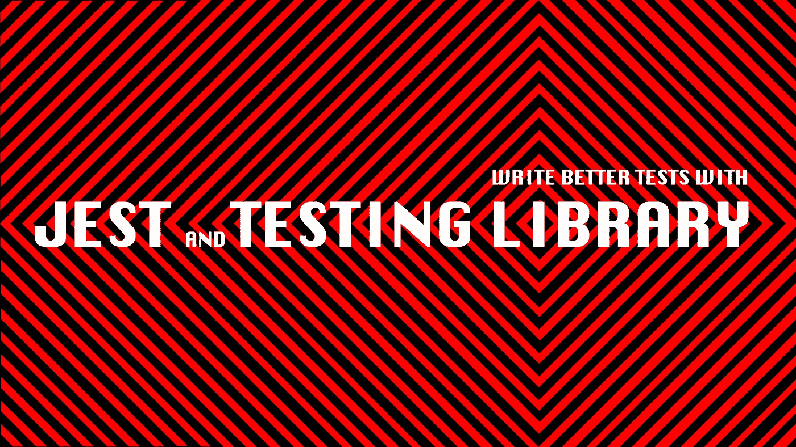
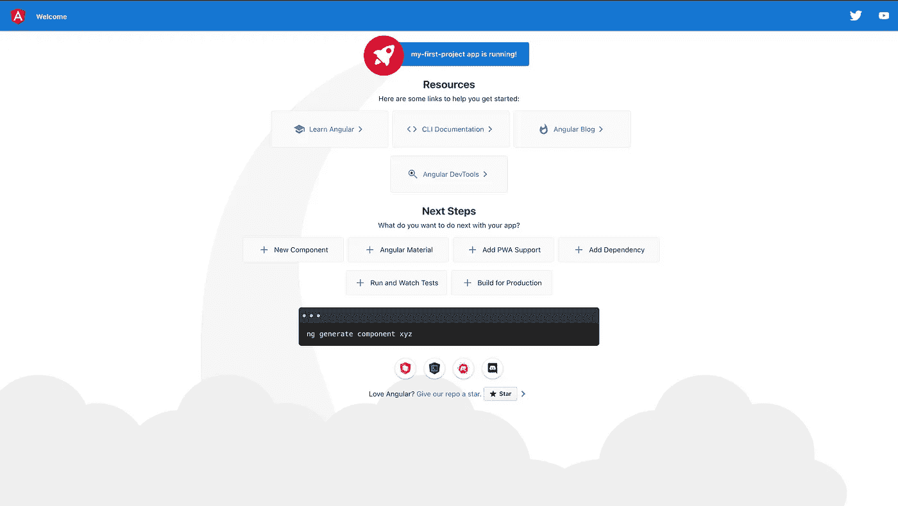
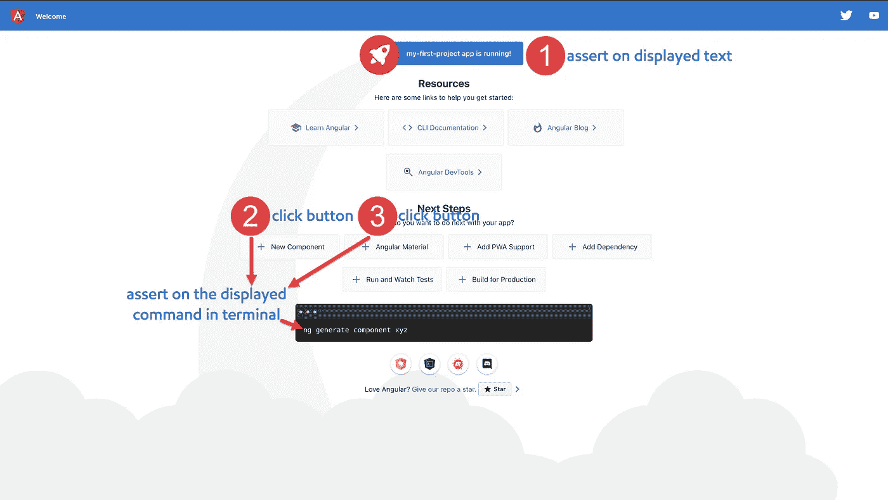

# 用 Jest 和测试库编写更好的测试

> 原文：<https://medium.com/nerd-for-tech/write-better-tests-with-jest-and-testing-library-e7eee393e583?source=collection_archive---------1----------------------->

采取渐进的步骤来编写无实现细节的测试



# 放弃

在这个演示中，我使用从 Angular CLI 生成的应用程序代码和测试(当创建新项目时),并假设这是实际的生产应用程序。我相信这足以指出如何改进我们的测试策略。

# 先决条件

## 角度投影

遵循[角度命令](https://angular.io/cli)创建新项目。创建一个之后，尝试使用以下命令在本地提供服务。

```
ng serve
```

在浏览器中，打开 [http://localhost:4200/](http://localhost:4200/) 查看新应用程序的运行。



应用程序在本地启动并运行

# 重写测试# 0——从初始测试开始

角度应用由示例代码和测试生成。通过运行下面的命令，您会看到所有测试都通过了。

```
ng test
```

仔细看看。您会看到这些是实现细节测试。

*   测试#1 断言创建了组件的一个实例— *除了组件可以被实例化之外，它什么也没说*
*   测试#2 断言组件属性的值— *，即使测试通过，但这并不保证该属性将被正确地绑定到视图，并且对用户可见*
*   test#3 查询 class 和 html 标记以在显示的文本上断言— *这比前两个要好。但是 css 选择器对最终用户是不可见的(他们也不在乎)。如果开发人员决定重新设计/重构，例如类名的改变，测试将会失败，但是应用程序仍然可以工作(假阴性)。*

```
import { TestBed } from '@angular/core/testing';
import { AppComponent } from './app.component';describe('AppComponent', () => {
  beforeEach(async () => {
    await TestBed.configureTestingModule({
      declarations: [AppComponent],
    }).compileComponents();
  });//test#1
  it('should create the app', () => {
    const fixture = TestBed.createComponent(AppComponent);
    const app = fixture.componentInstance;
    expect(app).toBeTruthy();
  });//test#2
  it(`should have as title 'my-first-project'`, () => {
    const fixture = TestBed.createComponent(AppComponent);
    const app = fixture.componentInstance;
    expect(app.title).toEqual('my-first-project');
  });//test#3
  it('should render title', () => {
    const fixture = TestBed.createComponent(AppComponent);
    fixture.detectChanges();
    const compiled = fixture.nativeElement as HTMLElement;
    expect(compiled.querySelector('.content span')?.textContent).toContain('my-first-project app is running!');
  });
});
```

# 重写测试# 1——考虑用例

我提出了两个新的用例(最初可能更多，但是对于这个演示来说两个用例就足够了)，即用户可以看到应用程序的标题(测试#1)，用户可以单击按钮并看到自动生成的命令(测试#2，测试#3)。

*   测试#1 在显示的文本上断言
*   测试#2 单击“新组件”按钮，并在终端显示的命令上断言
*   测试#3 点击“角材料”按钮，并在终端显示的命令上断言



```
import { TestBed } from '@angular/core/testing';
import { AppComponent } from './app.component';describe('AppComponent', () => {beforeEach(async () => {
    await TestBed.configureTestingModule({
      declarations: [AppComponent],
    }).compileComponents();
  });test('should render title and display angular cli command after clicking button - using Karma and Jasmine', async () => {//test#1 assert on the displayed text
    const fixture = TestBed.createComponent(AppComponent);
    fixture.detectChanges();
    const compiled = fixture.nativeElement as HTMLElement;
    expect(compiled.querySelector('.content span')?.textContent).toContain('my-first-project app is running!');//test#2 click ‘New Component’ button and assert on the 
//displayed command in terminal
    const terminal = fixture.nativeElement.querySelector('.terminal');
    let buttonElement = fixture.debugElement.query(debugEl => debugEl.name === 'button' && debugEl.nativeElement.textContent === 'New Component');
    buttonElement.triggerEventHandler('click', null);
    fixture.detectChanges();
    await fixture.whenStable();
    expect(terminal.textContent).toBe('ng generate component xyz');//test#3 click ‘Angular Material’ button and assert on the  
//displayed command in terminal
    buttonElement = fixture.debugElement.query(debugEl => debugEl.name === 'button' && debugEl.nativeElement.textContent === 'Angular Material');
    buttonElement.triggerEventHandler('click', null);
    fixture.detectChanges();
    await fixture.whenStable();
    expect(terminal.textContent).toBe('ng add @angular/material');
    expect(terminal.textContent).not.toBe('ng generate component xyz');
  });
});
```

它更好，但是…语法似乎非常复杂，没有人能一目了然。

# 重写测试# 2——使用角度测试库编写实现细节自由的测试

在这个增量步骤中，我用`jest`替换了`Karma`和`Jasmine`，还添加了`@testing-library/angular-testing-library`。

## 用笑话代替因果报应和茉莉

遵循[预设角度文档](https://thymikee.github.io/jest-preset-angular/docs/getting-started/installation/)

## 添加角度测试库

遵循其[文档](https://github.com/testing-library/angular-testing-library)

重写测试后，您可以看到这些测试不依赖于实现细节。我们现在测试应用程序的方式与用户使用它的方式相同，并根据用户在屏幕上看到的内容进行断言。这些实用程序函数使测试易于理解。

```
import { fireEvent, render, screen } from '@testing-library/angular';
import { AppComponent } from './app.component';describe('AppComponent', () => {
  test('should render title and display angular cli command after clicking button - using angular testing library', async () => {
    **await render(AppComponent);**//test#1 assert on the displayed text     
    **expect(screen.getByText(`my-first-project app is running!`))**//test#2 click ‘New Component’ button and assert on the 
//displayed command in terminal    
    **fireEvent.click(screen.getByRole('button', { name: /New Component/i }));
    expect(screen.getByText(`ng generate component xyz`));**//test#3 click ‘Angular Material’ button and assert on the  
//displayed command in terminal    
    **fireEvent.click(screen.getByRole('button', { name: /Angular Material/i }));
    expect(screen.getByText(`ng add @angular/material`));
    expect(screen.queryByText(`ng generate component xyz`)).toBeNull;**
  });
});
```

# 重写测试# 3——用`userEvent`替换`fireEvent`

这是相对较小的一步。我添加了`@testing-library/user-event`库——“它模拟了用户与浏览器交互时会在浏览器中发生的真实事件”。您可以看到它提供了来自`fireEvent`的高级 API。

## 添加用户事件

遵循其[文档](https://github.com/testing-library/user-event)

```
import { render, screen } from '@testing-library/angular';
**import userEvent from '**[**@testing**](http://twitter.com/testing)**-library/user-event';**
import { AppComponent } from './app.component';describe('AppComponent', () => {
  test('should render title and display angular cli command after clicking button - using angular testing library, userEvent', async () => {
    await render(AppComponent);

    //test#1 assert on the displayed text
    expect(screen.getByText(`my-first-project app is running!`))

    //test#2 click ‘New Component’ button and assert on the 
    //displayed command in terminal
    **userEvent.click**(screen.getByRole('button', { name: /New Component/i }));
    expect(screen.getByText(`ng generate component xyz`));//test#3 click ‘Angular Material’ button and assert on the  
    //displayed command in terminal
    **userEvent.click**(screen.getByRole('button', { name: /Angular Material/i }));
    expect(screen.getByText(`ng add @angular/material`));
    expect(screen.queryByText(`ng generate component xyz`)).toBeNull;
  });
});
```

# 重写测试#4 —用`toBeInTheDocument`替换`toBeNull`

另一个小步骤是，`@testing-library/jest-dom`库提供了一组自定义的 jest 匹配器来扩展`jest`。这将使测试更具声明性，更易于阅读和维护。

## 添加笑话

遵循其[文档](https://github.com/testing-library/jest-dom)

现在我们将从`toBeNull`改为`toBeInTheDocument`——这将使测试更具声明性。`toBeInTheDocument`允许断言文档中是否存在某个元素。

```
import { render, screen } from '@testing-library/angular';
import userEvent from '[@testing](http://twitter.com/testing)-library/user-event';
import { AppComponent } from './app.component';describe('AppComponent', () => {
  test('should render title and display angular cli command after clicking button - using angular testing library, userEvent, jest-dom', async () => {
    await render(AppComponent);//test#1 assert on the displayed text     
    expect(screen.getByText(`my-first-project app is running!`))

//test#2 click ‘New Component’ button and assert on the 
//displayed command in  terminal
    userEvent.click(screen.getByRole('button', { name: /New Component/i }));
    expect(screen.getByText(`ng generate component xyz`));//test#3 click ‘Angular Material’ button and assert on the  
//displayed command in terminal
    userEvent.click(screen.getByRole('button', { name: /Angular Material/i }));
    expect(screen.getByText(`ng add @angular/material`));
    expect(screen.queryByText(`ng generate component xyz`))**.not.toBeInTheDocument();**
  });
});
```

# 摘要

我有 3 个理由来说明为什么我们需要编写测试，测试库可以帮助我在各个方面进行改进。

1.  **将代码交付到产品的信心**:让我引用[来自测试库*的指导原则*](https://testing-library.com/docs/guiding-principles/)你的测试越像你的软件被使用的方式，他们就能给你越多的信心。”
2.  **重构/实现附加特性的安全网**:编写实现细节自由测试可以避免重构带来的测试失败。我们现在可以肯定，测试失败是有原因的❎误报❎误报。
3.  文档:测试库提供了更高级的 API，使得测试更具声明性和可理解性。任何人都可以查看测试，并且应该能够理解这些被测试组件中的用例。