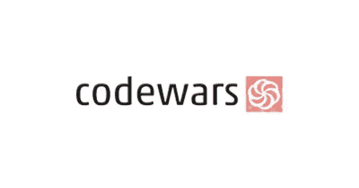
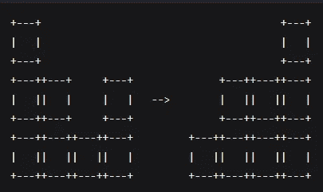
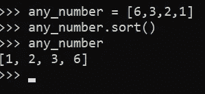
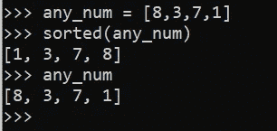

# 编写代码大战-重力翻转解决方案 Python

> 原文：<https://medium.com/nerd-for-tech/write-up-code-wars-gravity-flip-solutions-python-3d7355a4f463?source=collection_archive---------6----------------------->



Code Wars 是从编程语言中学习算法的最佳平台，在这里我想用 Python 编写“重力翻转”挑战的解决方案。写的时候，挑战在 kyu 8。

好吧，不要对 kyu 8 失望。去年，我真的很喜欢 JavaScript，现在依然如此。但是，不知何故，我觉得数据科学在 5 年内会有更大的机会。于是，我把我的帆变成了 Python 语言。作为对数据科学的介绍。

最近我分享了这篇文章，因为这个挑战让我对 Python 有了一个非常基本的概念，但是这很重要，我也有一个这样的座右铭。

> 你永远不会明白一件事，除非你能把它教给孩子

所以让我们开始吧！

# 问题

```
Bob is bored during his physics lessons so he's built himself a toy box to help pass the time. The box is special because it has the ability to change gravity.There are some columns of toy cubes in the box arranged in a line. The i-th column contains a_i cubes. At first, the gravity in the box is pulling the cubes downwards. When Bob switches the gravity, it begins to pull all the cubes to a certain side of the box, d, which can be either 'L' or 'R' (left or right). Below is an example of what a box of cubes might look like before and after switching gravity.
```



```
Given the initial configuration of the cubes in the box, find out how many cubes are in each of the n columns after Bob switches the gravity.
```

# 例子

```
flip('R', [3, 2, 1, 2])     =>  [1, 2, 2, 3]
flip('L', [1, 4, 5, 3, 5])  =>  [5, 5, 4, 3, 1]
```

# 回答

是的，只需要两行代码就可以解决。我对 JavaScript 的理解对这个概念很有帮助。但不知何故，这种语法有时让我很烦，但没问题——我学到了很多。

如你所见，我在程序中使用了两个基本概念，排序算法和三元运算符。

## 分类算法

通过解决这个问题，我才明白，在 Python 中有两个函数可以对列表进行排序。是 sort()和 sorted()。这两者的不同之处在于 sort()直接改变列表，不返回任何值，而 sorted()不改变列表，而是返回排序后的列表。

所以当你使用 sort()时，如下图所示



在调用它之前，输出将是 none。因为这个过程是在后端(系统)。但是当你使用 sorted()时，如下图所示



执行完命令后，输出将被直接打印，但原始列表不会受到影响。

仅供参考，这两个函数都有两个参数，可能会在您的项目中有用。

*   reverse-如果值为 True，排序后的列表将反转(降序)
*   key——它对于像 JSON 这样的大信息的排序很有用。因为它是一个关键字。

## 三元运算符

一年前问我这个，我会说，那是什么？😂。但是，自从我学习 JavaScript 以来，六个月已经过去了。我真的很喜欢这个，因为三进制使得函数更加简单。而不是构建占用许多行真正大的嵌套循环。你只用一行就能完成。

三元运算符是一种条件运算符，用于计算事物的真假。有什么特别的，只需要一句台词。相信我，这会让你看起来更聪明。Python 中的语法与 JavaScript 不同，但仍然可以理解

```
[True_statement] if [expression] else [False_statement]
```

如你所见，我的答案是这样写的

```
return sorted(arr) if text == 'R' else sorted(arr, reverse=True)
```

因此，在长的答案看起来会像这样

```
if text == 'R':
    return sorted(arr)
else:
    return sorted(arr, reverse=True)
```

据我所知，我们不能返回任何‘If 条件’，但在三元运算符中可以。所以我得到了四行，而只用一行就完成了任务。

# 结论

在这里我们得出结论，我们已经编写了简单的程序，其中包含排序算法和三元运算符。我知道这真的很简单，但是你知道上面的天空仍然是一片天空吗，所以我找到了更多干净的答案，并投票将其作为最佳实践。

```
def flip(d,a):
    return sorted(a, reverse=d=='L')
```

这样更简单，对吗？，感谢阅读到最后。

记住，
好好码✌

## 我的 Python 文章集的链接

[](https://github.com/theDreamer911/codewars-python) [## dream 911/codewars-python

### 这是我为 Python 语言写的 codewars。通过创建……为 dream 911/codewars-python 开发做出贡献

github.com](https://github.com/theDreamer911/codewars-python)