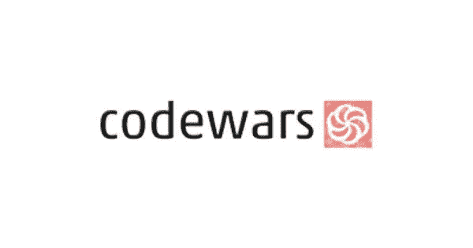
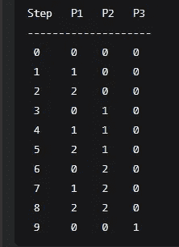
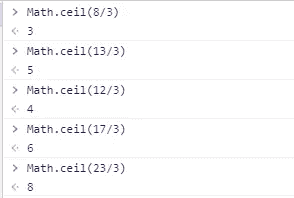
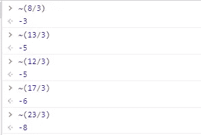
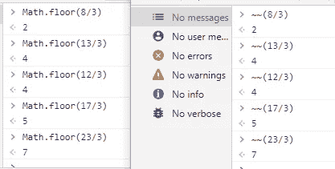

# 写代码大战—动手解决方案 JavaScript

> 原文：<https://medium.com/nerd-for-tech/write-up-code-wars-hands-up-solutions-javascript-a35e83b0db84?source=collection_archive---------11----------------------->



Code Wars 是从编程语言学习算法的最佳平台，在这里，我想用 JavaScript 编写“举手”挑战的解决方案。写的时候，挑战还在 kyu 7。我知道这只是圭 7，但我第一次遇到这个挑战是在一月左右，但直到今天我没有完成它，直到搜索写了。

# 描述

```
Imagine that you have an array of 3 integers each representing a different person. Each number can be 0, 1, or 2 which represents the number of hands that person holds up.Now imagine there is a sequence which follows these rules:None of the people have their arms raised at firstFirstly, a person raises 1 hand; then they raise the second hand; after that they put both hands down — these steps form a cyclePerson #1 performs these steps all the time, person #2 advances only after person #1 puts their hands down, and person #3 advances only after person #2 puts their hands downThe first 10 steps of the sequence represented as a table are: 
```



```
Given a number, return an array with the number of hands raised by each person at that step.
```

# 这个概念

正如你所看到的，也许这个挑战并不难理解，但如果我们还是初学者，这将是非常具有挑战性的。它将使用数学地板功能，使它更容易，但在这里，我想告诉你，也许新的运营商。

> ~还有~~

## ~运算符

~运算符的工作方式类似于 Math ceil，但是在负上下文中，下面是一个例子



你看所有的数字都会被四舍五入到下一个最大的整数。如果你使用~操作符，它会变成像这样的负数



## ～运算符

～运算符的工作方式与我之前说过的数学底数相同，所以结果将舍入到下一个最小的整数



了解这个概念后，让我们完成这个形

# 答案

*   使用数学地板

*   使用~~运算符

那么，你认为哪个答案是最好的。感谢你的阅读，我希望它能帮助你，让你更好地理解 JavaScript，最后有一个漂亮的代码。