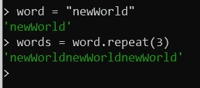

# 书写代码战争—罗马数字编码器解决方案 JavaScript

> 原文：<https://medium.com/nerd-for-tech/write-up-code-wars-roman-numerals-encoder-solutions-javascript-875b2cc8da28?source=collection_archive---------3----------------------->


Code Wars 是从编程语言学习算法的最好平台，在这里我想用 JavaScript 写一个“罗马数字编码器”挑战的解决方案。写的时候，挑战还在 kyu 6。

## 问题

```
Create a function taking a positive integer as its parameter and returning a string containing the Roman Numeral representation of that integer.Modern Roman numerals are written by expressing each digit separately starting with the left most digit and skipping any digit with a value of zero. In Roman numerals 1990 is rendered: 1000=M, 900=CM, 90=XC; resulting in MCMXC. 2008 is written as 2000=MM, 8=VIII; or MMVIII. 1666 uses each Roman symbol in descending order: MDCLXVI.
```

## 例子

```
solution(1000); // should return 'M'
```

## 暗示

```
Symbol    Value
I          1
V          5
X          10
L          50
C          100
D          500
M          1,000Remember that there can't be more than 3 identical symbols in a row.
```

如你所见，挑战的目的是让我们输入的每个整数都变成罗马符号。如果你还记得第一个算法。对我来说，它是将测验值分配到单词 A、B、C、D 或 e 中。这都是一样的，不同的是，我们需要将它分配到罗马编码器中。所以看起来很难，对吗？。

所以，你可以用老方法完成它，像这样(这个想法来自[法尔](https://www.codewars.com/users/Phares)

太长了吧？从老办法来说，我们可以改进。正如你所看到的，每个罗马字符都会变成特定的数字。所以，通过将它声明为一个对象，我们可以得到答案。这是我的答案，它改进了我在谷歌上找到的另一个解决方案。

在第 11 行，我使用了 repeat 函数。这是一个内置函数，用于构建包含指定数量的字符串副本的新字符串。对于这个例子，我声明了新的变量 word，并重复了三次。



这个词会被重复，对吗？在我的解决方案中，我只是把它放入 for 循环函数中，所以它会一直重复，直到数完为止。

是的，确切地说，我仍然是个新手，有很多事情我还不知道。我希望这篇文章能帮助你，并希望你永远不要停止学习。

有一个好的代码😉