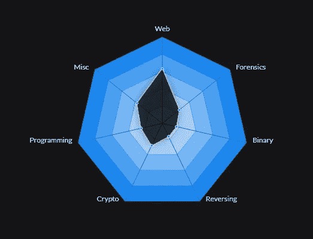
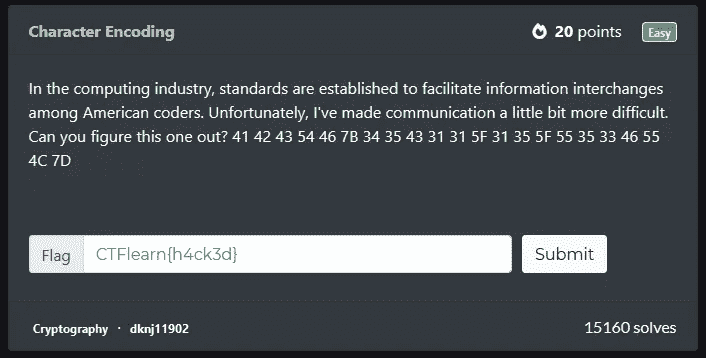
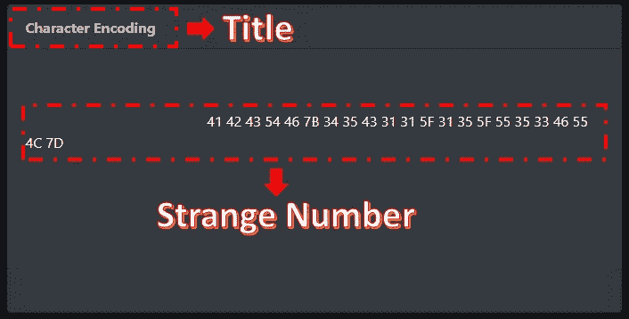
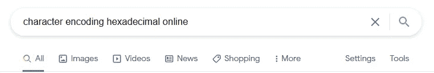
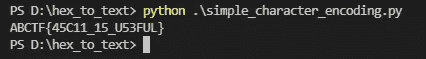

# 写下 CTFlearn —字符编码

> 原文：<https://medium.com/nerd-for-tech/write-up-ctflearn-character-encoding-b55736003f0c?source=collection_archive---------8----------------------->

奥拉夫·阿伦斯·罗特内在 [Unsplash](https://unsplash.com/s/photos/challenge?utm_source=unsplash&utm_medium=referral&utm_content=creditCopyText) 上的照片

CTFlearn 是学习网络安全的绝佳平台。它包含了从最容易到最困难的许多挑战。此外，它有很大的社区让你和其他人互动。网络安全不是计算机科学的新领域。但是，在这个平台上，你可以学习 Web、取证、二进制、逆向、加密、编程和其他知识。

上图是我的统计，你可以点击这个[链接](https://ctflearn.com/user/scarletpark)关注我。从图中我们可以毫不夸张地说，我对网络感兴趣。但是对于这篇文章，我想分享一下名为“二进制编码”的密码学。

因为我热爱代码，所以让我们用编程语言来完成这个任务。在这种情况下，我将使用 Python。好吧，我们开始吧。这就是问题。

完成 CTF 挑战赛最重要的概念是我们能发现最重要的事情。因为，不是所有的都重要，挑战中总有线索。对于上面的挑战，可以重点关注题目和怪号。

如果你曾经学习过密码学，我相信你会明白这个奇怪的数字其实是十六进制的。因此，要完成这项工作，你只需要结合挑战中的重要参数，并输入到谷歌搜索。

嗯，与其用那种方式，不如用更酷的方式。好的，在 Python 中，有一个叫做编解码器的模块。这个模块定义了一组对象基类。通过这个帮助，我们可以将十六进制的编码字符转换成文本。语法很简单，就像这样。

我们来谈谈代码

*   在第一行，代码将导入一个名为 codecs 的模块
*   在第三行中，陌生的数字被保存到名为十六进制的变量中
*   在第四行，我们将十六进制合并成一个字符串格式，并保存到名为 hexs 的变量中。因为我懒得一个个把空格去掉，所以我更喜欢用 join 和 split 函数。
*   在第五行中，我们将六进制解码成字符串。如您所见，它将调用名为 decode 的编解码器函数，该函数采用两个变量。
*   在最后一行，我们打印输出

如果你运行这个程序，它会得到这样的输出

恭喜您获得旗帜` abctf { 45c 11 _ 15 _ U53FUL } ` 1

嗯，感谢你阅读这篇文章，写这篇文章。我刚刚发现了一个词，我想这样分享

> 越坚持一件事，第一眼就越明白~ @handhikayp

如果你真的对什么感兴趣，我认为你应该去追逐它。再次感谢你的阅读，永远感谢。

祝你代码✌愉快