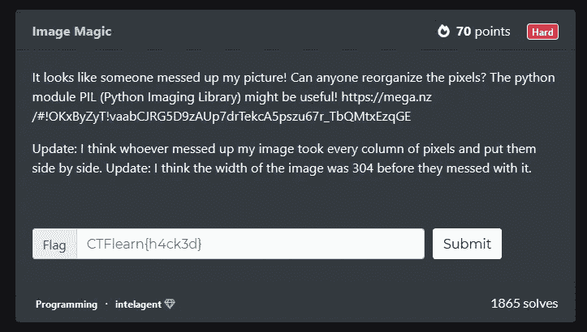
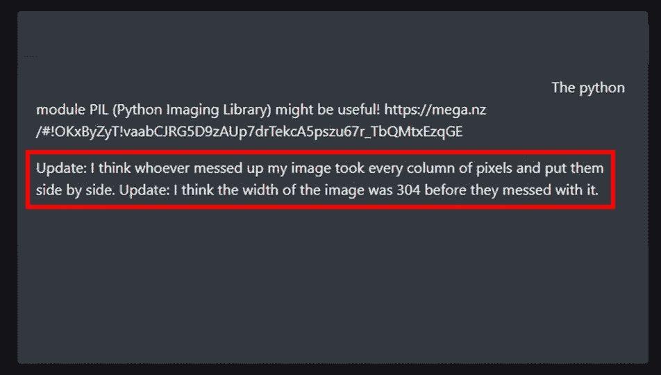
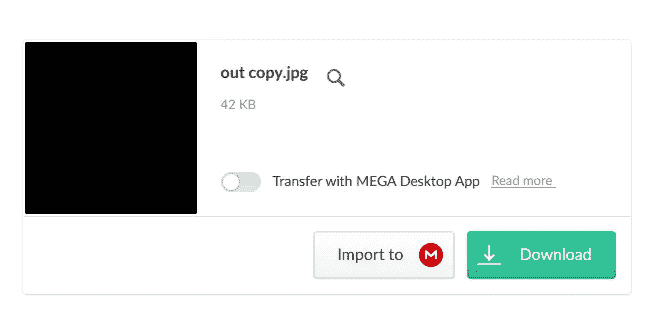
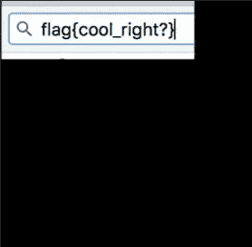
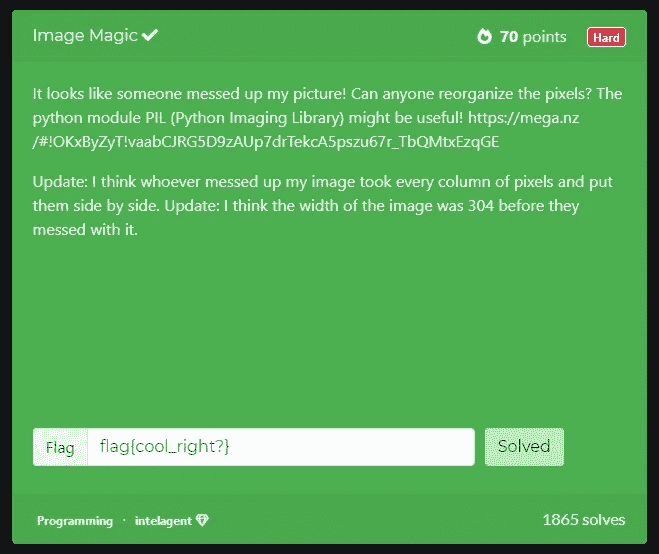

# 写 CTFlearn —图像魔术

> 原文：<https://medium.com/nerd-for-tech/write-up-ctflearn-image-magic-2caf5d651913?source=collection_archive---------9----------------------->


阿什·埃德蒙兹在 [Unsplash](https://unsplash.com/s/photos/abstract?utm_source=unsplash&utm_medium=referral&utm_content=creditCopyText) 上拍摄的照片

现在，我们再一次为 CTFlearn 提供另一种解决方案。今天我想分享一下编程挑战'[图像魔法](https://ctflearn.com/challenge/89)'。写这篇文章的时候，挑战等级是硬的，奖励是 70 分。



好了，在打破这个问题，并采取了重要的一部分，我得到了这个



如您所见，有几个信息可以帮助我们解决这个问题

*   Python 模块 PIL
*   网址:[链接](https://mega.nz/#!OKxByZyT!vaabCJRG5D9zAUp7drTekcA5pszu67r_TbQMtxEzqGE)
*   每列像素将它们并排放置
*   图像的宽度 304

# 暗示

## PIL 模块

PIL (Python 图像库)是一个 Python 模块，可用于在解释器中增加图像处理功能。它由弗雷德里克·伦德建造。这个模块也被称为枕头。枕头比 PIL 更友好，它由亚历克斯·克拉克叉成。要使用这个模块，首先我们需要使用这个命令安装它

```
pip install Pillow
```

## URL:链接

巨大的文件链接实际上把我们带入了我们需要处理的图像。所以，就照常下载吧。[ [链接](https://mega.nz/#!OKxByZyT!vaabCJRG5D9zAUp7drTekcA5pszu67r_TbQMtxEzqGE) ]



## 每列像素将它们并排放置

为了理解这个意思，你应该打开这个文件。图像是这样的


你明白吗？我希望你能理解。正如我们所看到的，图像是在一行中构建的，根据提示，我们知道像素应该并排放置。

## 图像的宽度 304

我认为这是非常清楚的，原始图像的宽度约为 304，所以我们将在后面的代码中使用。

# 密码

这是编程挑战，让我们进入代码

好吧，让我们打破它，

*   首先，我们导入 PIL 模块
*   接下来，我们创建一个名为 image 的变量来保存图像。我们还声明了保存输出的变量。
*   在下一行中，直到 for 循环结束，图像将被分解成像素，然后再次组合。
*   最后，我们将新图像保存为“answer.jpg”

如果我们打开图像，我们会看到这样的显示


实际上我们已经完成了，但是为了让答案更具可读性，我们也可以使用 PIL 模块来翻转图片。

添加脚本后，现在图像将是这样的



我们完成了，只要把答案放进盒子里，我们就得到这个。



## 恭喜你！！！