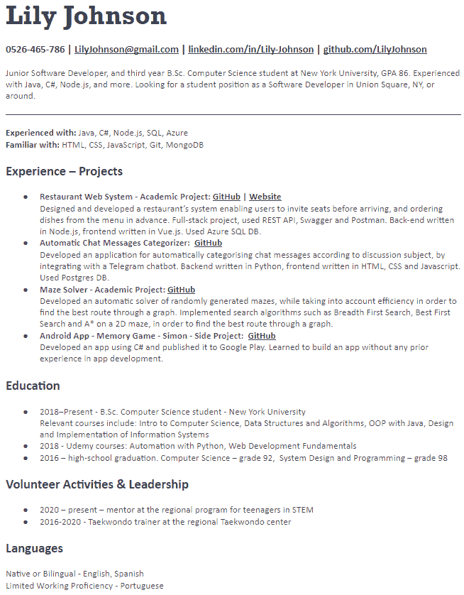

# 为你的第一个技术职位写一份出色的简历——第三部分

> 原文：<https://medium.com/nerd-for-tech/writing-a-great-cv-for-your-first-technical-role-part-3-aa0eb0379ffa?source=collection_archive---------4----------------------->

## 杂项部分、格式和最终 CV 示例

图片由[Free-Photos](https://pixabay.com/users/free-photos-242387/)@[pixabay](https://pixabay.com/)提供

欢迎来到我的系列*的第三部分，也是最后一部分，为你的第一个技术角色*写好简历。

在第[篇第](https://naomikriger.medium.com/writing-a-great-cv-for-your-first-technical-role-part-1-75ffc372e54e)篇和第[篇第二](https://naomikriger.medium.com/writing-a-great-cv-for-your-first-technical-role-part-2-6ee35affd74f)篇文章中，我们介绍了简历介绍、技术技能演示、副业&学术项目以及工作&志愿者经历。

现在，我们将进入最后一集，关注简历的最后部分。你应该还是不应该在这个文档中添加爱好和语言？如何处理格式化？简历中的章节如何排序？在编写和编辑这个文件时，有没有其他的提示需要记住？

这些是我们将在今天的文章中回答的一些问题。

你准备好了吗？我们开始吧！

# 杂项部分

图片由[shell _ ghost cage](https://pixabay.com/users/shell_ghostcage-2016503/)@[pix abay](http://pixabay.com)

你的一些爱好、课外活动和特质可能与简历非常相关。虽然不是每个爱好都是相关的，但重要的是要识别并添加那些相关的爱好。

例如:

*   优秀的标志——无论是在体育还是志愿者活动中——对未来的面试官来说都是一个很好的信号，表明你可以成为一名优秀的员工。
*   流利的外语可能与你的申请有关。虽然英语是“高科技”语言，但在许多国家，这并不是当地居民的母语，生活在美国或英国的移民也是如此。所以提及你的英语熟练程度很可能是相关的。我建议使用一个已知的语言等级，比如 [ILR 等级](https://en.wikipedia.org/wiki/ILR_scale)。
*   从事一项活动多年证明了一种能力，那就是当事情变得艰难或无聊时，坚持并长时间执行某事而不放弃

# 好例子:

**兴趣爱好**

地区跆拳道中心的跆拳道教练—2016–2020

**语言**

母语或双语——英语、西班牙语
有限的工作能力——葡萄牙语
初级能力——俄语

请记住，不要仅仅为了填充页面而添加爱好和活动，尤其是如果这是一项你参与了很短时间的活动。如果你在简历中添加了一些东西，尤其是在杂项部分——你这么做是因为你相信它在了解你时会有附加值。

# 简历长度——保持在一页以内

标准的简历长度是单页，我推荐坚持。尤其是如果你正处于职业生涯的初期，因此没有太多的工作经验。

没有充分理由就超过一页有两个问题:

1.  这表明你没有分清好坏
2.  你写得越多，就越难突出真正重要的东西——你希望被评判的技能和成就。记住——招聘人员会浏览你的简历，他们应该很容易从中发现对你最重要的东西。

这篇文章的一部分读者可能是正在改变职业的人，他们可能有很多东西要写。我仍然建议坚持一页纸，强调真正重要的东西。超越的唯一例外是需要列出特殊的成就，如长期职业生涯后的转变、管理经验、已发表的一长串学术文章等。

# 文件格式— DOCX 还是 PDF？

如何选择？以下是一些相关的注意事项:

*   **格式一致性:**有你的格式、设计、文件长度等。在不同平台上查看文件时保持一致非常重要。
    PDF 让你的格式保持一致，而 DOCX 则不然。
*   **人力资源系统的可扫描性:**一些公司使用自动系统扫描候选人的简历，寻找相关关键词。过去，这些系统主要支持 DOCX 文件，但现在许多系统也支持 PDF 文件。

我建议使用 PDF 作为您的主要格式，但总是有一个 DOCX 版本备用。申请职位时——检查是否提到了所需文件的格式，如果提到了，就跟着做。

# 简历中的图片——Pic 还是 Not to Pic？

有些人会在简历顶部添加照片，认为这有助于招聘人员更好地吸引应聘者。
强烈推荐**而不是**加图。一般来说，你应该删除任何可能错误地成为偏见基础的东西，图片就是其中之一。此外，你正在接受技能、专业知识、经验和潜力方面的测试。你的长相与你的申请无关，不应该参与其中。

# 格式和外观

*   确保文件看起来干净整洁。
    一方面——区分标题和内容很重要，这可以通过字体大小或者颜色来实现。强调重要的技能和成就也很重要，这可以通过使用**粗体**或*斜体*来实现。
    另一方面，我们应该保持文档的整体外观优雅。滥用格式化工具会导致文档难以阅读，而且看起来很不专业。
*   **常见格式错误示例:**
    a) **过度强调单词**(带粗体/斜体/下划线)——每隔一行或每隔几行。
    b) **在 CV 中使用多种颜色**。标题可以是彩色的，内容应该是黑色的。超过两种颜色通常就太多了。
    c) **使用多种字体大小**。再说一次——一种尺寸的标题和另一种尺寸的内容就可以了。
*   大多数情况下，Microsoft Word 的“简历”模板之一正是您要找的。
*   **不要为特殊布局而疯狂**。我见过“创造性的”布局，比如将页面分成两栏，或者沿着页面设置多个“立方体”。大多数情况下，这些文件读起来不舒服，也不容易被人力资源扫描系统处理。
    我们大多数人都是技术人员，没有设计背景，对我们来说可能很好的东西对其他人来说可能看起来不专业。最好着重强调技术技巧，保持文件的格式整洁优雅。
*   遵循上一节——重要的是**知道强调什么**。假设你选择用下划线来强调你所有的相关成就。找出那些让你脱颖而出的东西，例如优秀奖或重要课程的高分，只在上面加下划线。
*   陈述的顺序:这些部分既要按照日期排序，最近的高，最近的低，也要按照和你申请的职位最相关的事情的顺序。这篇文章大部分是按照我建议的提及不同部分的顺序写的。此外，我通常建议把你的经验(即使是“仅仅”在业余项目中获得的经验)放在你的教育之前。这是因为你的经历是你在申请时最容易受到批评的地方。然而，如果你是一名成绩优异的名校相关学士学位的学生——在文件顶部相对提及它会让你脱颖而出。
*   在每个部分中，按照重要性排序，最适合你的放在最前面。

# 最终注释

*   流行语很重要。自动人力资源扫描系统会在你的简历中寻找特定的关键词，这就是为什么我们经常建议**对你申请的每个职位的简历进行适度的编辑。此外，阅读你简历的招聘人员会想知道你是否适合这个职位。因此，尽管我们之前讨论过这个问题，我还是要再提一次——包括相关的技能、语言、框架和流行语，让你脱颖而出，看起来最适合这个角色。**
*   确保你没有**拼写错误和错别字**。将你的文档发送给你信任能做好工作的朋友或熟人进行校对。如果你的简历是用母语以外的语言写的，这一点尤其重要。
*   从你的简历中获得反馈，最好是从你想面试的领域的工作人员那里。最好从面试你申请的职位的人那里得到反馈。我建议至少从 ***收到***3-5 名专业人士的反馈。
*   **永远不要陷入完善简历的困境**让它阻止你申请职位。给自己定一个目的地，比如业内 X 人的反馈，或者一个截止日，然后开始申请。请记住，无论你在简历上花了多少功夫，总会有人提出改进建议，在某些时候，这些建议不一定会产生明显的效果。

# 最后但同样重要的是，这种简历的一个例子

就是这样！我们完了！我希望你发现这一系列信息丰富和有用，并且你现在确实是一个 CV 忍者，拥有所有相关的工具来使你的技能、经验、知识和能力脱颖而出。

现在是时候让你得到你的文件，并充分利用它。

最后一点——我很想听听你的想法。如果你觉得这些文章有用，请告诉我！如果您有任何问题、意见或建议，请随时联系我们进行进一步讨论。

干杯！

图片作者[塔帕纳科恩](https://www.canva.com/p/tapanakorn/) @ [坎瓦](https://www.canva.com/)