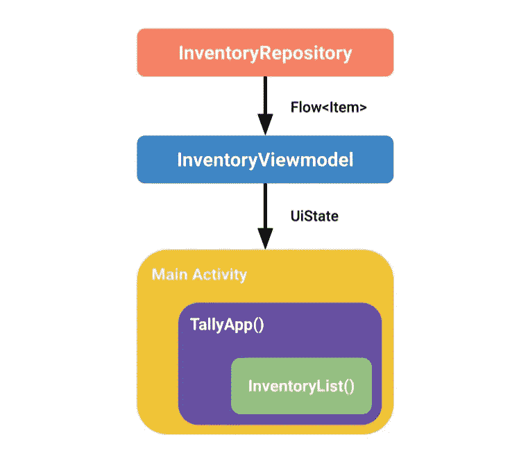

# 用 Jetpack Compose 和 Dagger Hilt 编写集成测试

> 原文：<https://medium.com/nerd-for-tech/writing-an-integration-test-with-jetpack-compose-and-dagger-hilt-8ef888c1a23d?source=collection_archive---------0----------------------->

照片由 [Heri Mulyana](https://unsplash.com/@totempropartis?utm_source=medium&utm_medium=referral) 在 [Unsplash](https://unsplash.com?utm_source=medium&utm_medium=referral) 上拍摄

这篇文章将展示一个使用 Hilt 在 Compose 和 ViewModel 之间运行集成测试的简单设置。

自从 Compose 变成 beta 版后，我一直在花时间熟悉它。我选择了一个辅助项目作为我的学习媒介——一个显示库存项目列表的简单应用程序。作为一个“负责任”的工程师，我决定从初始阶段开始添加测试。Compose 和 Hilt 的团队在记录它们方面做得非常好，所以关于测试的信息很容易找到。然而，我并没有发现太多涉及这两者的场景。

## **项目结构**

让我们假设下面的结构。

使用 Hilt 将存储库、视图模型和活动连接在一起，以管理它们的依赖关系。

## **测试场景**

对于本文，我们将使用一个简单的集成测试场景，验证我们的 UI 显示一个库存项目列表。理想情况下，这个测试帮助我们确保我们的视图模型和组合 UI 按照预期的方式一起工作。

(*请记住这是一个人为的例子。可以对这种测试的价值进行争论。然而，这不是这篇文章的重点*

让我们仔细看看我们项目中的一些代码，以便更好地理解如何实现这个测试。

## 测试中的代码

**主要活动:**作曲和刀柄的入口点。这里的 InventoryViewModel 由 Hilt 提供。

**InventoryViewModel:** 负责从存储库中读取数据并发出一个 UiState。

**清单条目:**一个负责显示清单条目列表的组件。

(*这篇文章不会详细解释 Hilt 是如何工作的，但是，请注意注释*`*@AndroidEntryPoint*`*`*@HiltViewModel*`*`*@Inject*`*都与使用它进行依赖注入所需的 Hilt 设置有关。更多信息* [*此处*](https://developer.android.com/training/dependency-injection/hilt-android) *)***

**查看上面的代码片段，我们可以观察到`InventoryViewModel`依赖于`InventoryRepository`获取数据。存储库通常负责从云中获取这些数据。**

**测试时，我们的目标是创建一个尽可能接近生产的场景，同时仍然是可预测的和可靠的。因此，为了我们的最大利益，避免攻击任何实际的服务器来获取数据。相反，我们更愿意为测试断言提供一个硬编码的项目列表。**

**仔细看看`InventoryRepository`，我们看到它是一个接口。这很重要，因为它给了我们提供任何我们喜欢的具体实现的灵活性。**

**然而，我们希望只在测试时交换到**。这就是 Hilt 及其测试能力发挥作用的地方。一会儿我们会看到这些是什么。****

**为了完成我们的测试目标，我们需要以下内容:**

*   **用于测试的预定项目列表**
*   **Hilt 的测试依赖:Hilt 提供了 API，允许我们操作依赖注入过程来满足我们的测试需求。我们可以通过`HiltAndroidRule, HiltTestApplication`和`HiltTestRunner`来实现这一点**
*   **测试 Compose 的依赖关系:这提供了`ComposeTestRule`，我们将使用它来“加载”我们的可组合组件并执行断言。**
*   **耐心😂**

**让我们开始吧…**

## **添加测试依赖项**

**下面的依赖关系让我们能够访问测试规则和其他组件来编写我们的测试。**

## **提供虚假的物品清单**

**Hilt 让这变得非常容易。基本前提是通过替换用于提供依赖关系的模块，用测试版本替换真实的依赖关系。**

**在测试时提供列表库的假实现的柄模块**

**这段代码基本上导致了只在测试期间适用的模块的创建。使用由 Hilt 的测试工件提供的`@TestInstallIn`注释，我们可以指定:**

*   **依赖关系的相关组件范围。这是使用`components`参数完成的，**
*   **使用`replaces`参数，该测试模块应替换的模块。**

## ****安装 hilttestatapplication****

**使用 Hilt 需要一个用`@HiltAndroidApp`注释的应用程序类。该注释生成一个顶级组件，由 Hilt 用来提供对其他组件的依赖(例如由`@androidEntryPoint`注释创建的`ActivityComponent`)。)**

**同样的要求也适用于测试。幸运的是，Hilt 提供了一个我们可以使用的测试应用程序，下面是设置的样子。**

**我们将使用这个测试运行程序来代替默认的测试运行程序，方法是在我们的项目级 Gradle 文件中指定这一行。**

****

****注意:**使用您的包名**

## **最后，写测试。**

**在这最后一步，我们终于准备好编写测试类了。**

**使用 Hilt 和 Compose 编写的 Ui 测试**

**在编写测试时，我们应该注意一些事情:**

*   **为了用 Hilt 运行一个插装测试，我们将用`@HiltAndroidTest`注释测试类。**
*   **`HiltAndroidRule`允许我们通过调用`inject()`在测试中执行注射。这将使我们能够用我们之前定义的 fake 替换 ViewModel 的存储库依赖项。**
*   **`ComposeTestRule`是将主(根)组件加载到屏幕上所必需的。这是通过调用测试规则上的`setContent`并传入可组合的来完成的。**

## **对测试规则进行排序**

**为了成功地使用 Compose 和 Hilt 编写一个正常运行的 UI 测试，这两个测试规则都必须作为类级属性可访问，以允许访问上面提到的测试 API。另外，Hilt 要求其测试规则首先执行*。JUnit 提供了两种方法来实现这一点。***

*   *****RuleChain API** :使用这个 API，我们可以像这样轻松地指定顺序:***

***然而，这将阻止规则作为单独的属性被访问，从而阻止我们分别调用句柄上的`inject()`和`setContent{}`并编写测试规则。因此，这(👇🏽)是比较好的做法。***

*   *****`**order**`**参数** : JUnit `4.13`提供了一种更简单的方法，通过使用`Rule`注释的`order`参数来实现这些约束。您需要做的就是为每个规则提供一个数值。提供的数值用于按升序对规则进行排序。下面是使用这种方法的代码:*****

*****将所有东西放在一起，我们将最终完成这个琐碎但功能强大的集成测试。*****

*****按照上面在我们简化的场景中描述的步骤，你应该能够为你的基于组合的 UI 编写一个**集成测试，并注入依赖关系**。关键的要点是确保两个测试规则都可以作为测试中的类级属性来访问，并在测试时使用 Hilt 的机制来提供假的实现。*****

*****快乐作曲和测试。*****

******我要感谢* [*乔西·沃尔夫*](https://medium.com/u/8efc0359e234?source=post_page-----8ef888c1a23d--------------------------------)*[*汉尼斯·斯特鲁*](https://medium.com/u/cc847167b232?source=post_page-----8ef888c1a23d--------------------------------) *和* [*丽莎·翁沃迪*](https://medium.com/u/9b0ad522a833?source=post_page-----8ef888c1a23d--------------------------------) *在撰写本文时提供的反馈。*******