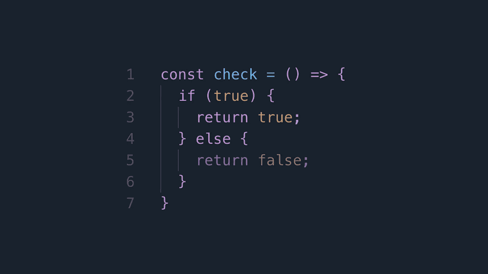

# 用 JavaScript 编写更好的条件表达式

> 原文：<https://medium.com/nerd-for-tech/writing-better-conditional-expressions-in-javascript-2c07d32666f0?source=collection_archive---------7----------------------->



编写条件表达式非常容易。但是，我们的做法还有改进的余地。利用 JavaScript 提供的灵活性，我们可以通过使用一些好的实践，用干净的代码替换条件。并且它可以产生更易维护的代码。在这篇文章中，让我们来看看如何写出更好的条件表达式。

# 1.早期回报

当我们开始学习编程时，我们被教导应该只有一个 return 语句。虽然这个建议没有错，但是如果代码库很大，阅读代码就会变得很有挑战性。尽管我们在编写代码时应该遵循单一责任和其他坚实的原则，但早期返回使代码更具可读性，并给出代码流的清晰概念。

早期返回提供了一种编写更好的条件表达式的方法，并使代码更具可读性。虽然有些人会不同意这一点，但我的偏好是，如果有一个无效的条件早期返回。

而不是拥有:

```
if (model && model.isValid) {
  if(model.properties.isValid) {
    // valid logic
  }
  else {
    throw new Error('invalid model');
  }
}
else {
    throw new Error('invalid model');
}
```

我们可以做到:

```
if (!model || !model.isValid || !model.properties.isValid) {
  throw new Error('invalid model');
}

// valid logic
```

它肯定会归结为偏好，有时还会归结为正在编写的代码，但是早期的回报肯定有助于更快的浏览，更少的代码块和更容易的调试。

# 2.避免多重条件

可以用 switch 语句替换多个 if else 块，以提高可读性。

```
function onKeyPress(key) {
  if (key === 'a') {
    moveLeft();
  } else if (key === 'w') {
    moveTop( );
  } else if (key === 's') {
    moveDown( );
  } else if (key === 'd') {
    moveRight( );
  } else if (key === 'h') {
    showHelp( );
  } else if (key === 'f') {
    toggleFullScreen( );
  }
}
```

可以更好地写成:

```
function onKeyPress(key) {
  switch (key) {
    case ‘a':
      moveLeft();
      break;
    case ‘w':
      movelTop();
      break;
    case 'S':
      moveDown():
      break;
    case ‘d':
      moveRight();
      break;
    case ‘h':
      showHelp();
      break;
    case 'f':
      toggleFullScreen();
    break;
  }
}
```

但是有一个更好的方法。我们可以使用对象文字/映射以简洁的方式重写它:

```
function onKeyPress(key) {
  const mapping = {
    a: moveLeft,
    w: movelTop,
    s: moveDown,
    d: moveRight,
    h: showHelp,
    f: toggleFullScreen,
  };
  mapping[key] && mapping[key]();
}
```

object literal/dictionary 是最干净的实现形式，并且通过向它添加键值，增加了可扩展的好处。

# 3.使用内置数组方法

为了匹配多个条件，我们通常将代码编写为:

```
const isAnimal = animal => {
  if (animal === ‘cat’ || animal === ‘dog’
    || animal === 'lion' || animal === 'bird') {
    return true;
  }

  return false;
};
```

但是我们可以使用内置的 Array.includes()方法来这样做，而不必担心添加这么多“或”条件。

```
const isAnimal = animal => {
  const animals = [‘cat’, ‘dog’, ‘lion’, 'bird'];
  return animals.includes(animal);
};
```

或者，如果我们正在处理对象的数组，并且想要检查属性，我们可以利用 Array.some()方法来检查是否满足某个条件:

```
const isAnimal = name => {
  const animals = [
    { name: 'cat', legs: 4 },
    { name: 'dog', legs: 4 },
    { name: 'lion', legs: 4},
    { name: 'bird', legs: 2}
  ];
  return animals.some(animal => animal.name === name);
};
```

我们同样可以使用 Array.every 来检查所有对象是否都有属性，或者使用 Array.find()来执行一些逻辑。

# 4.使用默认值和析构

利用最新的 ECMAScript 特性总是一件好事。提供默认值消除了初始化变量时对一些条件的需要。利用对象析构也是如此。

```
const test = (animal, legs) => {
  if (!animal) return;
  const num_legs = legs || 0; // if legs not provided, default to zero
  console.log(`${animal} has ${num_legs} legs!`);
}
```

我们可以使用缺省函数值来消除值初始化的条件。

```
const test = (animal, legs = 0) => {
  if (!animal) return;
  console.log(`${animal} has ${num_legs} legs!`);
}
```

如果我们在处理对象，我们可以利用析构操作符。出发地:

```
const test = (animal) => { 
  // printing animal name if value provided
  if (animal && animal.name)  {
    console.log (animal.name);
  } else {
    console.log('unknown');
  }
}
```

可以改写为:

```
function test({name} = {}) { 
    console.log (name || 'unknown');
}
```

如果你想了解更多关于析构操作符的知识，你可以阅读我们关于[析构和传播操作符](https://www.wisdomgeek.com/development/web-development/rest-and-spread-operator-three-dots-that-changed-javascript/)的帖子。

对于类似的初始化相关条件，我们也可以使用[可选的链接和无效合并操作符](https://www.wisdomgeek.com/development/web-development/javascript/using-the-optional-chaining-operator-in-javascript/)。

这就是写更好的条件表达式的全部内容。使用这些技术来编写更好的条件表达式，我们可以使我们的代码更干净，可读性更好。如果您对如何编写更好的条件表达式有任何其他建议，请随时在下面留言，我们会将它添加到我们的列表中！

*原载于 2021 年 3 月 30 日*[](https://www.wisdomgeek.com/development/web-development/javascript/writing-better-conditional-expressions-in-javascript/)**。**