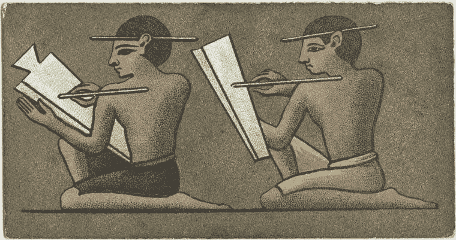
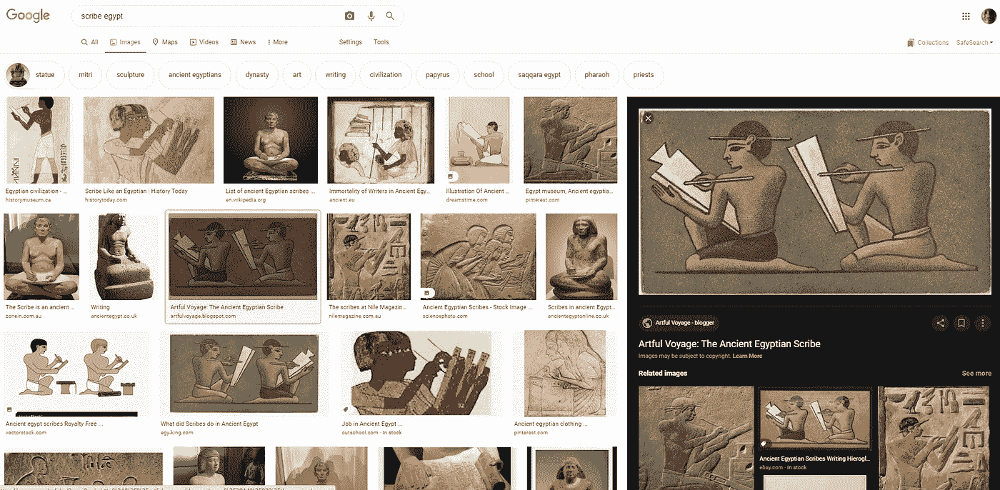

# 写作是一种技术

> 原文：<https://medium.com/nerd-for-tech/writing-is-a-technology-6f73ea77b995?source=collection_archive---------13----------------------->

埃及抄写员

当我认为写作不是科技产品时，我是多么无知，我希望你不要这样想。写作是一种技术，一种曾经并且仍然对社会有着最强大影响的技术。文字使得像埃及人和罗马人这样的大文明得以诞生。在口头语言也可以被视为技术创新之后，书写是人类试图创造另一种交流媒介的结果，这始于我们的祖父母试图通过绘画来描绘他们的环境。书写是一种习惯性的绘画形式，是为了方便交流而特别设计的。现在建立的州和国家是书写技术的产物，而书写技术是唯一一种使自己变形并适应变化和新技术创新的技术。我们已经有一些像乔治·莱考夫这样的科学家研究口头语言对我们思维方式的影响，以及阿拉伯语、英语、法语、沃洛夫语等口头语言如何突出我们的大脑如何处理信息。我几乎可以肯定，写作也影响了我们的大脑进化，我猜它更好地构建了我们的思维，并且有其他好处，只有我们研究它对人类神经解剖学进化的影响才能发现。

是的，写作是一种技术，它是我们现在受益的所有这些创新的基础。古腾堡和学校教育的创立普及了这项技术，但当一项技术产品离开早期采用者到达大众时，事情总是变得简单。写作现在被视为无用的东西，在谈话、图片、视频等其他交流形式面前被低估了。作为写作主要媒介的书籍似乎也过时了。但是无论谁说写作是一种技术。带着最好的来不容易。

谷歌搜索抄写员埃及