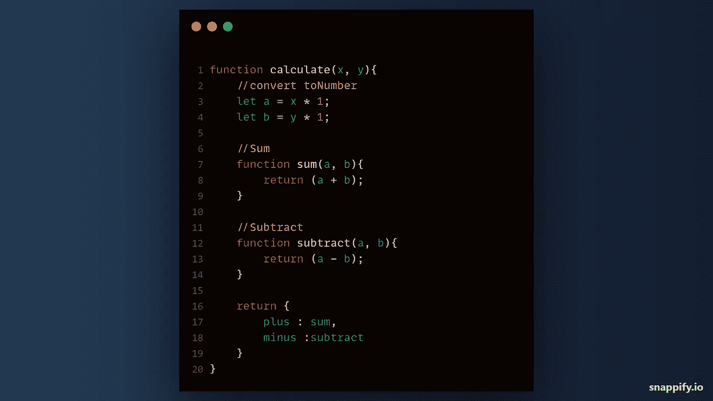
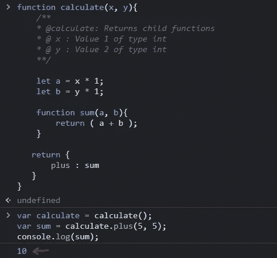
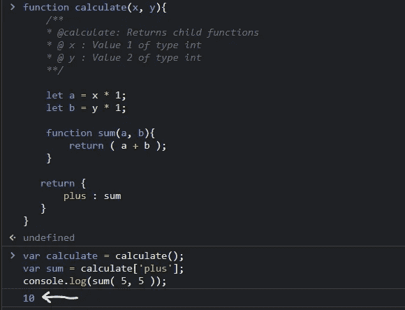
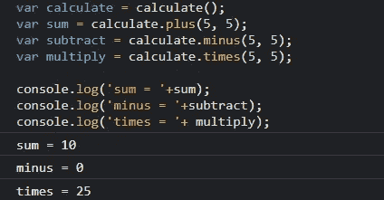
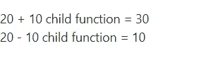

# 编写嵌套函数— JS 和 PHP

> 原文：<https://medium.com/nerd-for-tech/writing-nested-functions-js-php-f21c1d6c5d13?source=collection_archive---------1----------------------->

嵌套函数 javascript

今天我将向您展示如何用 JavaScript 和 PHP 编写和访问嵌套函数。

> 嵌套一个函数意味着在一个被称为**父函数**的特定函数中有多个被称为**子函数**的函数。

为了嵌套一个函数，必须有一个父函数，然后子函数在其中。

# 让我们从 JavaScript 开始

假设我们正在构建一个简单的计算器，它将返回子函数(加号)和(减号)。

加号只是将提供的数字相加，减号只是将提供的数字相减。

## 父函数

我们首先将父函数声明为 **calculate()** ，以接受两个参数(x，y)。

现在让我们声明一个 ***局部变量*** 来保存参数 x 和 y，然后将它乘以(1)以确保我们确实在使用*数字*。

## 子功能

让我们声明一个将返回值之和的子函数。我们将调用这个函数 **sum()** ，然后我们将传入参数 **(a，b)** 。

现在，让我们测试这个简单的函数，返回一个具有自定义名称的对象，并将我们的子函数作为其值。

这实际上意味着，每当我们访问返回值 plus 时，我们的 calculate 函数将执行其子函数 **sum()** 。

让我们声明一个保存函数及其属性的变量。

现在我将向您展示两种访问函数属性的方法。想象你正在访问一个对象。

我们将访问 plus 属性并传入参数 **( 5，5 )** 以返回两个值的和。

## *圆点符号*

## 使用*方括号*

这种方法相当棘手。但是在 PHP 中，这也是我能想到的访问嵌套函数的方法之一。

使用这种方法意味着您必须将试图访问的属性作为字符串传入，然后通过传入参数输出结果。

听起来很困惑，对吧？看看下面的代码。

我们已经将函数属性 plus 赋给了变量 sum，没有传递任何参数。

现在我们通过传递值(5，5)来输出 sum 变量的值。

如您所见，这是相同的输出。

## 更多子功能

让我们再添加 2 个子函数来减去或乘以我们的值。

现在，这就是我们需要的精确输出。

这就是 JavaScript 嵌套函数。

# 服务器端编程语言（Professional Hypertext Preprocessor 的缩写）

这个过程在 PHP 中还是一样的，除了你不能使用点符号访问嵌套函数的属性。

这是因为被称为**连接器**的点符号用于将*两个字符串或变量连接在一起*。

我们仍然有两种访问嵌套函数的方法。

## 使用全局变量

我们将声明一个全局变量来保存我们的函数及其属性，然后同时传入参数，然后我们将使用方括号来访问我们的变量属性。

**注意，**我们还会在返回值中将参数传递给子函数。

现在，这就是我们预期的精确输出。

## 使用一个变量，然后调用它的属性，就像它们都被声明为函数一样。

在向您展示这个方法之前，让我们添加一些子函数。

现在，因为我们返回的是直接传递了参数的子函数，所以我们可以在页面上的任何地方直接调用子函数。

这又是我们需要的结果。

我希望在这一点上，我们已经理解了什么是嵌套函数，以及如何用 JavaScript 和 PHP 编写它们。

谢谢大家！