# 在笔记本项目中编写文本提示

> 原文：<https://medium.com/nerd-for-tech/writing-text-tips-in-your-notebook-project-976639b37e7b?source=collection_archive---------32----------------------->


格伦·卡斯滕斯-彼得斯在 [Unsplash](https://unsplash.com/s/photos/writing?utm_source=unsplash&utm_medium=referral&utm_content=creditCopyText) 上拍摄的照片

> 数据分析是一个对数据进行检查、清理、转换和建模的过程，目的是发现有用的信息、提供结论和支持决策[1]。在这个领域工作的人被称为“数据分析师”。
> 
> 数据科学是一个研究领域，它结合了领域专业知识、编程技能以及数学和统计知识，以从数据中提取有意义的见解[2]。在这个领域工作的人被称为“数据科学家”。

大数据时代，信息大规模传播。除非有人去做，否则它是无用的。正因为如此，数据分析师和数据科学家在今天的生活中扮演着重要的角色。两者的区别在于，数据分析师侧重于显示数据，使其可以理解，而数据科学家侧重于处理数据，以获得更具体的信息，通常数据已经由数据分析师进行了处理。

如果你想成为数据分析师或数据科学家，你将需要平台来支持你的工作。据我所知，有三个平台可以用来开始，谷歌合作实验室，IBM 沃森工作室，或 Jupyter 笔记本电脑。前两个是一个在线平台，它很容易使用，因为你只需要在上面注册就可以访问和启动代码。第三种是离线平台，但是需要安装一些依赖。

在这篇文章中，我想分享一些有用的在笔记本上写文章的技巧。我将使用的平台是谷歌合作实验室，因为它可以直接使用，无需任何安装。仅供参考，谷歌 Colab 中的文本是基于 LaTeX 的，所以可能你之前就明白了。

> 为什么发短信？

数据分析中的文本被用作注释，编写注释的目的是使你的代码能被其他人理解。永远记住这一点，只有当孩子们理解你教给他们的东西时，你才真正理解了一些东西。注释告诉每个人你真正想在代码中写什么。

不多说了，让我们通过点击“文本”按钮来添加文本

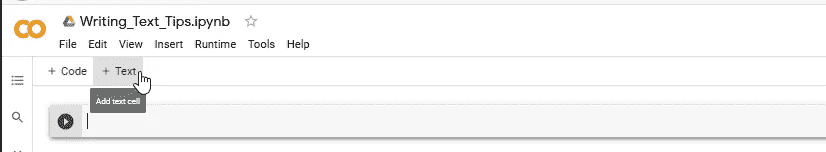

## 写入标题

页眉被用作标题，它被放置在页面的顶部。在 Google Colab 中，您可以使用' # '字符编写标题。

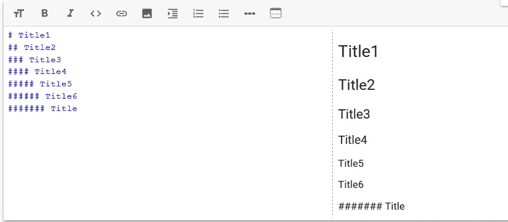

正如你所见，它像 HTML 一样工作，标题只支持从 h1 到 h6。在 h6 之后，任何带有' # '字符的文本都不会变成任何东西。

## 写作降价

Markdown text 是一种格式化文本的方式，在 MS. Word 中你可能知道有斜体、粗体、删除线等。你也可以像这样在 Google Colab 里写。

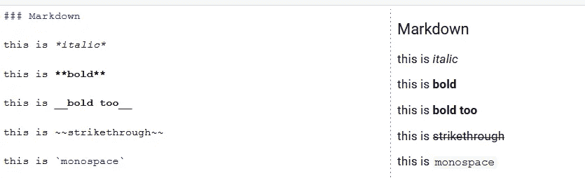

## 编写代码块

要写一段代码，你需要写三个反勾号(```)

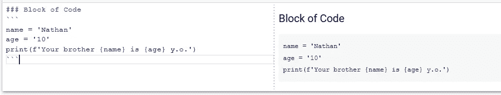

只有“文本”代码不会运行！

## 书写缩进

为了让你的代码更加清晰，有时你需要缩进，这样它就容易理解。构建它的字符是(>)这样的

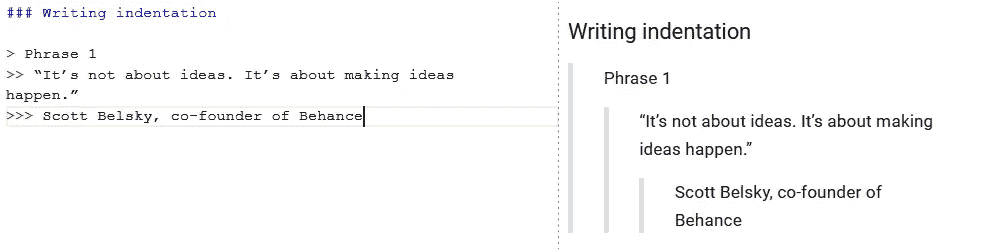

## 书写列表

就像 HTML 一样，你可以写有序和无序的列表，对于有序的你可以写数字，对于无序的你可以写(*)字符，就像这样

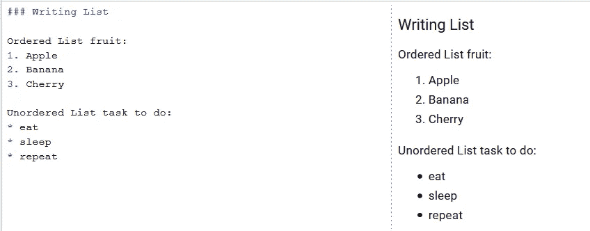

## 写作链接

要编写链接，你需要像这样使用这种格式`[text](links)`

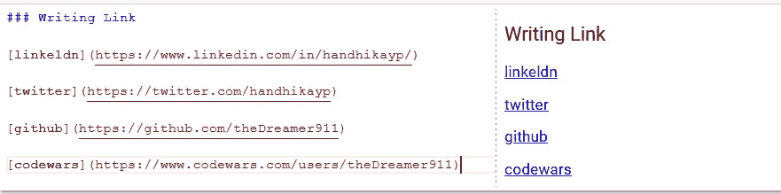

## 添加图像

就像链接一样，你只添加(！)字符，就像这样

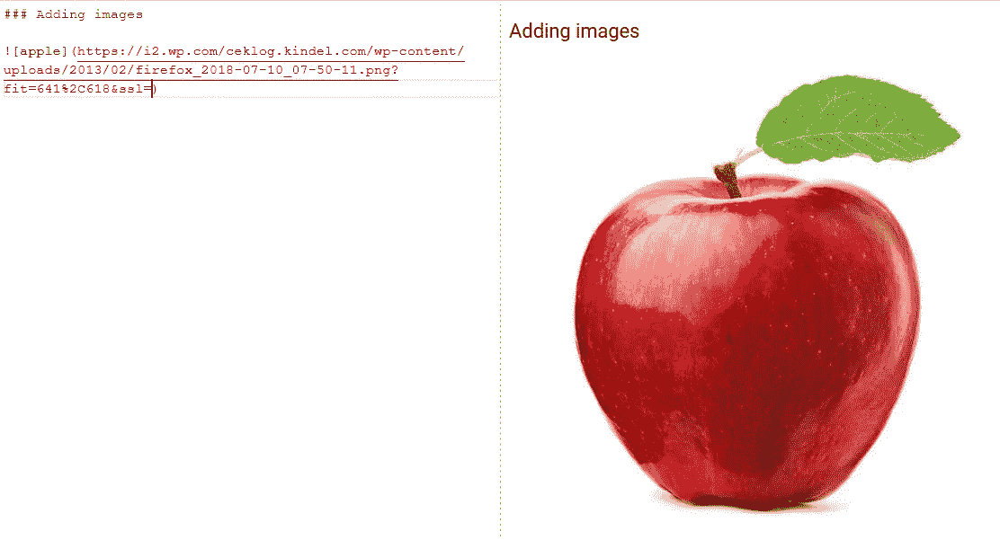

## 编写公式

要写任何数学表达式，你需要把它写在($)字符之间，就像这样

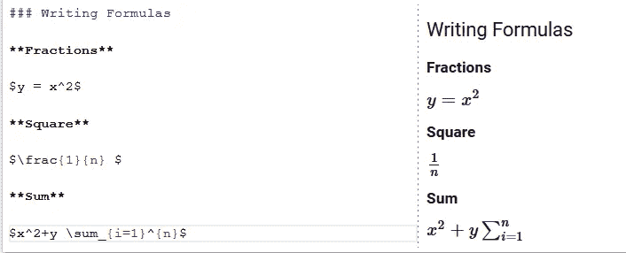

## 书写矩阵

Google Colab 也支持我们编写一个矩阵，要编写它你需要像这样添加一些文本`\begin{type_of_matrix} ... \end{type_of_matrix}`

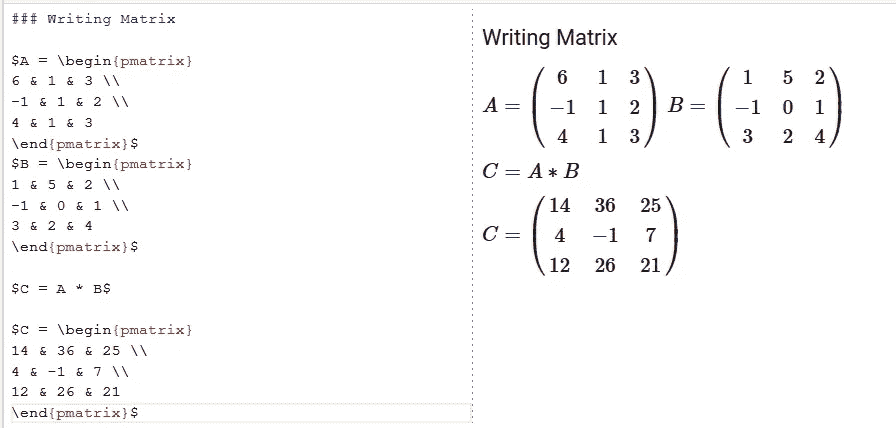

以下是矩阵类型的列表[3]

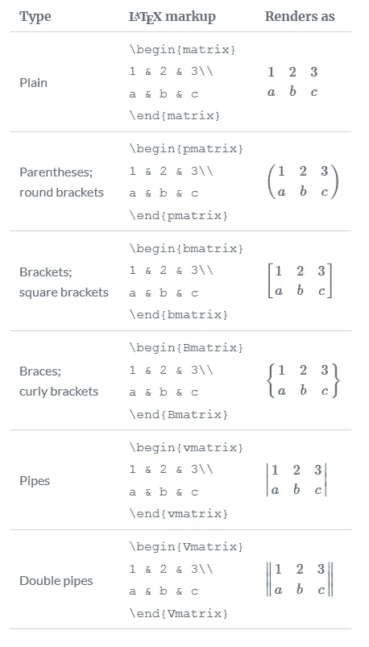

## 写表格

是的，我们可以直接用文本写一个表格，你需要做的就是用(|)字符分隔每一列。要使它成为表格，你需要写三次(-)字符。

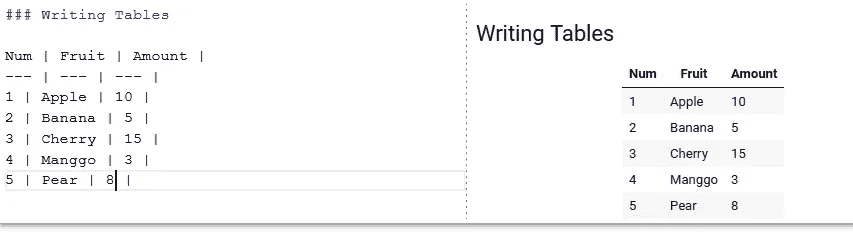

## 结论

我们进入这篇文章的最后一部分。感谢你的阅读，我希望在你读完这篇文章后，你会对如何在你的笔记本上使用“文本”有更多的了解，这样你的读者就会明白了。谢谢你

最后，
祝✌代码愉快

## 来源

[1][https://en.wikipedia.org/wiki/Data_analysis](https://en.wikipedia.org/wiki/Data_analysis)
【2】[https://www.datarobot.com/wiki/data-science/](https://www.datarobot.com/wiki/data-science/)
【3】[https://www.overleaf.com/learn/latex/Matrices](https://www.overleaf.com/learn/latex/Matrices)

## 源代码

[](https://github.com/theDreamer911/dailyChallenges/blob/master/Writing_Text_Tips.ipynb) [## 梦想 911/每日挑战

### 在 GitHub 上创建一个帐户，为梦想 911/每日挑战的发展做出贡献。

github.com](https://github.com/theDreamer911/dailyChallenges/blob/master/Writing_Text_Tips.ipynb)