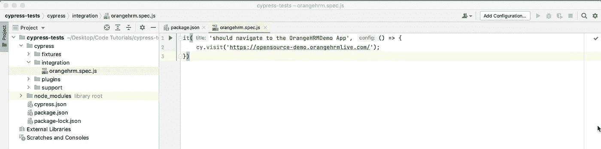
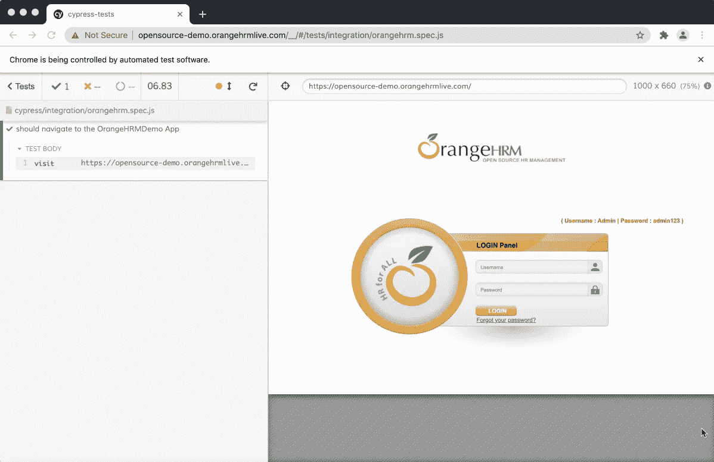
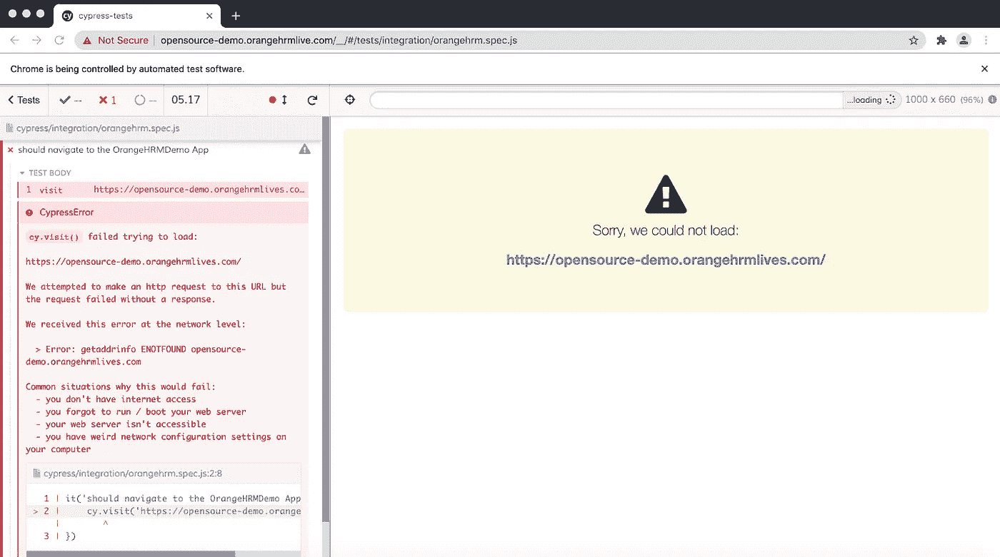

# 用 Cypress 编写第一个测试

> 原文：<https://medium.com/nerd-for-tech/writing-the-first-test-in-cypress-e85e650ead0d?source=collection_archive---------21----------------------->


我们将在“integration”文件夹中创建一个文件来编写我们的第一个测试，并在其中输入测试代码。我们将通过右键单击生成一个新文件，将其命名为“orangehrm.spec.js”。我们需要一个测试运行程序来编写测试，我们使用 Mocha 测试运行程序。摩卡自带 Cypress 集成，我们不用安装。此外，它还是唯一的柏树试跑者。你必须拥有它。这和硒是两码事。对于您选择的任何测试运行程序，您可以按照自己的意愿执行 Selenium 代码。好的，我们在它的函数中写一个测试，比如这个。

```
it('should navigate to the OrangeHRMDemo App', () => {
  cy.visit('[https://opensource-demo.orangehrmlive.com/](https://opensource-demo.orangehrmlive.com/)')
})
```



初始代码

那么测试在做什么？它只是访问我们的应用程序，仅此而已！尝试用 npx cypress open 命令运行它

```
npx cypress open
```

是啊！是啊！是的。它在跑！然后就过去了。而且看起来真的很酷。



测试通过

查看测试命令如何显示在左侧，应用程序如何显示在顶部。这是与 Selenium 的另一个对比:界面有助于您了解测试过程中发生了什么。我们可以发现，当我们进行更严格的试验时，找出测试中的错误是一个很大的优势。

让我们让它崩溃吧。让我们将网址更新为“[https://o-demo.orangehrmlives.com](https://o-demo.orangehrmlives.com.')/”。让我们回到测试上来。



测试失败

可以看出三点:第一是测试失败，第二是直截了当的澄清。您将会看到，在我们保存文件后，产品和错误信息以及最终信息立即得到了检查。赛普拉斯人意识到好的错误是非常重要的。它在寻找和奔跑。这对成长来说是完美的，但你应该关掉它，有时会分散注意力。这就是了。