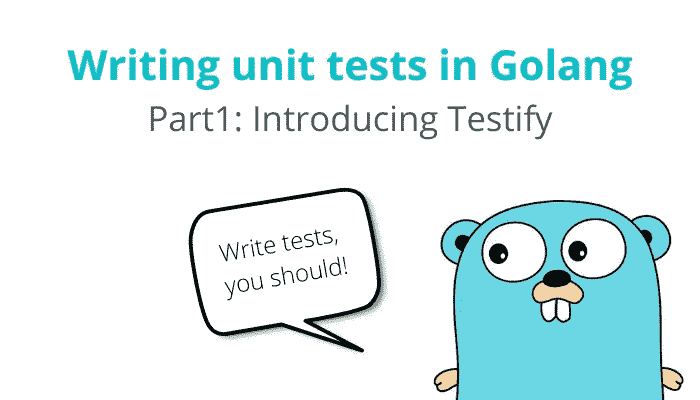

# 用 Golang 编写单元测试第 1 部分:引入证明

> 原文：<https://medium.com/nerd-for-tech/writing-unit-tests-in-golang-part-1-introducing-testify-c0d458442412?source=collection_archive---------2----------------------->

U nit 测试是一种为程序的单个组件(也就是最小的部分)编写测试的方法。它的目的是验证任何一段代码总是按预期工作。

此外，单元测试有很多优点，如提高代码质量，提供文档，代码可以单独测试，不需要另一个模块就可以工作，等等。

我不打算解释什么是单元测试，因为这超出了本文的范围。在本文的最后，我会列出一些有用的资源，供你进一步阅读单元测试。

# 为什么你总是要写单元测试？

简单！以确保在修改代码时不会出错。单元测试确保一切按预期运行，还可以在 bug 进入生产之前防止或检测到它们。

我见过很多不写测试尤其是单元测试的程序员。缺乏测试可能会在应用程序中引入错误，影响用户体验，甚至更糟，破坏应用程序…哎呀！

# 一个叫做“作证”的包裹

作证是…

> Go code (golang)一组包，提供了许多工具来证明您的代码将如您所愿地运行。https://github.com/stretchr/testify

哇，等一下。但是 Go 已经有了标准的[测试包](https://golang.org/pkg/testing/)！为什么我们需要另一个库来编写测试？

好问题！Go 标准测试包在测试方面做得不错，但是它仍然缺少一些有用的功能，比如断言、模拟和测试套件。evidence 就像是 Go 标准测试包的扩展，可以完成我提到的所有事情(是的，为了使用 evidence，您需要标准测试包)。

# 例子

在这一节，我将展示一些用 Go 编写单元测试的例子。在我们开始之前，我会给你一些关于编写测试的提示。

## 编写测试的技巧。

1.  将您的测试文件保存在与要测试的函数相同的目录中。
2.  测试函数名应该以单词 **Test** 开头。

## 单元测试示例(简单)

让我们从一个简单的`Add`函数开始。该函数接受两个参数，并返回它们的总和。

其测试功能如下所示。

仔细看第 21 行，您会看到我们调用了函数`assert.Equal`来断言实际结果和预期结果的值。如果它们相等，则测试通过。否则，测试失败。

## 单元测试示例(测试表)

在下一个例子中，我将向您展示如何为单元测试创建一个测试表。
这里我们定义一个函数`IsAllLowerCase`。如果给定的输入只包含小写字符，它将返回`true`。否则，返回`false`。

其测试功能如下所示。

首先，定义具有以下字段的`testCase`结构；`name`(作为测试用例名称)、`input`(作为函数输入)、`expectedResult`(作为测试的预期结果)、`hasError`(作为结果预期错误的标志)。

使用`testCase`的切片定义一个测试表。您可以定义任意多的测试。它可能是你能想到的最简单或最离奇的事情。

通过 for…循环测试表开始测试。在这个例子中，我们使用函数`assert.Nil`和`assert.NotNil`来分别断言当前的测试用例不期望或者期望一个错误。

这就是本文的全部内容。还有更多我们没有讨论的话题，比如嘲讽和测试套件。在本系列的下一部分，我将向您展示更多关于它们的内容。再见，永远写测试！

# 看我的其他文章

 [## Flutter 基础知识:无状态小部件和有状态小部件之间的区别

### Flutter 中的 Widget 是什么？理解有状态和无状态 Wigets。

siraphobk.medium.com](https://siraphobk.medium.com/flutter-basics-the-differences-between-stateless-widget-and-stateful-widget-3f66cec639b0)  [## 扑 2:简而言之，零安全

### 你的 flutter 应用程序听起来不安全！

medium.com](/nerd-for-tech/flutter-2-null-safety-in-a-nutshell-f20aeb74772) 

# 参考资料和进一步阅读

*   [关于艾迪森·亚伯拉德的单元测试，你需要知道什么](https://levelup.gitconnected.com/what-you-need-to-know-about-unit-testing-7b04004da8fe)
*   [尼克·霍奇斯的《单元测试和为什么你应该这么做》](https://betterprogramming.pub/unit-testing-and-why-you-should-be-doing-it-ab61407c53ce)