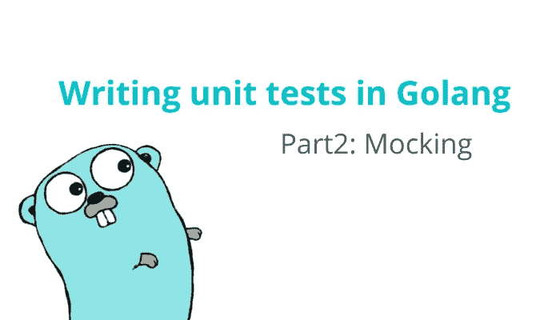

# 用 Golang 编写单元测试第 2 部分:模仿

> 原文：<https://medium.com/nerd-for-tech/writing-unit-tests-in-golang-part-2-mocking-d4fa1701a3ae?source=collection_archive---------0----------------------->

如果您还没有阅读本系列的第 1 部分，请不要忘记查看一下。

 [## 用 Golang 编写单元测试第 1 部分:引入证明

### 单元测试是为程序的单个组件(也就是最小的部分)编写测试的一种方式。目的…

medium.com](/nerd-for-tech/writing-unit-tests-in-golang-part-1-introducing-testify-c0d458442412) 

在软件开发中，一个程序通常由许多层和功能组成，这意味着多个代码块必须一起工作。因此，对于程序员来说，创建这样一个测试来检查所有部分都正常工作是很痛苦的。单独测试每个代码块会好得多。这是因为使用较少的代码更容易检测到错误或开发特性。如果所有的代码都在工作，那么整个程序都在工作。

我们已经知道单元测试是一种验证程序的每个最小部分的测试。你可能会问…“如果，我的代码(或者我的函数)和其他模块交互怎么办？像数据库、网络服务器等。在编写测试时，我真的必须连接或传输数据到那些模块吗？”

答案是: ***不*** 我鼓励你不要这样做。

下一个问题是“那怎么做呢？我如何在不实际操作的情况下测试与其他模块交互的代码？”。

答案是:你可以 ***模仿*** 你的代码与其他模块交互的地方。模仿是创建一个存根(一个假的，一个不是真的，随便你怎么说)代码的一种方式，它可以替代整个代码的一些功能。它的目的是使测试更容易，因为您可以自由地控制那些存根函数的输入和输出，这允许您只关注业务逻辑。

# 例子

## 这个想法

我正在创建一台带有打印机组件的计算机。计算机将有一个叫做`PrintA4`的功能，它可以把我们提供的任何内容打印在 A4 纸上。打印机也将有自己的功能称为`Print`，它将打印我们提供的任何内容和纸张大小。

## 代码

下面的代码演示了一个将被用作模拟示例的应用程序。有一个字段为`Pr`的`Computer`结构。`Pr`字段实现了`Printer`接口。`Printer`接口有一个方法`Print`。另外，`MyPrinter`是一个拥有方法`Print`的结构。可以看到`MyPrinter`实现了接口`Printer`。`Computer`结构有一个方法`PrintA4`。

模拟演示的代码

现在，我们想测试调用`Pr.Print`的函数`PrintA4`(第 12 行)。这段代码中的打印机就像我们前面讨论过的“其他模块”。为了测试`PrintA4`，我们实际上并不需要从打印机中打印出来。因此，我们将创建一个存根函数，模拟接口`Printer`的函数`Print`。测试代码如下所示。

模拟演示的测试代码

[作证](https://github.com/stretchr/testify)的另一个主要特点是嘲讽。evidence 为您提供了一个`mock`包，您可以创建自己的模拟对象来测试您的代码。

在第 10~21 行，我创建了一个模拟对象。这个对象将模仿`Printer`接口。在第 30 行，您可以看到模拟对象调用了方法`On`。该方法设置给定模拟函数的期望值。如示例所示，我已经设置了一个期望，函数`Print`将接收两个参数，分别是`"A4"`和`"hello world"`。之后，它调用`Return`告诉模拟对象 reutrn `nil`作为它的返回值。

第 37 行，调用`PrintA4`时，会调用`Pr.Print`。在生产中，它应该调用对象`MyPrinter`的`Print`，但在这种情况下，它将调用对象`PrinterMock`的`Print`。这太棒了，因为我们实际上不需要调用真正的函数。我们不必与其他模块交互，只需与我们的存根函数交互即可。这使得代码可测试并且更容易调试。

最后，我们用`AssertExpectations`函数断言我们的期望。该函数验证存根函数的输入是正确的，并且存根函数被正确调用。

# 使用模仿生成模仿

一个问题浮现在你的脑海里“如果…如果我的函数有很多对象呢？如果在我的函数中有许多不同对象的函数调用，我需要编写所有这些模拟吗？”

答案是:嗯 ***有但实际上没有*** 。

嘲弄是一个非常方便的软件包，可以为你生成嘲弄。这样，您就不必自己编写模拟了，因为有一个自动化工具为您处理这样的工作。

要使用嘲弄，你可以简单地输入
`go get github.com/vektra/mockery/v2/.../`
然后再输入`go rungithub.com/vektra/mockery/v2 --all`。

模拟将自动生成到`mocks`文件夹中。从`Printer`接口生成的示例代码如下所示。

生成代码的示例

第二部分到此结束。在下一部分，我将讨论测试套件，这是我们将讨论的最后一个主题。现在，请继续关注并快乐编码！

# 参考

[克里斯蒂安·塞基](https://dev.to/chseki/how-i-mock-unit-tests-in-golang-3dcp)
写的《我如何在 Golang 中模仿单元测试》[凯尔·约斯特写的《模仿围棋技巧》](https://www.myhatchpad.com/insight/mocking-techniques-for-go/)

# 看我的其他文章

 [## 扑 2:简而言之，零安全

### 你的 flutter 应用程序听起来不安全！

medium.com](/nerd-for-tech/flutter-2-null-safety-in-a-nutshell-f20aeb74772)  [## Flutter 基础知识:无状态小部件和有状态小部件之间的区别

### Flutter 中的 Widget 是什么？理解有状态和无状态 Wigets。

siraphobk.medium.com](https://siraphobk.medium.com/flutter-basics-the-differences-between-stateless-widget-and-stateful-widget-3f66cec639b0)