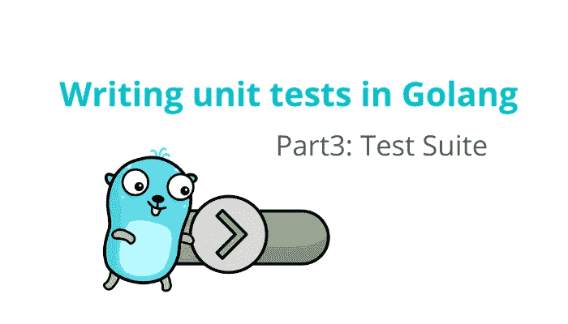
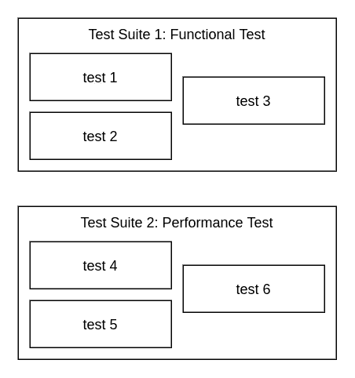
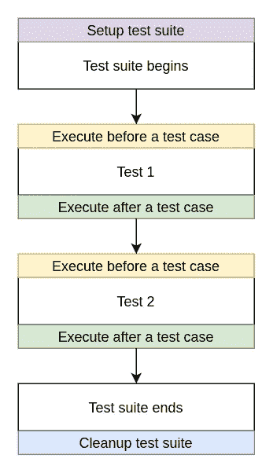

# 用 Golang 编写单元测试第 3 部分:测试套件

> 原文：<https://medium.com/nerd-for-tech/writing-unit-tests-in-golang-part3-test-suite-6cca903be9ab?source=collection_archive---------0----------------------->



正如你可能知道的，一个程序通常会随着时间的推移而成长和发展。随着时间的推移，你可能会添加新的功能，一些边缘情况处理，修复错误等。增加更多的测试也是不可避免的。我们可以说，随着软件的发展，测试用例也在增加。


[https://www . getyarn . io/yarn-clip/70 db0a 71-520 c-451 b-9901-4 f 264 e 7 D6 b 08](https://www.getyarn.io/yarn-clip/70db0a71-520c-451b-9901-4f264e7d6b08)

在某些时候，您会注意到“糟糕，有很多测试，我不知道我必须执行哪一个！”。当你的软件中有太多的测试时，管理它们可能会很麻烦。(无论何时将代码推送给 git，都不能一直执行所有的测试。)有时，你只是想测试程序的一些功能，以确保不会出错。这就是测试套件出现的地方。

一组测试用例被称为测试套件。我们可以使用一个测试套件来对测试进行分组。例如，您可以为功能测试和性能测试创建一个测试套件。当您开发一个新特性时，您可以只执行功能测试套件来测试程序是否按预期工作。或者创建一个性能测试。每当涉及到依赖性升级或效率改进时，您可以执行性能测试套件来确保效率符合规范。测试套件可以简化为下图所示。



测试套件

好了，现在我要用我们信任的包[的包](https://github.com/stretchr/testify#suite-package)[套件](https://pkg.go.dev/github.com/stretchr/testify/suite#pkg-types)作证。

套件包为您在测试套件中执行代码的方式和时间提供了高度的灵活性。您控制着代码执行的每一步。例如，您可以在套件执行之前/之后执行一些设置代码。或者甚至在套件中的每个测试之前/之后执行一些代码。测试套件的执行过程如下图所示。



测试套件执行过程

# 例子

我将创建一个计算器测试套件来测试加减函数。有如何在套件和测试执行之前/之后执行代码的例子。示例代码如下所示。

计算器测试套件

这是执行的结果。(为了便于阅读，我添加了一些箭头和破折号。)

```
>>> From SetupSuite
-- From SetupTest 
From TestAddOne
-- From TearDownTest 
-- From SetupTest 
From TestSubtractOne 
-- From TearDownTest 
>>> From TearDownSuite 
PASS
```

这就是你如何创建一个测试套件。感谢您的阅读，请记住，无论何时开发程序，都要编写测试！

如果您还没有阅读本系列的第 1 部分和第 2 部分，请不要忘记阅读它们。

[](/nerd-for-tech/writing-unit-tests-in-golang-part-1-introducing-testify-c0d458442412) [## 用 Golang 编写单元测试第 1 部分:引入证明

### 单元测试是为程序的单个组件(也就是最小的部分)编写测试的一种方式。目的…

medium.com](/nerd-for-tech/writing-unit-tests-in-golang-part-1-introducing-testify-c0d458442412) [](/nerd-for-tech/writing-unit-tests-in-golang-part-2-mocking-d4fa1701a3ae) [## 用 Golang 编写单元测试第 2 部分:模仿

### 如果您还没有阅读本系列的第 1 部分，请不要忘记查看一下。

medium.com](/nerd-for-tech/writing-unit-tests-in-golang-part-2-mocking-d4fa1701a3ae) 

## 参考

*   [https://www . test monitor . com/blog/test-case-test-suite-test-run-what-the-difference](https://www.testmonitor.com/blog/test-case-test-suite-test-run-whats-the-difference)
*   [https://www . testim . io/blog/test-suites-test-cases-hierarchy-explained/](https://www.testim.io/blog/test-suites-test-cases-hierarchy-explained/)
*   [https://pkg . go . dev/github . com/stretchr/evidence/suite # pkg-types](https://pkg.go.dev/github.com/stretchr/testify/suite#pkg-types)