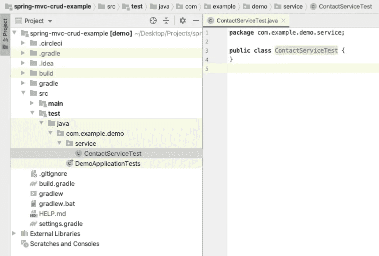
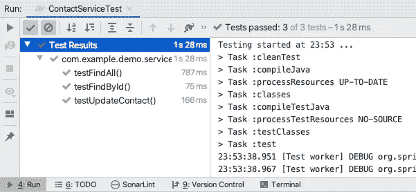

# 用 JUnit 5 在 Spring Boot 编写单元测试

> 原文：<https://medium.com/nerd-for-tech/writing-unit-tests-in-spring-boot-with-junit-5-9498e204de34?source=collection_archive---------3----------------------->

单元测试是测试驱动开发和持续集成实践中不可或缺的一部分。尽管在 Java 中有一些框架可以实现这一点，但是 JUnit 已经被广泛使用了很长时间。


[斯科特·格雷厄姆](https://unsplash.com/@homajob?utm_source=medium&utm_medium=referral)在 [Unsplash](https://unsplash.com?utm_source=medium&utm_medium=referral) 上拍照

*这个中型故事将是我以前的 Spring Boot 教程的延续，在这个故事中，我将专注于为我以前实现的一个项目编写单元测试。我将使用一个 Spring Boot 的 MVC 项目，该项目使用 Gradle 作为构建工具，但是即使您更喜欢 Maven，也应该可以使用。*

如果你没有要继续的项目，请随意使用下面的例子，

[](https://github.com/mmafrar/spring-mvc-crud-example) [## MMA frar/spring-MVC-crud-example

### 用 JPA 和 JSP 实现 Spring Boot MVC CRUD 操作

github.com](https://github.com/mmafrar/spring-mvc-crud-example) 

在本例中，我们将在上述存储库中的 com.example.demo.service 包中为 ContactService.java 编写单元测试。在 src/test/Java/com/example/demo/service 目录中创建类 ContactServiceTest，如下图所示。



ContactServiceTest.java

然后在类级别添加下面给出的注释，以表明这是一个测试类，并指示 JUnit 在它创建的同一个测试实例上执行所有测试用例。

```
@SpringBootTest
@TestInstance(TestInstance.Lifecycle.***PER_CLASS***)
**public class** ContactServiceTest {
```

接下来，将 ContactService 类自动连接到测试类中。使用 before all 和 after all 注释来创建和删除运行测试用例所需的数据。

```
@Autowired
ContactService **contactService**;

@BeforeAll
**void** setUp() {
    Contact contact = **new** Contact();
    contact.setName(**"Mohamed Afrar"**);
    contact.setEmail(**"example@gmail.com"**);
    contact.setCountry(**"Sri Lanka"**);
    **contactService**.saveContact(contact);
}

@AfterAll
**void** tearDown() {
    **contactService**.deleteById(1);
}
```

然后我们将为 findAll、findById 和 updateContact 方法编写测试用例，每个方法一个测试用例。参考下面给出的要点中的测试注释方法。

一旦你的测试类准备好了，你就可以通过 IDE 或者构建工具来运行它。我将通过 IDE 运行测试，但是如果您想通过构建工具来尝试，请使用**。Gradle 测试**命令用于 Gradle。下图显示了通过 IDE 测试执行结果，



试验结果

上面创建的测试类将在嵌入式 H2 数据库上运行。但是对数据库运行测试并不是一个好的实践。因此，我们需要集成像 Mockito 这样的框架来模拟数据库调用等。

编码快乐！下面是我发布的一个 DEV 社区视频。此外，您可能有兴趣查看我的中间故事[将 Spring Boot MVC 和 JSP 项目部署到 AWS Elastic Beanstalk](https://towardsaws.com/deploying-spring-boot-mvc-with-jsp-project-to-aws-elastic-beanstalk-dc665b6b8849) 。

[](https://dev.to/mmafrar/configuring-multiple-data-sources-with-spring-boot-2-and-spring-data-jpa-5c95) [## 用 Spring Boot 2 和 Spring Data JPA 配置多个数据源

### 链接到故事…

开发到](https://dev.to/mmafrar/configuring-multiple-data-sources-with-spring-boot-2-and-spring-data-jpa-5c95)