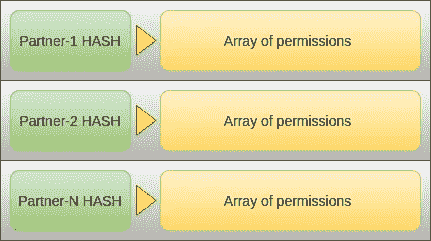
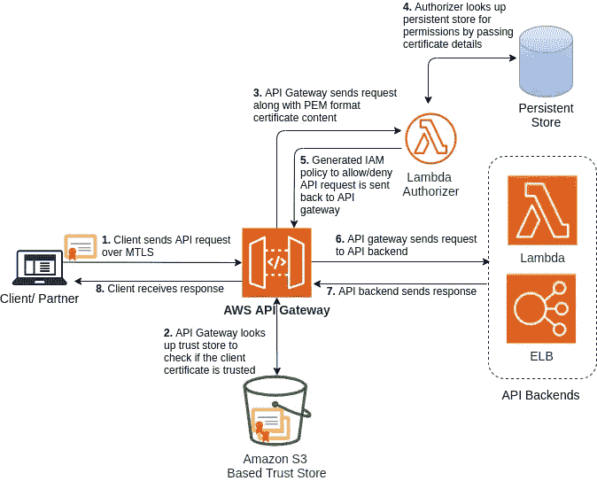

# REST APIs 的 X.509 基于证书的授权

> 原文：<https://medium.com/nerd-for-tech/x-509-certificate-based-authorization-for-rest-apis-db05261d5a9e?source=collection_archive---------4----------------------->

*利用传输层信任的简单而强大的 API 授权方案*

X.509 证书是基于相互 TLS (MTLS)的身份验证的核心。从本质上讲，证书代表了客户/合作伙伴的身份，并用于认证可信方。本文将尝试描述一个 API 授权方案，该方案利用传输层信任，授权客户/合作伙伴访问部署在 [Amazon API Gateway 上的 API。](https://aws.amazon.com/api-gateway/)然而，该方案不考虑任何用户上下文。对于用户上下文相关的 API 授权，人们不得不求助于访问令牌之类的策略，这些策略通常携带一组作用域，基于这些作用域，可以在每个用户的基础上处理 API 授权。

从较高的层面来看，该解决方案包括两个部分，第一部分包括在合作伙伴入职流程中要采取的几个步骤(最好是自动化的)。这些步骤在“**与合作伙伴一起**”一节中进行了解释。第二部分(在随后的小节中描述- ' **配置&创建运行时组件'**)涉及配置和创建解决方案组件，以支持可信合作伙伴在运行时通过 MTLS 发出的 API 请求。

# 加入合作伙伴

授权方案要求在合作伙伴入职期间执行一系列活动。一旦合作伙伴共享了公共证书，就需要提取一组特定的字段(最好使用自动化过程),并且需要为合作伙伴创建唯一的标识符。此外，API 权限需要用这个唯一的标识符进行映射。

## 证书的生成

合作伙伴可以选择生成他们自己的证书(由 CA 信任)或由 API 提供者提供的自定义证书出售门户，这可以帮助合作伙伴作为自助服务生成证书(以及私钥)。自签名证书也是一个选项，但不建议用于生产。最后，生成的证书与 API 网关共享。

## 提取证书详细信息

作为合作伙伴加入过程的一部分，必须有某种方法从共享证书中提取特定的字段，以便为受信任的合作伙伴创建唯一的标识符。该策略可以简单到从证书中提取颁发者公用名(CN)、主题公用名(CN)和证书序列号。然后，可以将这些值连接起来，创建一个唯一的标识符:

*<签发人 CN > : <主题 CN > : <序号>*

虽然证书字段的串联可以工作，但是最好通过使用强大的哈希算法(如 SHA-256)来抽象这些值，以生成串联字符串的哈希值。这个不透明的散列值现在实际上可以唯一地标识系统内的伙伴。

> 通常，颁发者 CN 和证书序列号的组合是唯一的，因为证书颁发者必须确保没有两个具有相同证书颁发者 CN 的不同证书包含相同的序列号。然而，主题 CN 已经被扔进了混合，只是为了确定

## 授权合作伙伴

为合作伙伴创建了不透明的惟一标识符后，下一步的决策是根据业务需求，合作伙伴可以访问哪些 API 和相应的资源/方法。这个决定然后被转换成一个映射，其中每个条目将一个合作伙伴的惟一哈希值映射到该合作伙伴可以访问的资源列表(参见图 1)



图 1:带有 API 权限的特定于合作伙伴的哈希表

然后，这个映射被存储在持久存储中(比如 DynamoDB)。稍后，我们将看到 Lambda 授权器如何利用这个映射来授权合作伙伴访问 API 的请求。示例映射条目可能如下所示:

```
"19637284c1506405a9ed6ba699a5dacc7bc2567cf355207397528189acea71d5":   
  [{
      arn: "arn:aws:execute-api:**<region-code>**:**<acct-id>**:**<api-id>**",
      resource: "customer/*",
      stage: "DEV",
      method: "GET",
      effect: "Allow"
    },
    {
      arn: "arn:aws:execute-api:**<region-code>**:**<acct-id>**:**<api-id>**",
      resource: "products*",
      stage: "DEV",
      method: "GET",
      effect: "Allow"
    }, 
    ...
]
```

> 上面的结构试图将生成的哈希值与携带 API ARN、阶段、方法、资源和效果(允许或拒绝)的对象列表进行映射。本质上，这种结构支持授权方案的创建，其中某个合作伙伴可以访问一组特定的 API 资源和方法，而另一个合作伙伴可以访问另一组 API 资源和方法。合作伙伴之间也可能存在授权 API 资源的重叠

# 运行时组件的配置和创建

下面是该解决方案的各个组件如何协同工作以及所涉及的高级步骤的示意图:



图 2:使用 Amazon API Gateway 对 API 进行基于证书的授权

1.  尝试访问一组 API 的合作伙伴必须拥有可信客户端证书，并与 AWS API 网关建立 MTLS 连接。反过来，API 网关必须配置有*自定义域名*和 MTLS 认证支持，并且合作伙伴证书必须事先放在*信任存储*中
2.  一旦 API Gateway 收到来自合作伙伴的 API 请求，它将通过查找基于亚马逊 S3 的信任存储来验证合作伙伴，并检查合作伙伴使用的证书是否可信。此时，如果证书不可信，API 网关会阻止连接
3.  API 网关触发与所请求的 API 资源/方法相关联的 Lambda 授权器，并传递请求对象。该对象携带客户端证书内容(以 PEM 格式)
4.  Lambda authorizer 从请求中的证书内容中提取细节(颁发者 CN、主题 CN 和序列号),并使用这些从持久性存储(如 DynamoDB)中查找相应的 API 权限。在合作伙伴加入过程中，这些权限实际上是根据提取的证书详细信息放在持久性存储中的。它们表示哪些 APIs 资源/方法可以被可信伙伴调用
5.  Lambda authorizer 基于检索到的 API 权限生成 IAM 策略，并响应 API 网关
6.  API 网关随后使用这个 IAM 策略来允许或拒绝可信伙伴对所请求的 API 资源/方法的访问。如果访问被拒绝，将发回一个 HTTP 401(未授权)响应。
7.  如果允许访问，API 请求将传递给后端服务，响应将传递回调用者

> 虽然本文没有讨论 API 密匙，但是当要求监控每个合作伙伴对 API 的使用时，这个问题仍然很重要。API 密钥还有助于实现速率限制、节流、分配每月配额等。

## 配置 API 网关自定义域名

创建并随后配置支持 REST API MTLS 认证的区域自定义域名是解决方案的重要组成部分，这一点已在以下帖子中讨论过:

[](https://adrin-mukherjee.medium.com/using-mutual-tls-authentication-with-aws-api-gateway-cf42f63f581) [## 通过 Amazon API 网关使用相互 TLS 认证

### Amazon API Gateway 上的受信任客户和合作伙伴通过相互 TLS 获得更高的安全性

adrin-mukherjee.medium.com](https://adrin-mukherjee.medium.com/using-mutual-tls-authentication-with-aws-api-gateway-cf42f63f581) 

## Lambda 授权器编码

最后，必须创建一个“*请求*”类型的 Lambda 授权人。该授权人旨在执行以下任务:

*   检查请求是否有关联的客户端证书。证书的 PEM 内容可在'*event/request context/identity/client cert/clientCertPem '*下获得
*   解析传入的 X.509 证书的内容，并提取以下字段:I*S 用户公用名(颁发者 CN)* ，S *主体公用名(主体 CN)*和 C *证书序列号*
*   使用“**提取证书细节**部分中的串联技术创建一个唯一的合作伙伴标识符: *<发布者 CN > : <主题 CN > : <证书序列号>*
*   使用在“**提取证书详细信息**”部分(SHA-256)中使用的相同散列算法来生成合作伙伴标识符的散列值
*   在持久性存储(在“**授权合作伙伴”**一节中描述)中查找这个散列值，该持久性存储包含为每个可信合作伙伴生成的这些散列值与相应的授权 API 和资源的映射
*   基于检索到的授权 API 列表和相应的资源/方法生成 IAM 策略，并将其返回给 API Gateway。API 网关读取这个 IAM 策略，并决定是否允许访问所请求的 API 资源

查看下面的 GitHub 存储库，获取基于 X.509 证书的 Lambda 授权器的示例实现:

[https://github.com/adrin-mukherjee/x509_lambda_authorizer](https://github.com/adrin-mukherjee/x509_lambda_authorizer)

示例授权器从亚马逊 S3 加载一个文件，该文件包含 JSON 格式的所有 API 权限映射，以保持简单。然而，在实践中，持久性存储将是存储这些动态映射的理想选择，作为合作伙伴加入流程的一部分。

> Lambda 函数必须部署适当的执行角色，以允许它访问像 S3 或 DynamoDB 这样的持久性存储

最后，这个 Lambda 授权器必须与需要保护的相关 API 的方法相关联*。*

# 关于证书轮换的一个注记

当合作伙伴的证书被轮换时，需要做三件事:

*   从新证书中提取详细信息并随后生成哈希值
*   使用新证书更新 API 网关信任存储
*   最后，根据合作伙伴的 API 权限更新持久性存储中的哈希值。

# 结束语

本帖中描述的 API 授权方案值得在采用前仔细考虑。根据应用程序生态系统、安全要求、合规性和其他因素，这种策略可能会有很大的不同。该方案利用了应用层中的传输层属性，这在某些情况下可能不是最佳选择。此外，就授权的粒度而言，该策略没有考虑个体用户上下文。然而，它仍然提供了一个相对容易的选项来实现安全的 API 授权解决方案。

***NB*** *:这篇文章部分是我和我的朋友*[*ari JIT Mazumdar*](https://medium.com/u/6299fff095fd?source=post_page-----db05261d5a9e--------------------------------)进行了一些诚恳而健康的辩论的结果