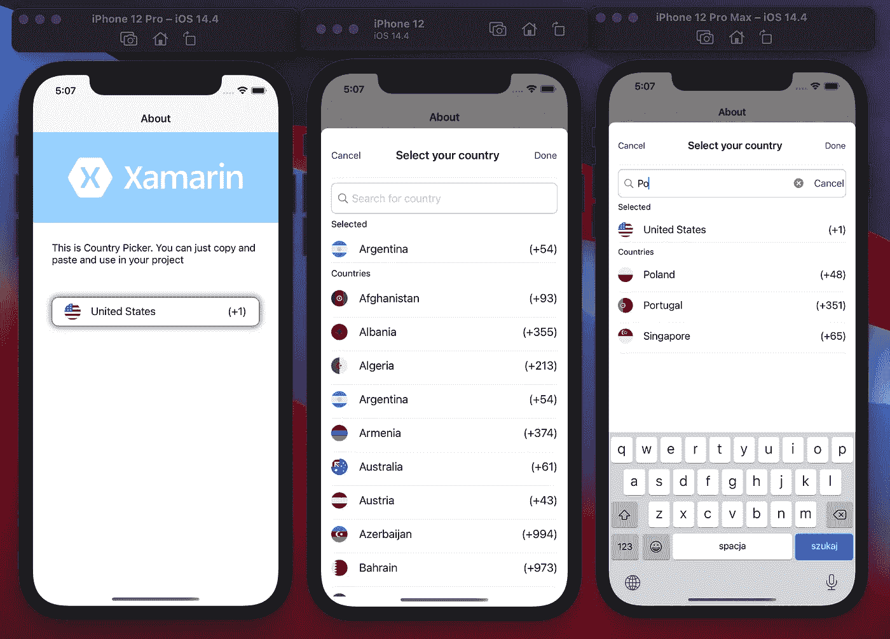
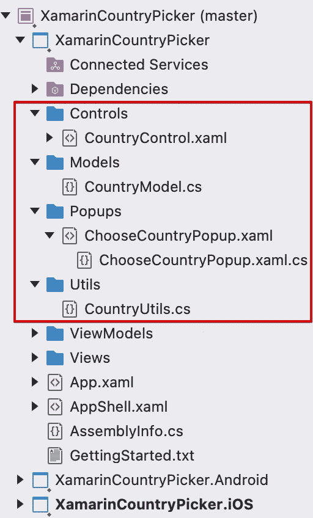
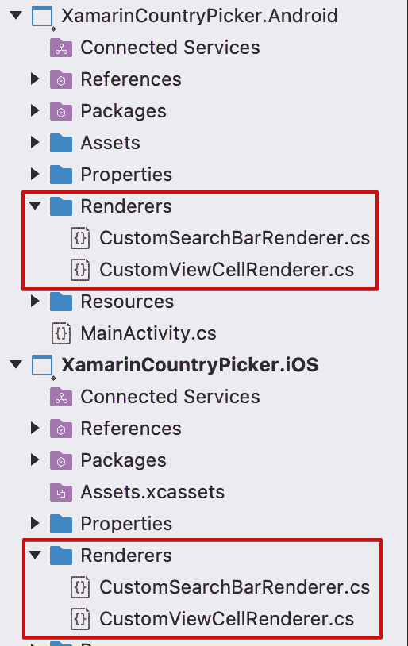

# Xamarin。用 Rg 形成国家/地区选取器。插件.弹出式菜单

> 原文：<https://medium.com/nerd-for-tech/xamarin-forms-country-picker-with-rg-plugins-popup-fec1a045f7c?source=collection_archive---------0----------------------->

## 美丽的国家采摘任何 Xamarin。使用 Rg 的表单应用程序。插件。弹出 NuGet 和在线 SVG 标志

嗨，伙计们😛。今天，我想与大家分享一个美丽的国家选择器实现，您可以将其集成到任何 Xamarin 中。表单应用程序。你所需要的就是从 GitHub repo 中复制几个文件夹，然后根据你的项目需求来享受或者定制。

 [## bbenetskyy/xamarinrcountrypicker

### 所有可用的国家。不是硬编码的——都是通用的。每个国家的 SVG 来自…

github.com](https://github.com/bbenetskyy/XamarinCountryPicker) 

F 有时我们需要为用户提供选择国家的可能性，但不经常我们也需要指定国家代码。那么，为什么没有一个漂亮的弹出窗口，让我们有可能搜索一个国家并立即看到国家代码呢？

# 弹出要求

*   弹出窗口应该在两个平台上完全相同——Android 和 iOS。
*   弹出窗口应该有打开和关闭动画。
*   弹出窗口应该包含尽可能多的国家，而不需要任何硬编码。
*   弹出窗口应该包含每个国家的标志，而不是作为嵌入资源添加每个标志。
*   弹出窗口应该包含没有任何硬编码键值对的国家代码。
*   弹出应该有可能通过国家名称搜索。
*   弹出应该有可能取消选择，并回到最初的国家。

我想这就是我想要实现的，它几乎接近一些真实世界的使用场景🙃。现在让我们来实现它😎

# NuGet 包

这里是用于弹出窗口的 NuGet 包的最小集合。我将提供每个 NuGet 使用的简短描述，也许不是你的应用程序中需要的所有功能，然后你可以省略一些包:

*   **Rg。Plugins.Popup** 用于显示弹出窗口
*   **Xamarin。PancakeView** 用于圆角
*   **libphonenumber-csharp** 用于获取国家代码编号
*   **Xamarin。FFImageLoading.Svg.Forms** 用于显示来自互联网的 Svg 图像

# 项目结构

示例应用程序[https://github.com/bbenetskyy/XamarinCountryPicker](https://github.com/bbenetskyy/XamarinCountryPicker)在默认 Xamarin 上创建。表单外壳模板，因此我们不会停留在它上面，而只是将我们的注意力转移到下一个文件夹:

所有的文件夹和文件只需要复制到你的应用程序中，除了`namespaces`什么都不需要改变。此外，我们在 Android 和 iOS 项目中有两个`Custom Renderers`也需要复制:

# **型号**

我们只有一个模型`CountryModel`，它实现了`INotifyPropertyChanged`接口，有三个字段:

*   flag Url——到 https://hatscripts.github.io/circle-flags 网站的完整 URL，该网站上有每个国家的 svg 标志。
*   CountryName —英文国家名称。
*   国家代码—国家电话号码。

# 实用工具

我们有一个`CountryUtils` `static` `class`，它将根据 ISO3166 为我们获取`RegionInfo`列表，并将英国国名转换为`CountryModel`:

这里一切都很简单，您可能感兴趣的是这个`PhoneNumberUtil`——这是来自**libphonenumber-cs harp NuGet**的实例，它在第`41`行通过两个字母的 ISO 地区名(`US`、`PL`、…)获得`CountryCode`

# 控制

这里我只创建一个控件来显示`Flag`以及`Country Name`和`Code`，因为你的应用程序中完整控件的最终用户界面可以是任何东西，但是你可以看看`AboutPage.xaml`

如果您想要类似的东西—根据您的需要用类似的代码和所需的可绑定属性创建控件。

好了，现在我们来看看`CountryControl`是在`ChooseCountryPopup`里面用来显示`Country Model`的:

并用一个类型为`CountryModel`的可绑定属性`Country`进行代码隐藏:

仍然一切都很简单😋，让我们来看看这个博客的明星——选择国家弹出式菜单。

# 弹出窗口

让我展示一下 XAML 的 Popup 代码，然后我们在几个要点上停下来:

您可能还记得，要求之一是打开和关闭动画。由于内置在 Rg 中，这很容易实现。插件弹出窗口`PopupPage.Animation`:

这将从底部显示，并在短时间内隐藏。根据我自己的测试，最好的是 400 毫秒到 in 和 300 毫秒到 out，但是花一点时间来玩这个值，也许你会找到更好的选择😉

接下来要讨论的重要事情是`ListView`与所有国家的集合:

> 🛑 ⛔️ 📛如果你在 iOS 上选择了除`RetainElement`之外的任何其他`CachingStrategy`，弹出窗口将不会出现！！！！在 Android 上一切都很好，但在 iOS 上你需要有`RetainElement`才能看到这个弹出窗口！！！🛑 ⛔️ 📛

同样，正如我之前提到的——我们有两个自定义渲染器，它们用于为`SearchBar`和`ListView`内部的`ViewCell`设置`transparent`或`white`背景。把它们的代码都放在这里只会浪费你的时间去跳过那些代码，所以如果你真的对它们是怎么做的感兴趣，我会留下一个 GitHub 的链接。

iOS 渲染器:

*   [https://github . com/bbenetskyy/xamarincontric picker/blob/master/xamarincontric picker . IOs/Renderers/customsearchbarender . cs](https://github.com/bbenetskyy/XamarinCountryPicker/blob/master/XamarinCountryPicker.iOS/Renderers/CustomSearchBarRenderer.cs)
*   [https://github . com/bbenetskyy/xamarincontric picker/blob/master/xamarincontric picker . IOs/Renderers/customsearchbarender . cs](https://github.com/bbenetskyy/XamarinCountryPicker/blob/master/XamarinCountryPicker.iOS/Renderers/CustomSearchBarRenderer.cs)

Android 渲染器:

*   [https://github . com/bbenetskyy/xamarinrcountrypicker/blob/master/xamarinrcountrypicker。Android/Renderers/customsearchbarender . cs](https://github.com/bbenetskyy/XamarinCountryPicker/blob/master/XamarinCountryPicker.Android/Renderers/CustomSearchBarRenderer.cs)
*   [https://github . com/bbenetskyy/xamarinrcountrypicker/blob/master/xamarinrcountrypicker。Android/Renderers/customviewcellrenderer . cs](https://github.com/bbenetskyy/XamarinCountryPicker/blob/master/XamarinCountryPicker.Android/Renderers/CustomViewCellRenderer.cs)

好了，`ChooseCountryPopup`后面的代码到了，没有什么特别的，只是一些加载完整的国家列表和搜索的逻辑，所以我就把它留在这里，没有任何额外的描述:

我想这是所有人🤪现在，我只留下了几个链接到我的个人资料和一个来自 Android 的带有国家弹出窗口的短视频🙂

 [## JavaScript 不可用。

### 编辑描述

twitter.com](https://twitter.com/bbenetskyy)  [## Bohdan Benetskyi 正在为 Xamarin 创建高级 CSS 渐变，在会议上发言

### Bohdan 是 Rzeszow 的 Xamarin 软件开发人员，是 Rzeszow & Cracow 的 Xamarin 本地活动的共同组织者，本地 CSS…

www.buymeacoffee.com](https://www.buymeacoffee.com/bbenetskyy)