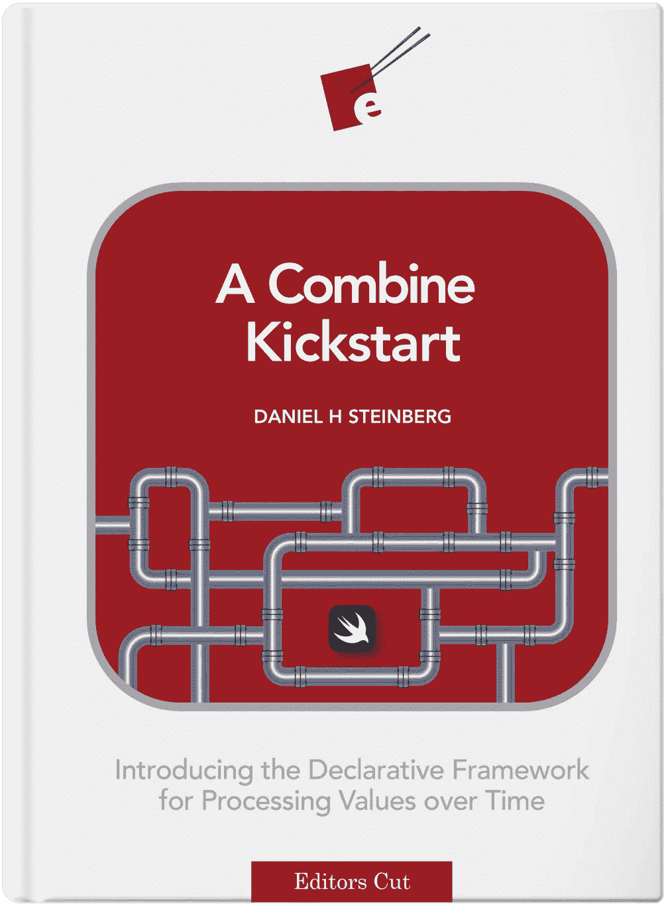
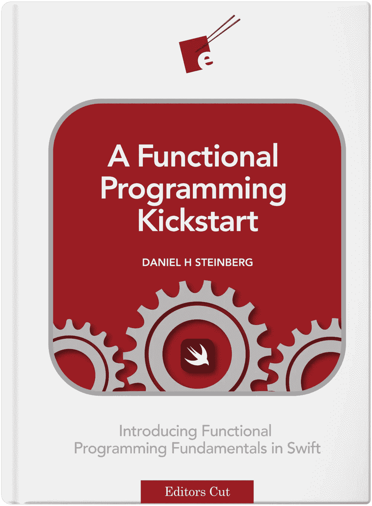

# Xcode 周刊-您一周的 iOS 开发剂量- 02

> 原文：<https://medium.com/nerd-for-tech/xcode-weekly-your-ios-dev-dose-for-the-week-02-d0dc1671613c?source=collection_archive---------5----------------------->

## iOS 开发者周刊杂志

# 🤔Xcode 周刊是什么？

> Xcode Weekly 是我在一周内浏览的一系列 iOS 应用开发者的资料，我觉得这些资料很重要。我正在和这里的每个人分享。-拉杰·库马尔

让我看看我为你们准备了什么。

# 🚨警报

快车道用户必读。

[**苹果即将推出的两步/双因素强制措施会如何影响你的快车道体验**](https://www.joshholtz.com/blog/2021/02/17/apples-2fa-with-fastlane.html?utm_campaign=iOS%2BDev%2BWeekly&utm_medium=web&utm_source=iOS%2BDev%2BWeekly%2BIssue%2B495)

信贷- [乔希·霍尔茨](https://www.joshholtz.com)

# 📰新闻

1.  [***提交健康通行证申请***](https://developer.apple.com/news/?id=l9sdah8l)

随着最近新冠肺炎疫苗的发布，我们看到越来越多的应用程序可以根据测试和疫苗接种记录生成健康通行证，用于进入建筑物和获得亲自服务。为了确保这些应用程序负责任地处理敏感数据并提供可靠的功能，它们必须由与公共卫生当局认可的实体合作的开发人员提交，如测试套件制造商、实验室或医疗保健提供商。与其他与新冠肺炎相关的应用程序一样，我们也接受由政府、医疗和其他认证机构直接提交的应用程序。

*信用*-[-*developer.apple.com*-](https://developer.apple.com)

2. [***新的和更新的苹果设计资源现已可用***](https://developer.apple.com/news/?id=kn2a8g2q)

为苹果平台设计应用变得更加容易。现在，您可以使用新的设计模板、组件、指南等为 macOS Big Sur 或 tvOS 14 快速布局您的应用。包括所有主要的 macOS 和 tvOS 组件，如按钮、分段控制、提醒、菜单和其他控制。此外，更新的 iOS 14 和 iPadOS 14 设计资源 Sketch 已经重建，以支持颜色变量，并包括许多小的改进和错误修复。

*功劳*-[-*developer.apple.com*-](https://developer.apple.com)

3. [***苹果开发者论坛上的新功能***](https://developer.apple.com/news/?id=of9ss4h1)

苹果开发者论坛是一个很好的地方，当你在开发主题上给予和接受帮助时，你可以和其他开发者以及苹果工程师交流。现在，更容易找到并跟踪您感兴趣的内容。利用增强的搜索和一个新的功能，为您监控线程，并在每次有回复时向您发送电子邮件。

*信用*-[T3【developer.apple.com】](https://developer.apple.com)

# 📃教程

1. [***用 Visual Studio 代码进行 Swift 开发***](https://nshipster.com/vscode/)

[Visual Studio Code(vs Code)](https://code.visualstudio.com/)是微软推出的跨平台文本和源代码编辑器。这是当今最令人兴奋的开源项目之一，有数百名贡献者定期更新。VSCode 是首批支持[语言服务器协议(LSP)](https://microsoft.github.io/language-server-protocol/) 的工具之一，该协议在以各种语言和技术提供出色的开发人员体验方面发挥了重要作用。

*信用-*[*NSHipster*](https://nshipster.com)

2. [***如何在 Swift 中使用可变参数***](https://www.avanderlee.com/swift/variadic-parameters/)

可变参数使得向函数传递零个或多个特定类型的值成为可能。对于经常使用一个元素的方法来说，它可能是一个干净的替代方法，并且您不希望在实现级别上仅为一个值创建一个组件数组。

信贷- [swiftlee](https://www.avanderlee.com)

3.[***map()、flatMap()和 compactMap()有什么区别？*T34**](https://www.hackingwithswift.com/articles/205/whats-the-difference-between-map-flatmap-and-compactmap)

Swift 为我们提供了`**map()**`、`**compactMap()**`和`**flatMap()**`方法，但是尽管它们听起来相似，但它们做的事情却非常不同。因此，在本文中，我们将看看`**map()**`与`**compactMap()**`与`**flatMap()**`的对比，以帮助您了解它们各自的功能以及何时有用。

*信用-* [*保罗·哈德森*](https://www.hackingwithswift.com)

# **📺视频**

1.  [***Swift ui 背后的 Swift——Daniel Steinberg at Hacking with Swift Live 2019***](https://www.youtube.com/watch?v=2eK8voQeokk&t=1268s)

丹尼尔·斯坦伯格是一位出色的演说家和作家。我认为是 iOS 社区中最好的之一。

查看他的网站- [dimsumthinking](https://dimsumthinking.com)

*功劳-* [*保罗·哈德森*](https://www.youtube.com/channel/UCmJi5RdDLgzvkl3Ly0DRMlQ)

2. [***核心数据与 SwiftUI(创建、读取、更新和删除)***](https://www.youtube.com/watch?v=_ui7pxU1rNI)

在这个视频中，Mohammad Azam 将演示如何开始使用 SwiftUI 处理核心数据。Azam 将解释如何使用核心数据执行 CRUD(创建读取更新删除)操作。

*信用-* [*穆罕默德·阿扎姆*](https://www.youtube.com/user/azamsharp)

# **📚书籍**

1.  [***一台联合收割机***](https://gumroad.com/l/combineKickstart)

这个手把手、快速移动的 kickstart 向你介绍了苹果平台上声明式和反应式编程的未来。

*信用-*[*dimsum 思维*](https://dimsumthinking.com)

2. [***一次功能编程 Kickstart***](https://gumroad.com/l/functionalKickstart)

函数式编程 Kickstart 是一个实践性很强、快速发展的项目，它将为你提供一套新的技能，你可以将这些技能添加到——而不是取代——你当前最喜欢的编程技术。

*信用-*

****就这样了伙计们，我该离开了。****

*我会试着每周都这样做，但不敢保证😷。*

***上一版⏮** [**Xcode Weekly —您一周的 iOS 开发剂量— 01**](/nerd-for-tech/your-ios-dose-for-the-week-01-d1a947829805)*

***下一版⏭**[**Xcode Weekly——你一周的 iOS 开发剂量——03**](https://rajaikumar.medium.com/xcode-weekly-your-ios-dev-dose-for-the-week-03-7504997704ad)*