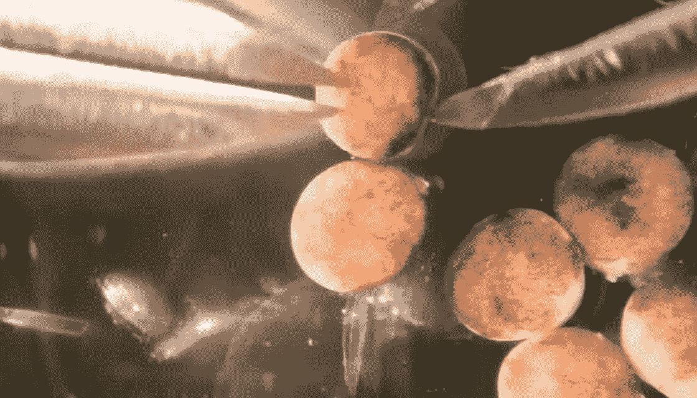

# 异种机器人！神圣的！

> 原文：<https://medium.com/nerd-for-tech/xenobots-holy-sh-t-b60316646e55?source=collection_archive---------2----------------------->

## 可编程纳米生物的生命伦理学

显然，显微外科手术是一件事情，异种机器人是这项事业的“最新”成果，或者更准确地说，是塔夫特大学和佛蒙特大学的生物学家和计算机科学家之间的合作。异种机器人是由数百个青蛙胚胎组成的微型可重构生物*。它们是人工智能设计的可编程活细胞。显然，它们对人类健康和生态系统都大有希望。*

> *“异种机器人可以以不同的方式在水环境中导航，在受到伤害后愈合，并显示出紧急的群体行为”(布莱克斯顿、莱德雷尔、克里格曼、卡尼尔、邦加德和莱文)*

*这些东西可以四处移动，抓取东西(微小的东西)，再生，甚至相互交流，它们可以作为团队或蜂群工作。奇怪的是，这些细胞是多么的可编程，它们完全是可编程的！它们可以从一种功能重新校准到另一种功能，而不必通过数百万年的进化来发展这种能力。为什么大自然让细胞与人工智能兼容？这是纯粹的生物形而上学。*

> *“在提取的胚胎干细胞被培养后，显微外科手术工具有助于将天然粘性细胞“粘合”在一起，形成一系列简单的器官构型，例如，具有臼齿状或肾状外观” *(Coghlan & Leins，2020)**

*此外……抛开那些占用大量资金的学术-工业术语:它们并不是真正的*生物，因为它们不是自主的，也不能繁殖，它们只能存活一周左右；“科学家”认为，随着他们进一步推进研究，这种情况将会改变(大概是在获得更多企业资助之后)。那是真是假还有待观察。但更重要的是，我们*希望*这是真的吗？有一件事是肯定的，你把“人工智能”和“合成生物学”这两个词放在一起，你会看到首席执行官打断他们的早午餐，比你说“可疑的生物伦理影响”还快地给你开出丰厚的薪水。**

> *“能动的生物结构已经由生长在精确成形的支架上的肌肉细胞创造出来。然而，将涌现的自组织和功能可塑性开发成自我导向的生命机器仍然是一个重大挑战”(布莱克斯顿、莱德雷尔、克里格曼、加尼叶、邦加德和莱文)*

*那么，这些小小的算法青蛙字节从修复人体组织到以最不可预测的方式融入生态系统并造成更大的破坏，还需要多长时间呢？更不用说它们“意外”转化为生物武器或新形式的生物政治监视的可能性了。想象一下，一个异种机器人将你的生物特征数据直接传输到你所在的市政当局，一家医药广告公司收集你每个器官的数据，普京派出异种机器人去杀害乌克兰的无辜平民。激动人心！*

*关于生物工程另一个分支的随机精彩文章！[https://spectrum.ieee.org/draper-dragonfleye-project](https://spectrum.ieee.org/draper-dragonfleye-project)*

*裁判员*

1.  *Coghlan 和 k . Leins(2020 年)。“活机器人”:关于外星机器人的伦理问题。*《美国生命伦理学杂志》*， *20* (5)，W1-W3。*
2.  **“科学家创造下一代活体机器人”*[https://www . science daily . com/releases/2020/01/200113175653 . htm](https://www.sciencedaily.com/releases/2020/01/200113175653.htm)*
3.  *布莱克斯顿，d .，莱德雷尔，e .，克里格曼，s .，卡尼尔，s .，邦加德，j .，莱文，M. (2021)。一个开发合成生命体的细胞平台。*科学机器人*， *6* (52)，eabf1571。*