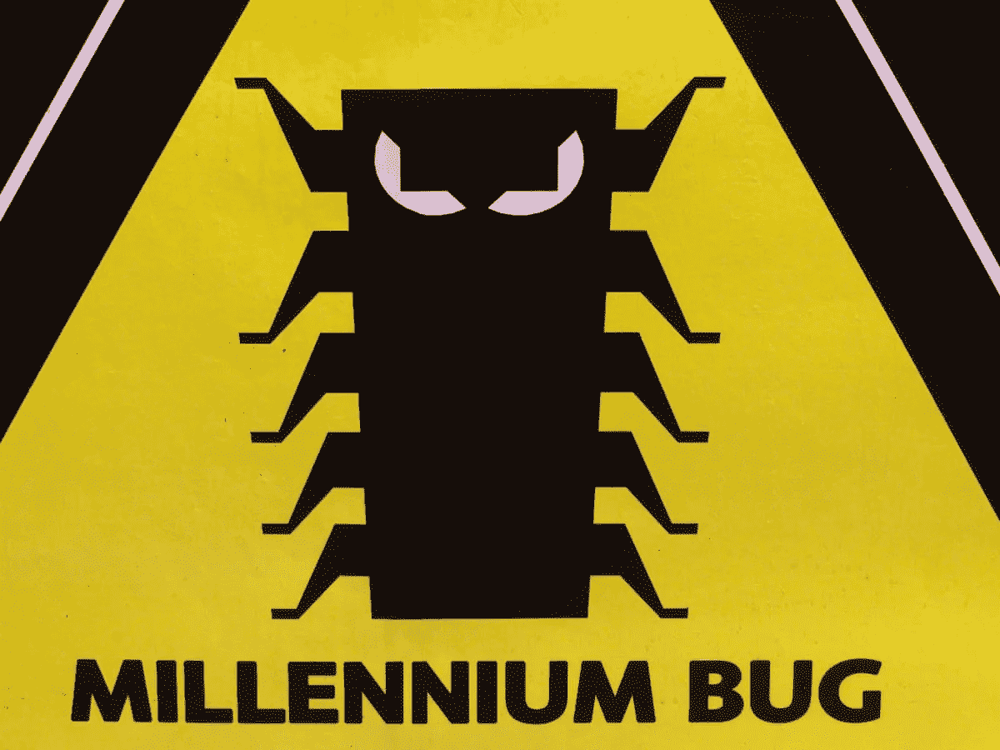
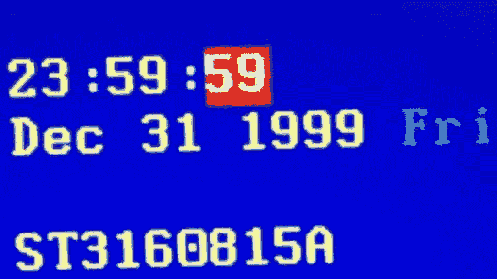

# “千年虫”——2000 年

> 原文：<https://medium.com/nerd-for-tech/y2k-bug-year-2000-709b4542af1f?source=collection_archive---------9----------------------->

## 2 位数怎么成了程序员的噩梦？..

Y2K，简单的意思是“2000 年”(2K = 2000 年)，是一个计算机缺陷/错误，在处理 1999 年 12 月 31 日以后的日期时造成了一些问题(实际上并不严重)。这也被称为“千年虫”。当“玛雅”日历转到 2000 年 1 月 1 日时，计算机程序员和用户都经历了这个错误(虽然不是病毒)。这就是为什么这被称为“千年虫”。所以，让我们讨论一下这种简单的“两位数”日期格式是如何在 90 年代末引起问题的。

Y2K 还是千年虫

从 20 世纪 60 年代到 80 年代，当复杂的计算机程序被编写时，程序员使用两位数的代码来表示年份。“19”部分被省略了。例如，日期不是 1970 年，而是 70 年。程序员们缩短了这个日期，因为计算机中的数据存储成本很高，而且占用了大量空间。

随着 2000 年的临近，程序员们意识到计算机不会把 00 识别为 2000 年，因为它指的是 1900 年。因此，程序员们担心，由于 2000 年 1 月 1 日可能被称为 1900 年 1 月 1 日，每天或每年编程的复杂的关键任务软件可能会被损坏或有缺陷。

“世界末日”还剩 1 秒

像银行这样每天计算利率的机构面临着真正的问题。计算机会计算出*减去*将近 100 年的利率，而不是某一天的利率。电厂也害怕这种虫子。发电厂依赖常规的计算机维护进行安全检查，如水压和辐射水平。如果日期不准确，将会出现无效计算，可能会给附近的居民带来风险。

运输也取决于正确的时间和日期。航空公司尤其处于危险之中，因为记录所有预定航班的计算机将受到威胁毕竟，1900 年航空公司的航班很少。

这是真的吗？🤔

实际上，没有发生程序员所期望的事情。澳大利亚在 2000 年 1 月 1 日之前从俄罗斯召回了几乎全部使馆人员，因为担心如果通讯或交通网络瘫痪会发生什么。但是安全总比后悔好。也为下一个“2038 年”问题做好准备。该主题将在另一篇文章中讨论。😉

在那之前，和平。✌