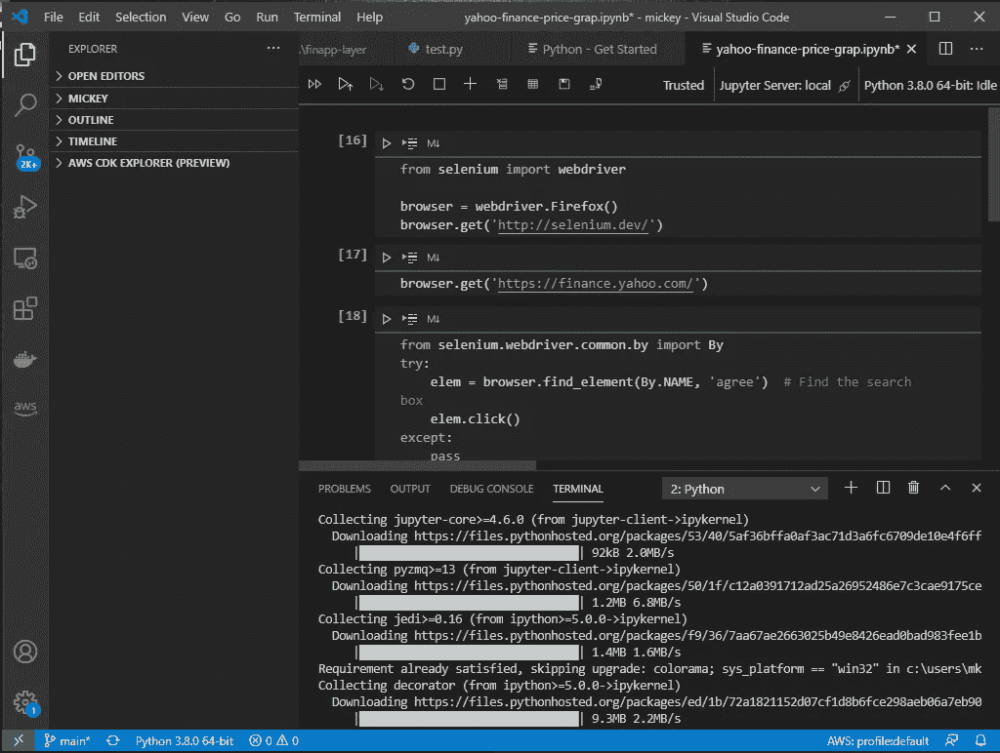

# Python 中的雅虎财经网络刮刀

> 原文：<https://medium.com/nerd-for-tech/yahoo-finance-web-scraper-in-python-d74b49ef0c15?source=collection_archive---------6----------------------->

今天我在玩网络报废。我知道很多人使用 BeautifulSOAP 和其他客户端，但我更喜欢 Selenium，因为它可以渲染和播放 java 脚本。

如果您不熟悉 Selenium，它是一个使用任何浏览器(Firefox、Chrome)来呈现您网站并以编程方式点击链接或收集数据的工具。

今天我试着玩 Visual Studio Code 的新功能(它现在支持 Jupyter notebook ),并试着从使用 React 的雅虎财经网站收集 SP500 ETF 指数的价格。



我的 Visual Studio 代码环境

这是我在 15 分钟内创建的功能代码。

```
from selenium import webdriver
from selenium.webdriver.common.by import By
from selenium.webdriver.common.keys import Keysbrowser = webdriver.Firefox()
browser.get('https://finance.yahoo.com/')try:
  elem = browser.find_element(By.NAME, 'agree')  # Find the search box
  elem.click()
except:
  passelem = browser.find_element(By.NAME, 'yfin-usr-qry')  # Find the search box
elem.send_keys('SPY' + Keys.RETURN)css_locator = 'span[data-reactid="32"]'
price = browser.find_element_by_css_selector(css_locator).text
print(price)
```