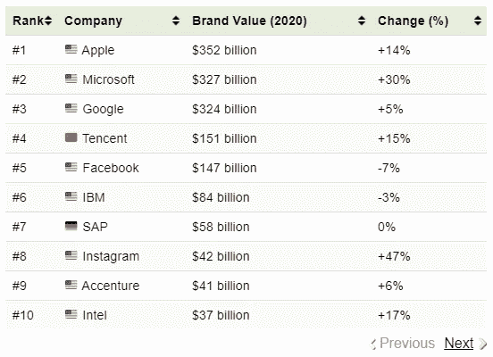
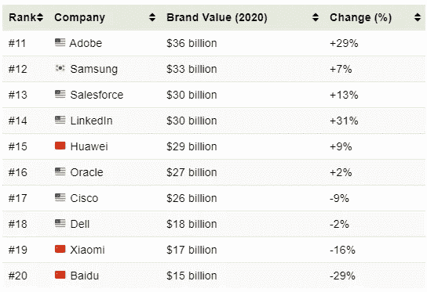
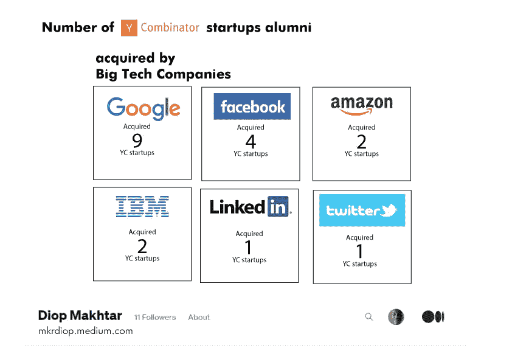

# YC 是创业市场

> 原文：<https://medium.com/nerd-for-tech/yc-as-startups-marketplace-75951087d5be?source=collection_archive---------17----------------------->

y 组合子

在分析的 1281 家初创公司中，有 66 家最终被另一家公司或初创公司收购。 ***这是 YC 创业搁置率的 5.15% (66/1281)。***

来自以下 20 家顶级科技公司

十大科技公司名单

下一个十大科技公司名单

5 收购了一家 YC 初创公司校友，共有 18 家初创公司被这 20 家顶尖科技公司之一收购。正是 ***占整个 YC 创业公司篮子*** 的 1.4% (18/1281)最终进入了大型科技公司的行列。也许有必要指出，就创业公司的数量而言，谷歌是最大的收购者，微软和苹果都没有收购 YC 的创业公司。

以下是概述

YC 初创公司被大型科技公司收购

在 YC 校友的 1281 个创业公司中，有 4 个是关于书的，其中一个已经死了。它占创业公司总数的 0.4%，这是一些关于书籍的创业公司。

[**Scribd**](https://www.scribd.com)**(S06):**加入读者会员，每月获得书籍、有声读物等

**HipType** (S12)死亡:HipType 为最受欢迎的电子书平台带来了分析和定向广告功能

****(**W15):book trope 开创了图书出版的全新选择**

**[**Beek**](https://www.beek.io) (W17):拉丁美洲最大的书评网站。明天——拉丁美洲最大的一切评论网站**

**你可能知道，Book dojo 是关于书籍的，但是是关于数据驱动的书籍、书籍驱动的平台、书籍社区和书籍爱好者的。**

**如果你需要加入 Book Dojo，这里有一个特定领域的创业公司。**

**很快第一本数据驱动的书[来了](http://clickmetertracking.com/7yyy)**

****

**预订 Dojo，一个只提供邮件服务的创业公司**