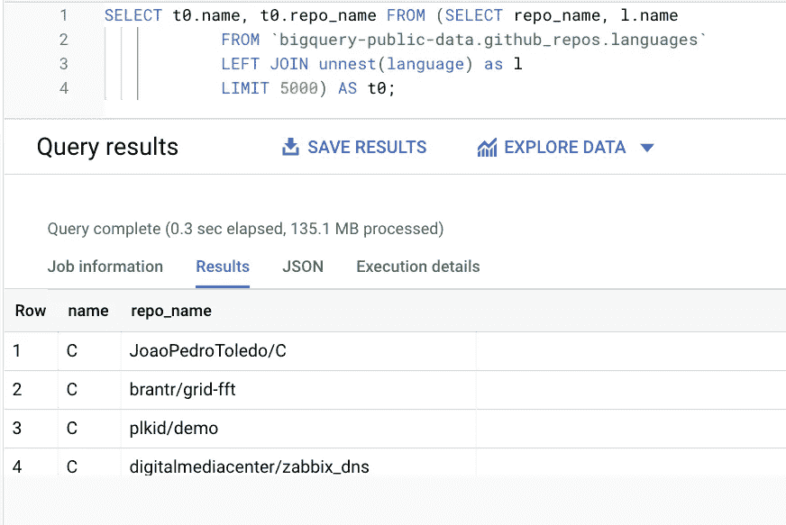
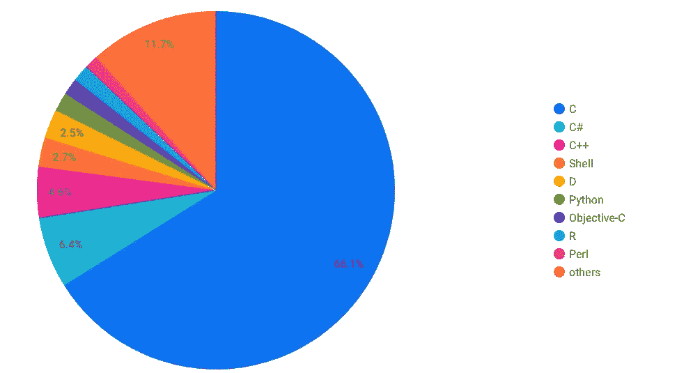
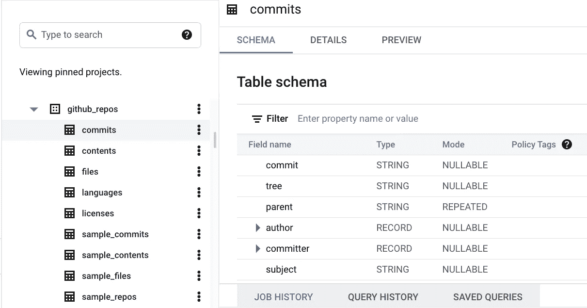
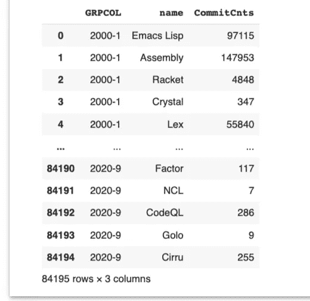
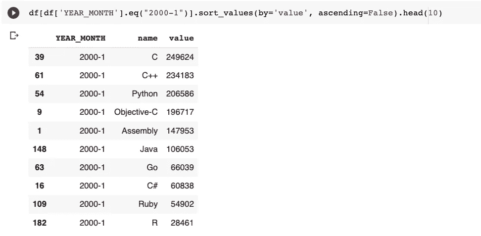
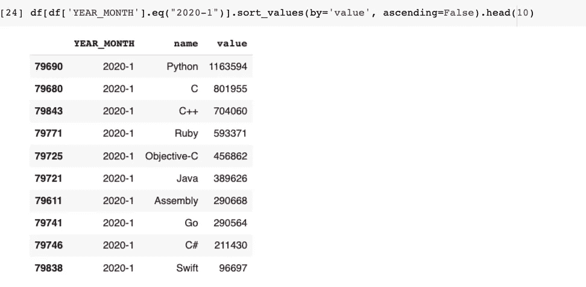
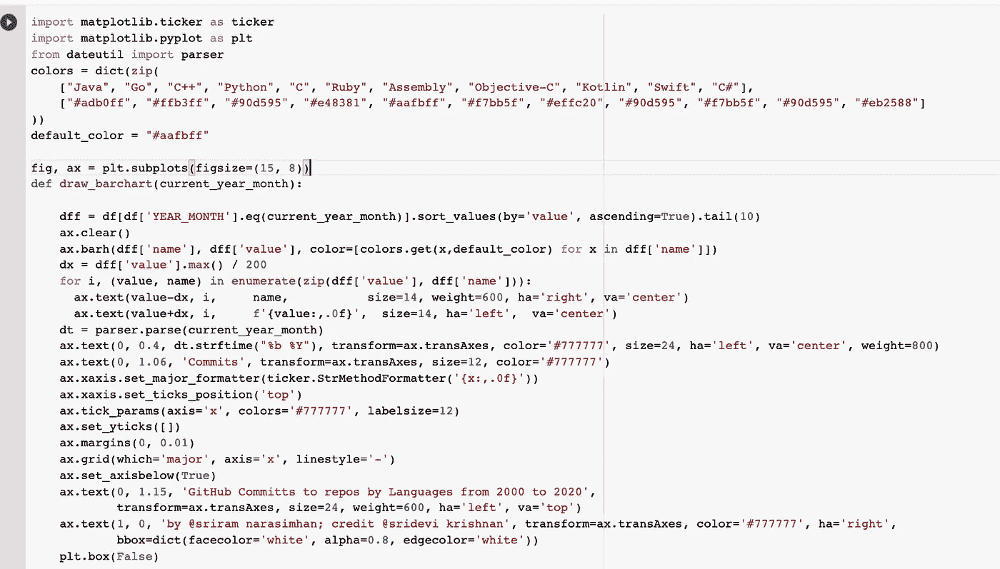
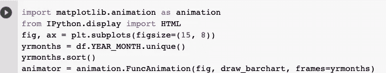
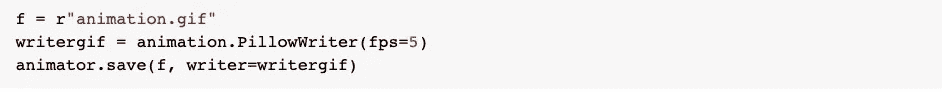
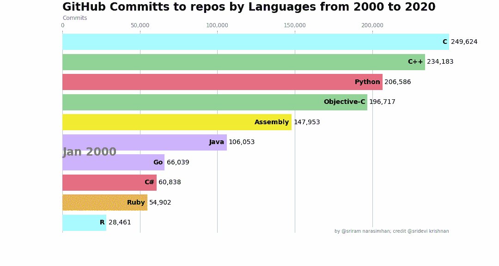

# 对 BigQuery GitHub 数据集的另一种分析

> 原文：<https://medium.com/nerd-for-tech/yet-another-analysis-of-bigquery-github-dataset-3be93c0857ff?source=collection_archive---------15----------------------->

早在 2016 年，谷歌就将所有开源项目相关的 GitHub 回购信息作为公共数据集发布在谷歌 BigQuery 上。这为进行有趣的分析打开了大门。在本帖中，我们将分析这个数据集，并尝试对过去二十年开源项目中编程语言的流行程度得出一些见解。

这篇文章的 Python 笔记本可以在[这里](https://colab.research.google.com/drive/1Nu5cRwtw6MsQZKC2jAStLMZqOWiaHHeT?usp=sharing)找到

有几个这样的分析已经在这个数据集上完成，更多细节请参考本文末尾的链接。

*请注意，github_repos 数据集非常庞大，在运行这些查询时，您很容易就会超过免费层每月 1TB 已处理数据的限制。*

第一个查询想要探索跨各种开源仓库的编程语言。languages 表中有这些信息，可以很容易地用这样的查询进行查询

> SELECT t0.name，t0 . repo _ name FROM(SELECT repo _ name，l.name
> 
> 来自` big query-public-data . github _ repos . languages '
> 
> 左连接 unnest(语言)作为 l
> 
> 极限 5000)作为 t0；

Google DataStudio 可以方便地以饼状图的形式查看结果，如下所示

有人会认为 Python 会很流行，所以结果可能会有点令人惊讶。为了更深入地挖掘这一点，让我们进一步分析一下，看看这些回购中有多少是活跃的。

该信息在提交表中。

**提交**表拥有所有回购的所有提交的完整历史。你可以想象这是一张巨大的桌子。幸运的是，有一个 **sample_commits** 表，其中包含来自 commits 表的示例数据，供我们使用。请注意，sample_commits 表与 commits 表的结构并不完全匹配，您必须相应地修改查询，例如，sample_commits 中的 repo_name 是一个字符串类型，但在 commits 表中，它是一个重复元素。

通过连接 commits 和 languages 表，我能够获得我正在寻找的信息。

接下来，为了便于分析，让我们将查询结果加载到 Pandas 数据框中。数据如下所示:

该列表包含非编程语言回购提交，经过一些清理后，让我们看看 2020 年 1 月的前 10 个提交，看起来是这样的

看起来 C 语言 repos 在 2000 年有最多的提交。

如果我们查看 2020 年 1 月的提交，它看起来像下面这样

可以看到，C 语言的回购提交从 249，624 增加到 801，955，但是 Python 语言的回购提交从 206，586 增加到 1，163，594。

Matplotlib 有一个漂亮的图形和动画包。通过一些简单的编码，我们可以创建一个连续的条形图动画，显示过去 20 年中各种语言的提交情况，从而了解趋势。

有一些假设可能会扭曲结果并导致一些重复计算

*   如果一个回购协议有多种语言，任何提交都将计入所有语言
*   数据中的提交日期/作者日期有时不可靠，有时也是未来的日期。

# 有用的链接

1.  [https://code labs . developers . Google . com/code labs/big query-github](https://codelabs.developers.google.com/codelabs/bigquery-github#0)
2.  [https://cloud . Google . com/blog/topics/public-datasets/github-on-big query-analyze-all-the-open-source-code](https://cloud.google.com/blog/topics/public-datasets/github-on-bigquery-analyze-all-the-open-source-code)
3.  【https://github.com/fhoffa/analyzing_github 