# 另一篇关于 Var、Let 和 Const 关键字的文章。

> 原文：<https://medium.com/nerd-for-tech/yet-another-article-on-var-let-and-const-keywords-93ce35ee9d58?source=collection_archive---------9----------------------->

照片由[克里斯托弗·罗宾·艾宾浩斯](https://unsplash.com/@cebbbinghaus?utm_source=medium&utm_medium=referral)在 [Unsplash](https://unsplash.com?utm_source=medium&utm_medium=referral) 上拍摄

如果你已经写了一段时间的 JavaScript，或者你是一个刚开始 JavaScript 软件开发生涯的初学者，你一定遇到过这三个神奇的关键词 ***var*** ， ***let*** 和 ***const*** 。这些关键字只有一个任务，在 JavaScript 中声明一个变量。

## 什么是变量？

用最简单的术语来说，变量可以说是一个容器，其中存储了一个值，并且可以在以后的代码中重用。正如您在下面的代码中看到的，变量 ***greeting*** 现在保存了值***hello user****，如果需要，可以在代码中重用该值。*

*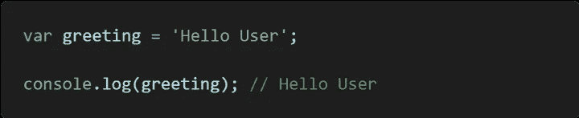*

*来自作者*

*如果你注意到在代码上面关键字 ***var*** 位于变量名 ***问候语*** *之前。*它的主要工作是告诉 JavaScript 单词***问候语*** 是一个变量，JavaScript 将内存分配给这个变量。如果它们都做同样的事情，声明一个变量，为什么有三个关键字？它们都有细微的差别，如果使用不当，会对您的代码产生重大影响。我分三点来讨论。*

*   *范围*
*   *申报或重新申报*
*   *指派或重新指派*

## *范围*

*这就是****var***可能比较棘手的地方，也是其他关键字产生的原因之一。var 的问题在于它是 ***函数作用域*** 的，如果没有 ***函数*** ，那么 ***var*** 将是 ***全局作用域的。*** 而 ***让*** 和 *const* 都是 ***块范围的。下面的代码片段应该可以帮助你理解。*****

**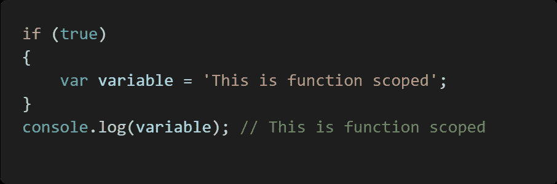**

**来自作者**

**在这个 if 语句中，你一定注意到变量是在 if 块中声明的，但是 ***console.log*** 仍然可以找到它，为什么？在这种情况下，没有一个函数，所以关键字 ***var*** 使***variabl*e*****具有全局作用域，即在 if 块*** 之外**

**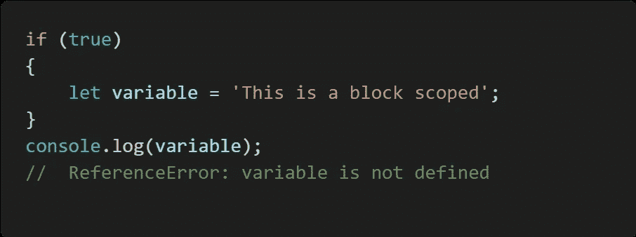**

**来自作者**

**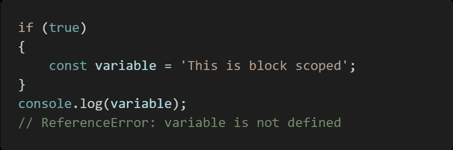**

**来自作者**

*****let*** 和 ***const*** 关键字在作用域上下文中处理时表现相同。如上面代码中所示，*变量在 ***中被声明如果*** 阻塞，那么当 ***console.log*** 寻找它时，它也找不到，于是就出现了 ***引用错误。*** 但是如果 ***console.log*** 在 ***if*** 块内被调用，就会被看到并记录到控制台。***

**这个概念不仅在 ***if 语句*** 中有效，在 ***for 循环*** 中也有效**

**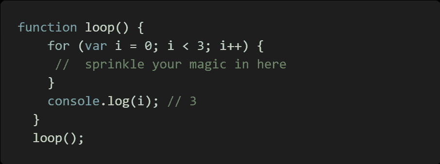**

**来自作者**

**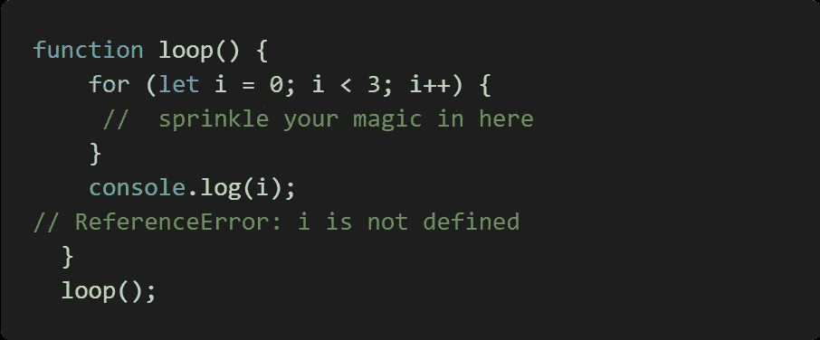**

**来自作者**

**这是关键字 ***var*** 范围问题的一个很好的例子。在 ***循环*** 结束后 ***变量* i** 仍然将 **1** 添加到其先前的 ***值*** 中，因为 ***var*** 关键字是函数作用域内的**

> ***最好使用 let 或 const，以防止您的代码由于 var 的作用域问题而行为不当。***

## ***申报或重新申报***

***开发者可能会错误地重新声明一个变量。这可能是由于开发人员不知道该变量已被声明。这也是 ***var 的*** 的缺点，下面来看看代码片段。***

**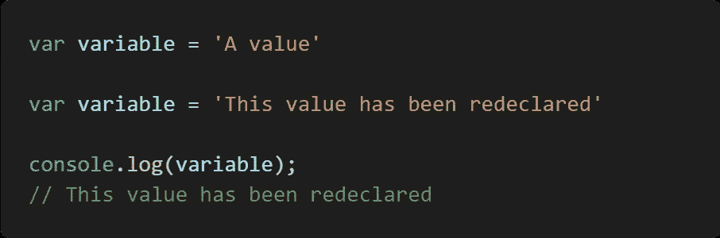**

**来自作者**

**上面的代码声明了一个变量，并重新声明了它，从而将变量值更改为新值。**

**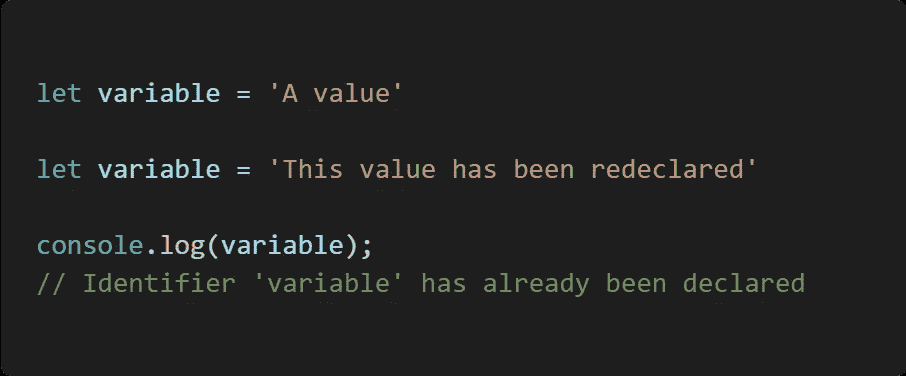**

**来自作者**

**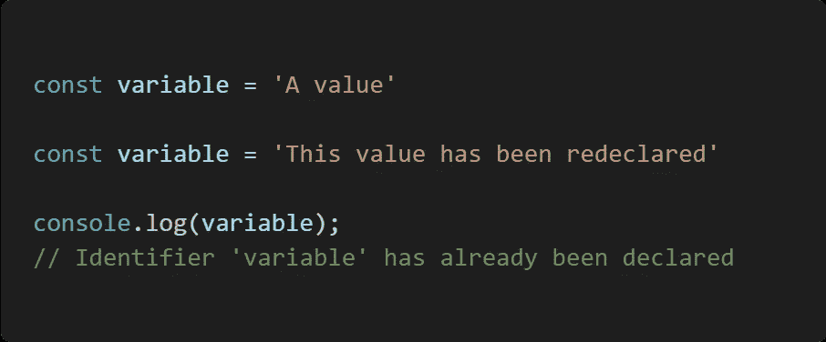**

**来自作者**

**这也是 ***让*** 和 ***const*** 有类似行为的地方，它们在被声明后不能被重新声明。这使你不必知道你所创建的每个变量名，以避免它被覆盖，同时也保持检查。**

## **指派或重新指派**

**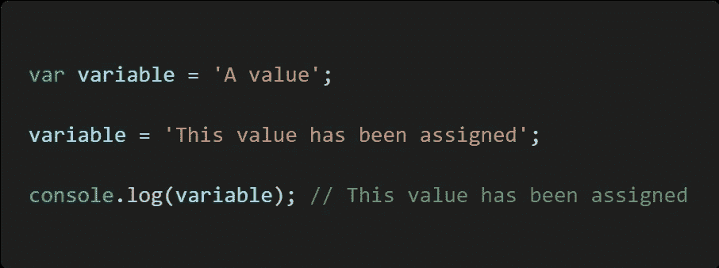**

**来自作者**

**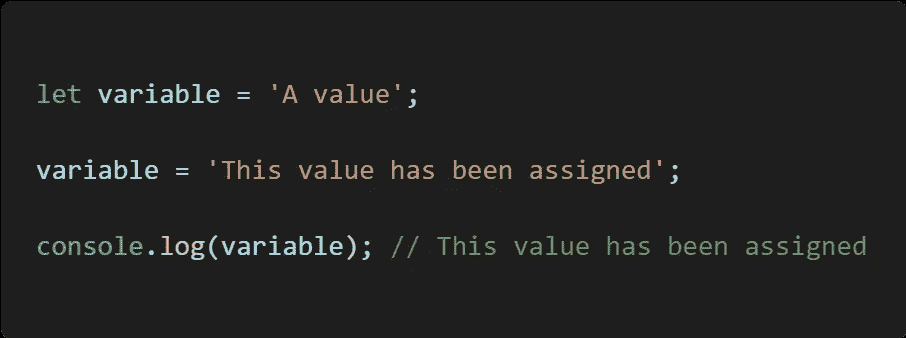**

**来自作者**

**虽然 ***var*** 和 ***让*** 表现相同，当你想重新分配一个 ***变量*** 为 ***值时。*** 另一方面，c ***onst*** 在这方面不同于其余的。**

**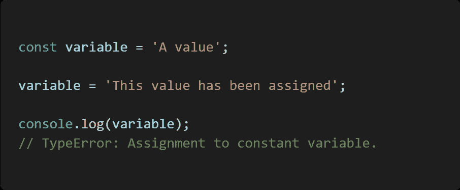**

**来自作者**

**正如你所看到的 ***变量*** 一旦赋值就不能重新赋值。在 JavaScript 中，可以说 ***const*** 代表 c ***onstant*** 。如果不希望变量值改变，这很有用**

**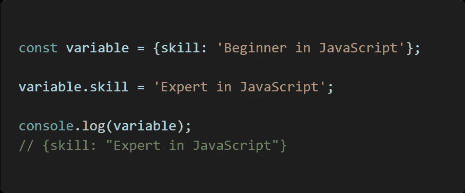**

**来自作者**

**但是当处理一个*的对象时，情况就完全不同了，为什么呢？这归结为 JavaScript 存储对象的方式。该变量保存一个 ***对象*** 作为 ***值*** ，但不是 ***对象*** 本身，而是链接到 ***对象*** 的内存中的一个地址。混乱的😕？我起初是，但后来有了这个概念。那就是一个 ***对象*** 是如何存储的包括 ***数组、*** I 知道这听起来很奇怪但是随着时间的推移你就明白了。***

> **仅供参考:在声明变量时，最好使用 let 或 const 关键字来避免代码中的任何问题。大多数情况下使用 const，如果您打算以后更改变量值，可以使用 let。**

****快乐阅读！！！****

## **结论**

**希望你从这篇文章中很好的理解***var*******let***和 ***const*** 关键词。这只是 JavaScript 为您准备的一些好东西。✌***