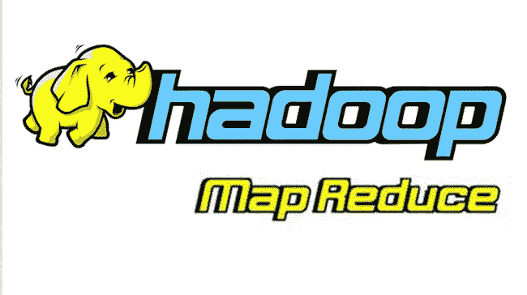
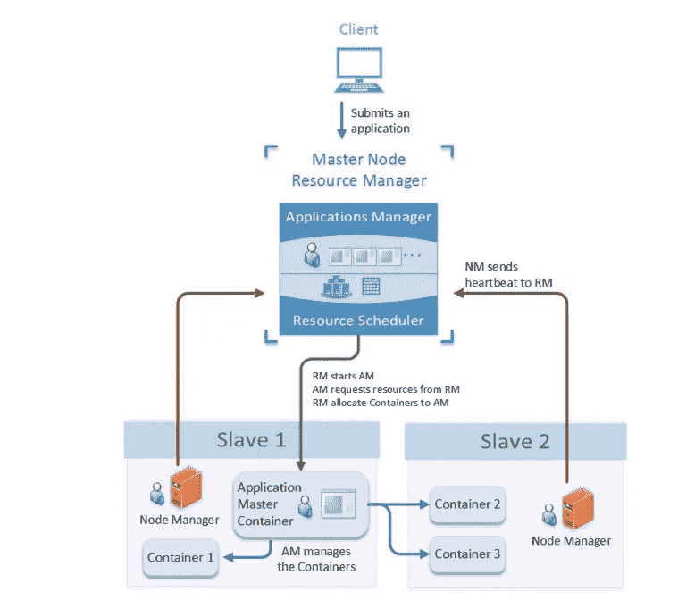
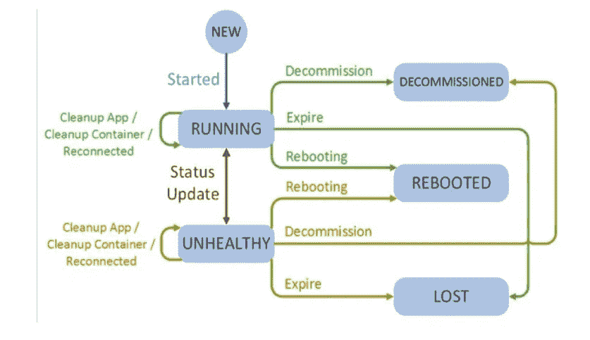
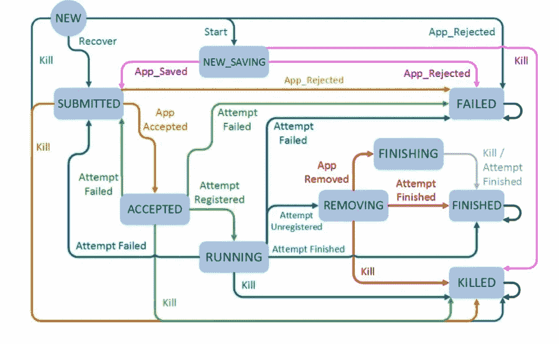
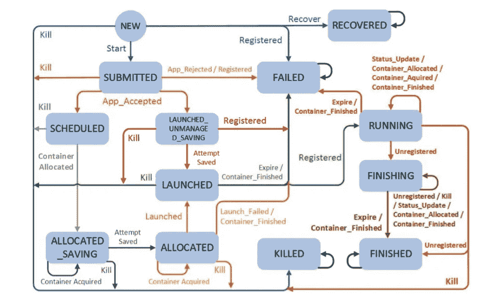
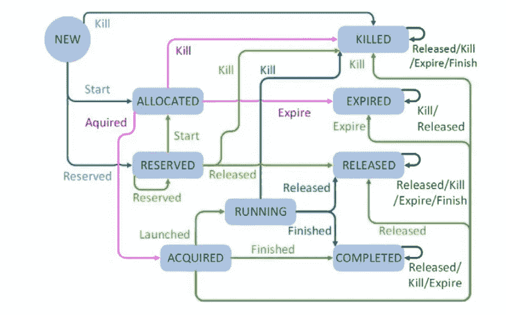
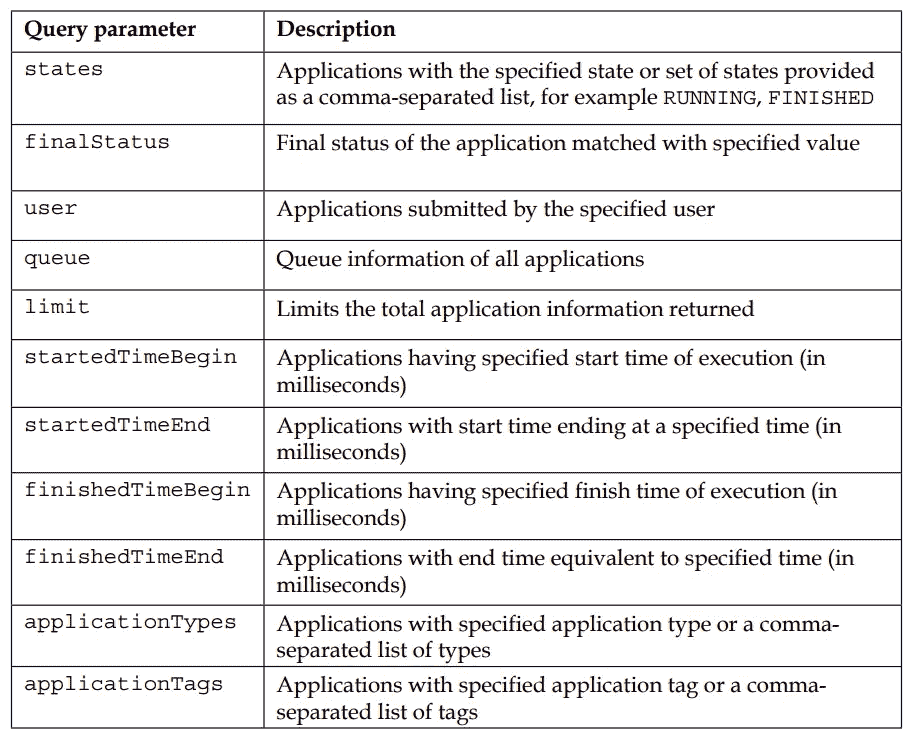

# 另一个资源协商者(YARN):内部、架构和 REST APIs

> 原文：<https://medium.com/nerd-for-tech/yet-another-resource-negotiator-yarn-internals-and-architecture-af33da73e7a?source=collection_archive---------0----------------------->

在 2006 年初，Apache Hadoop 作为一个使用编程模型在计算机集群上分布式处理大型数据集的框架被引入。Hadoop 是作为一种解决方案开发的，旨在以尽可能经济高效和最简单的方式处理大数据。Hadoop 由存储层 **Hadoop 分布式文件系统(HDFS)** 和 **map reduce** 引擎组成，用于跨集群的资源利用和作业执行。



随着数据开始变得越来越大，Hadoop 文件系统能够存储它，但传统的 map reduce 批处理框架成为了一个性能瓶颈。

**YARN** 是**的首字母缩写，另一个资源协商器**已经作为 Hadoop 的第二代资源管理框架推出。Yarn 是作为 Apache Hadoop 下的子项目添加的。

**纱线成分概述**

在 Hadoop-1 中，作业跟踪器和任务跟踪器作为**主从架构**工作。作业跟踪器负责资源管理、作业调度和作业监控。Yarn 在 **Resourcemanager** 和 **Applicationmaster 之间分配这些作业跟踪器任务。**

代替**任务跟踪器** YARN 使用**节点管理器**作为工人守护进程。**资源管理器**和**节点管理器**作为纱线的计算框架。Applicationmaster 是一个用于应用管理的特定于应用的框架

**资源经理**

Resourcemanager 是一种基于群集的服务，它管理应用程序的计算资源调度，并优化群集利用率。

Resourcemanager 有两个组件

**调度器**:调度器负责给应用分配资源。它不保证作业完成或作业监控，调度程序根据作业的性质和资源需求分配资源。

**应用程序管理器:**为应用程序主机提供资源，监控应用程序进度，并在出现故障时重启应用程序。

**节点管理器**

Nodemanager 是一个基于节点容量的容器执行的每节点工作服务。内存是根据安装的内存和 CPU 核心数计算的。它向资源管理器发送心跳信号以更新其健康状态。

**应用主**

它是一个第三方应用程序框架库，管理 **YARN** 中应用程序的每个实例。它是一个第三方库，负责与资源管理器调度程序协商资源，并与节点管理器一起执行任务。资源管理器将容器分配给应用程序主机，这些容器用于运行应用程序特定的进程。监控应用程序、容器和应用程序本身的状态。

> 容器是一个资源逻辑包，包括内存、CPU、磁盘内存等等，都绑定到一个特定的资源。在完成一个应用程序后，application master 将取消所有容器的注册，并取消自己的注册。



纱线结构

**执行步骤**

*   客户提交申请。
*   资源管理器计划程序启动应用程序主机。
*   资源管理器调度程序根据需要将容器分配给应用程序主机。
*   节点管理器向资源管理器发送心跳信号(健康状态更新)

【YARN 如何满足大数据需求

*   **可伸缩性和高集群利用率:**可伸缩性是应用程序在不断扩展的工作负载下工作的能力，资源管理器调度器和管理器保存应用程序资源利用率信息，并根据需要分配资源。
*   **组件的高可用性:**应用主机处理容器的故障，资源管理器处理应用主机和节点管理器以及应用主机的故障。
*   **灵活的资源模型:**与 map reduce 不同，在 map reduce 中，资源是根据可用的 map 和 reduce 槽来定义的。Yarn 有一个基于内存和内核数量的通用资源请求定义。

**纱线生命周期管理**

作为主服务，资源管理器服务对于与 yarn 相关的不同进程有自己的观点。

资源管理器的不同视图是。

*   **节点视图:**节点管理器的生命周期。
*   **应用视图:**应用的生命周期。
*   **应用尝试:**与应用的执行相关联。
*   **容器:**提交申请的业务逻辑

**视图-1 节点**

资源管理器的节点视图管理集群中节点管理器节点的生命周期。



节点视图

*   每个节点管理器用状态 **NEW** 注册自己
*   注册成功后状态更新为**运行**
*   基于来自节点管理器的心跳，最终状态将是**退役/重启/丢失**

**视图-2 应用**

由资源管理器管理的应用程序的生命周期



应用视图

*   初始状态:**新**
*   最终状态:**失败/完成/死亡**

**View-3 应用尝试**

应用程序对纱线簇执行的每次尝试的生命周期。



应用程序尝试生命周期

*   开始状态:**新**
*   最终状态:**完成/过期/释放/杀死**
*   **完成了**

**视图-4 容器**

所有请求容器的生命周期



集装箱生命周期

*   开始状态:**新**
*   最终状态:**完成/过期/释放/杀死**

**纱托 API**

**资源管理器 REST API**

由管理员用来获取

*   集群摘要
*   调度程序详细信息
*   节点
*   应用程序

**集群总结**

*   **集群元数据:**这个 API 提供了关于集群的整体信息。

```
http://localhost:8088/ws/v1/cluster/info
```

**方法:**获取

*   **集群指标:**这个 API 提供了总体的集群指标。包含已提交、待定和正在运行的应用程序。

```
http://localhost:8088/ws/v1/cluster/metrics
```

**调度程序详细信息**

提供有关为群集配置的调度程序和队列的信息。

```
http://localhost:8088/ws/v1/cluster/scheduler
```

**节点**

*   获取所有节点列表的 API。

```
http://localhost:8088/ws/v1/cluster/nodes/
```

*   特定节点的信息

```
http://localhost:8088/ws/v1/cluster/nodes/{id}
```

**应用**

**应用列表:**用于获取应用对象或特定应用的信息的 API。

```
[http://localhost:8088/ws/v1/cluster/nodes/nbdm11c-011.prevalent.com:42235](http://localhost:8088/ws/v1/cluster/apps)
```

支持的查询参数有。



查询参数

应用程序统计:提供在集群上执行的不同应用程序的计数。

```
http://localhost:8088/ws/v1/cluster/appstatistics
```

**单项申请信息:**

```
http://localhost:8088/ws/v1/cluster/appstatistics/{id}
```